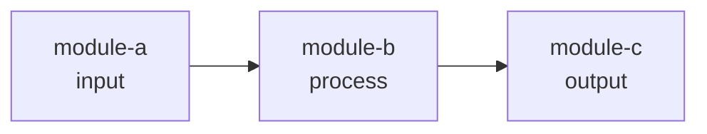
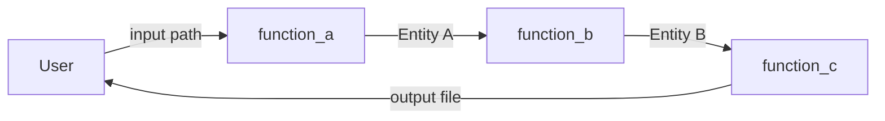
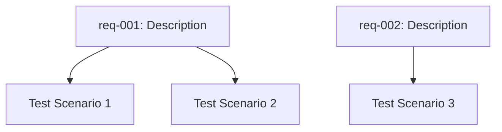
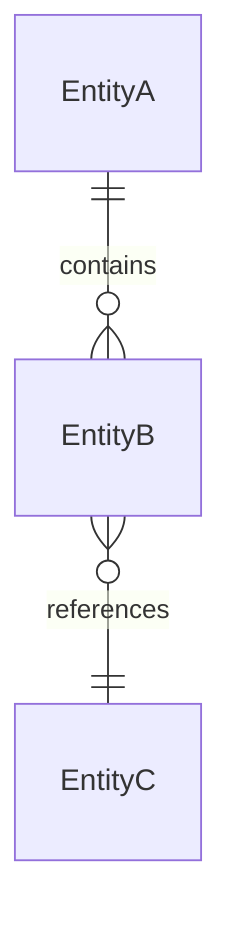

# Workspace Structure Guide

## Overview

The documentor skill generates both **Wavesmith entities** (queryable, traceable) and **workspace files** (human-readable, git-friendly). This dual approach enables:
- Entity queries via MCP
- Version control via git
- Human browsing via file system
- Documentation hosting via static sites

---

## Workspace Root Path

```
.schemas/app-builder-documentor/workspaces/{session-name}/
```

**Example**:
```
.schemas/app-builder-documentor/workspaces/contract-template-updater-docs/
```

**Path determination**:
- Session name sanitized (lowercase, hyphens, no spaces)
- Workspace path stored in `DocumentationSession.workspacePath`
- Created during Phase 1 (Contextualization)

---

## Folder Structure

```
{session-name}/
├── README.md                           # Documentation hub (index)
├── architecture/
│   ├── overview.md                     # System architecture
│   ├── modules.md                      # Module breakdown
│   └── diagrams/
│       ├── system-architecture.mmd     # Module dependency graph
│       ├── data-flow.mmd               # Interface I/O chain
│       ├── test-coverage.mmd           # Requirements → Tests
│       └── entity-relationships.mmd    # Layer 2 schema ERD
├── api/
│   ├── index.md                        # API overview
│   └── {module-name}/
│       └── {function-name}.md          # Per-interface API docs
├── guides/
│   └── implementation/
│       └── {module-name}.md            # Per-module implementation guide
├── tests/
│   └── {module-name}/
│       └── scenarios.md                # Per-module test documentation
├── traceability/
│   └── requirements-coverage.md        # Full traceability matrix
└── artifacts/
    └── provenance-visualization.html   # Interactive provenance artifact
```

---

## File Specifications

### README.md (Documentation Hub)

**Purpose**: Entry point for all documentation

**Format**:
```markdown
# {App Name} Documentation

**Generated**: {timestamp}
**Implementation Session**: {session-id}
**Discovery Session**: {session-id or "N/A"}

## Overview

{Brief description from problem statement or module purposes}

## Documentation Index

### Architecture
- [System Overview](./architecture/overview.md)
- [Module Breakdown](./architecture/modules.md)
- [Architecture Diagram](./architecture/diagrams/system-architecture.mmd)
- [Data Flow Diagram](./architecture/diagrams/data-flow.mmd)

### API Reference
- [API Index](./api/index.md)
- Module APIs:
  - [{module-name}](./api/{module-name}/)

### Implementation Guides
- [{module-name} Guide](./guides/implementation/{module-name}.md)

### Test Documentation
- [{module-name} Tests](./tests/{module-name}/scenarios.md)

### Traceability
- [Requirements Coverage Matrix](./traceability/requirements-coverage.md)

### Provenance
- [Interactive Visualization](./artifacts/provenance-visualization.html)

## Quick Links

- **Layer 1 (Discovery)**: Requirements and problem context
- **Layer 2 (Schema)**: `{schema-name}` entity definitions
- **Layer 2.5 (Implementation Spec)**: Module specifications
- **Layer 2.7 (Documentation)**: This documentation

## Coverage Summary

- **Modules**: {count} documented
- **Interfaces**: {count} documented
- **Tests**: {count} documented
- **Requirements**: {count} covered

---

*Generated by app-builder-documentor skill*
```

---

### architecture/overview.md

**Purpose**: High-level system architecture

**Format**:
```markdown
# System Architecture: {App Name}

## Problem Statement

{From Layer 1 Discovery, if available}

## Solution Approach

{From SolutionProposal summary, if available, or inferred from modules}

## System Components

### Modules Overview

| Module | Category | Purpose |
|--------|----------|---------|
| {name} | {input/process/output} | {purpose} |

### Module Dependencies

See [architecture diagram](./diagrams/system-architecture.mmd) for visual representation.

**Key Dependencies**:
- {module-a} → {module-b}: {relationship}

## Data Flow

See [data flow diagram](./diagrams/data-flow.mmd) for visual representation.

**High-Level Flow**:
1. {input-module} ingests data
2. {process-module} transforms data
3. {output-module} generates results

## Technology Stack

{Inferred from module details if available}

## Next Steps

- See [Module Breakdown](./modules.md) for detailed module specifications
- See [API Reference](../api/index.md) for interface documentation
```

---

### architecture/modules.md

**Purpose**: Detailed module breakdown

**Format**:
```markdown
# Module Breakdown

## {Module Name}

**Category**: {input/process/output}
**Purpose**: {purpose}
**Implements Requirements**: {list of requirement IDs}

### Responsibilities

{Extracted from module.details}

### Dependencies

- Depends on: {list of module names}
- Used by: {list of module names}

### Interfaces

- [{function-name}](../api/{module-name}/{function-name}.md): {purpose}

### Tests

- See [test documentation](../tests/{module-name}/scenarios.md)

---

{Repeat for each module}
```

---

### architecture/diagrams/*.mmd

**Purpose**: Mermaid diagram source files

**System Architecture** (`system-architecture.mmd`):


**Data Flow** (`data-flow.mmd`):


**Test Coverage** (`test-coverage.mmd`):


**Entity Relationships** (`entity-relationships.mmd`):


---

### api/index.md

**Purpose**: API overview and navigation

**Format**:
```markdown
# API Reference

## Overview

This API reference documents all interfaces for the {app-name} system.

## Modules

### {Module Name}

{Module purpose}

**Interfaces**:
- [{function-name}](./{module-name}/{function-name}.md): {brief purpose}

---

{Repeat for each module}

## Common Patterns

{If patterns emerge across interfaces, document them}

- Input validation
- Error handling
- Entity references

## Schema Entities

Referenced Layer 2 entities:
- `{EntityName}`: {brief description}
```

---

### api/{module-name}/{function-name}.md

**Purpose**: Detailed API documentation for a single interface

**Format**:
```markdown
# `{function_name}`

**Module**: {module-name}
**Purpose**: {purpose}

## Signature

```python
def {function_name}({parameters}) -> {return_type}:
    """
    {purpose}
    """
```

## Parameters

### `{param_name}`: {type}

{Description from interface.inputs}

{Repeat for each parameter}

## Returns

### `{return_name}`: {type}

{Description from interface.outputs}

{If references Layer 2 entity, link to schema}

## Errors

### `{error_type}`

{Description from interface.errors}

**When**: {circumstances}
**Handling**: {recommended action}

## Algorithm Strategy

{interface.algorithmStrategy}

## Example Usage

{If simple enough, show conceptual example - NO CODE}

**Conceptual Flow**:
1. Provide {input} to function
2. Function performs {algorithm}
3. Returns {output} entity

## Related

- **Module Guide**: [../../../guides/implementation/{module-name}.md]
- **Tests**: [../../../tests/{module-name}/scenarios.md]
- **Layer 2 Entity**: `{EntityName}` in {schema-name} schema
```

---

### guides/implementation/{module-name}.md

**Purpose**: Implementation guidance for a module

**Format**:
```markdown
# {Module Name} Implementation Guide

## Overview

**Purpose**: {module.purpose}
**Category**: {module.category}
**Implements**: {list of requirements}

## Responsibilities

{Extracted from module.details}

## Architecture Context

**Dependencies**:
- Depends on: {list}
- Used by: {list}

See [architecture diagram](../../architecture/diagrams/system-architecture.mmd)

## Interfaces

{For each interface in module}

### `{function_name}`

**Purpose**: {purpose}
**Algorithm**: {algorithmStrategy}
**Full Spec**: [API Reference](../../api/{module-name}/{function-name}.md)

## Implementation Guidance

{Domain-specific guidance from module.details}

### Key Algorithms

{Extract algorithm details from module.details}

### Data Structures

{Extract data structure info from module.details and interface I/O}

### Error Handling

{Extract error handling patterns from interface.errors}

### Performance Considerations

{Extract performance notes from module.details if available}

## Testing Strategy

See [test documentation](../../tests/{module-name}/scenarios.md)

**Test Coverage**: {count} scenarios

{List test scenarios briefly}

## Traceability

**Requirements Implemented**:
- {req-id}: {requirement description}

See [traceability matrix](../../traceability/requirements-coverage.md)
```

---

### tests/{module-name}/scenarios.md

**Purpose**: Test scenarios for a module

**Format**:
```markdown
# {Module Name} Test Scenarios

## Overview

**Module**: {module-name}
**Test Count**: {count}
**Requirements Validated**: {list of requirement IDs}

---

## Scenario: {test.scenario}

**Type**: {test.testType}
**Validates**: {requirement ID and acceptance criteria}

### Given (Preconditions)

{For each given}
- {given statement}

### When (Action)

{test.when}

### Then (Expected Outcomes)

{For each then}
- {then statement}

### Traceability

- **Requirement**: {requirement.id} - {requirement.description}
- **Acceptance Criteria**: {test.validatesAcceptanceCriteria}

---

{Repeat for each test}

## Coverage Summary

| Requirement | Acceptance Criteria | Test Scenarios |
|-------------|---------------------|----------------|
| {req-id} | {criteria} | {scenario names} |
```

---

### traceability/requirements-coverage.md

**Purpose**: Full traceability matrix

**Format**:
```markdown
# Requirements Coverage Matrix

## Overview

This matrix shows traceability from Layer 1 requirements through Layer 2.5 implementation to Layer 2.7 documentation.

## Coverage Summary

- **Total Requirements**: {count}
- **Requirements with Module Coverage**: {count} ({percentage}%)
- **Requirements with Test Coverage**: {count} ({percentage}%)
- **Requirements Fully Traced**: {count} ({percentage}%)

---

## Detailed Traceability

### {Requirement ID}: {Description}

**Source**: Layer 1 Discovery
**Priority**: {priority}
**Acceptance Criteria**:
{For each criterion}
- {criterion}

**Implementation**:
- **Modules**: {list of modules implementing this}
  - [{module-name}](../guides/implementation/{module-name}.md): {purpose}

**Interfaces**:
- [{function-name}](../api/{module-name}/{function-name}.md): {purpose}

**Tests**:
- [{scenario}](../tests/{module-name}/scenarios.md#{scenario-anchor}): {type}

**Documentation**:
- Module Guide: [guides/implementation/{module-name}.md]
- API Reference: [api/{module-name}/{function-name}.md]
- Test Docs: [tests/{module-name}/scenarios.md]

---

{Repeat for each requirement}

## Gaps

{If any requirements lack coverage}

**Requirements without Module Implementation**:
- {req-id}: {description}

**Requirements without Test Coverage**:
- {req-id}: {description}
```

---

### artifacts/provenance-visualization.html

**Purpose**: Interactive provenance artifact from artifacts-builder

**Format**: Standalone HTML file with embedded JavaScript

**Requirements**:
- Fully self-contained (no external dependencies)
- Offline-capable
- Interactive (React, Vue, or vanilla JS)
- See skill-composition-guide.md for full specifications

---

## Export Workflow

### Phase 4: Validation & Export

```python
def export_workspace(doc_session: DocumentationSession):
    workspace_path = doc_session.workspacePath

    # 1. Create folder structure
    create_folders(workspace_path)

    # 2. Export README.md (hub)
    export_readme(workspace_path, doc_session)

    # 3. Export architecture docs
    export_architecture(workspace_path, doc_session)

    # 4. Export API docs
    export_api_reference(workspace_path, doc_session)

    # 5. Export implementation guides
    export_implementation_guides(workspace_path, doc_session)

    # 6. Export test documentation
    export_test_docs(workspace_path, doc_session)

    # 7. Export traceability matrix
    export_traceability(workspace_path, doc_session)

    # 8. Export provenance artifact
    export_provenance(workspace_path, doc_session)

    # 9. Generate index
    generate_index(workspace_path)

def create_folders(workspace_path: str):
    folders = [
        "architecture/diagrams",
        "api",
        "guides/implementation",
        "tests",
        "traceability",
        "artifacts"
    ]

    for folder in folders:
        os.makedirs(f"{workspace_path}/{folder}", exist_ok=True)
```

---

## File Naming Conventions

### Markdown Files

- **lowercase-with-hyphens.md**: For all markdown files
- **{entity-name}.md**: Named after entity (module, interface, etc.)

### Diagram Files

- **{purpose}.mmd**: Mermaid source files
- Examples: `system-architecture.mmd`, `data-flow.mmd`

### HTML Files

- **{purpose}-{format}.html**: Descriptive names
- Example: `provenance-visualization.html`

### Module/Interface Naming

- Convert to lowercase with hyphens
- **ModuleSpecification.name** → `module-name`
- **InterfaceContract.functionName** → `function-name`

```python
def sanitize_filename(name: str) -> str:
    return name.lower().replace("_", "-").replace(" ", "-")
```

---

## Markdown Formatting Standards

### Headings

- **H1**: Document title (once per file)
- **H2**: Major sections
- **H3**: Subsections
- **H4**: Details (sparingly)

### Code Blocks

- Use language tags: ` ```python`, ` ```mermaid`, ` ```json`
- Include conceptual code only (no actual implementation)

### Tables

- Use GitHub-flavored markdown tables
- Align for readability in raw markdown

### Links

- **Internal links**: Relative paths (`../../api/module/function.md`)
- **External links**: Full URLs with descriptive text
- **Anchors**: For linking within documents (`#section-name`)

### Lists

- **Unordered**: Use `-` consistently
- **Ordered**: Use `1.` and let markdown auto-number
- **Nested**: Indent with 2 spaces

---

## Workspace Benefits

### For Humans

- **Browse locally**: Open README.md, navigate docs
- **Search**: Use file system search or IDE
- **Version control**: Git tracks documentation changes
- **Hosting**: Deploy to GitHub Pages, ReadTheDocs, etc.

### For Machines

- **Mermaid rendering**: GitHub, GitLab, Obsidian render `.mmd` files
- **Link checking**: Tools can validate internal links
- **Static site generation**: Hugo, Jekyll, MkDocs can consume structure
- **CI/CD**: Docs testable in pipelines

### For Teams

- **Onboarding**: New developers browse comprehensive docs
- **Code reviews**: Docs reviewed alongside code
- **Knowledge sharing**: Docs discoverable via git
- **Documentation drift**: Regenerate from specs keeps docs fresh

---

##Success Criteria

**Workspace export successful when**:

- ✅ All folders created
- ✅ README.md includes complete index
- ✅ All DocumentEntity entities exported to markdown
- ✅ All Diagram entities exported to `.mmd` files
- ✅ Provenance artifact exported as standalone HTML
- ✅ Internal links resolve correctly
- ✅ File naming conventions followed
- ✅ Markdown formatting clean and consistent

---

**The workspace structure provides a git-friendly, human-browsable, machine-processable documentation archive that complements the queryable Wavesmith entities.**
