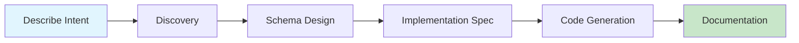

# Shogo AI

> AI-first app builder. Build anything with English.

A schema-first development platform where AI agents guide you from natural language intent to working applications. Describe what you need, iterate through conversation, and deploy—with schemas as the single source of truth throughout.

## Quick Start

### For App Builders

Use AI-powered skills to build applications through guided conversation:

1. Open an AI coding assistant in this repository
2. Describe what you want to build
3. Follow the 5-phase guided process

The system captures your intent, generates schemas, creates implementation specs, and produces TDD-ready code.

→ See the [App Builder Guide](docs/SKILL_USER_GUIDE.md)

### For Developers

**Prerequisites:**
- [Bun](https://bun.sh) — JavaScript runtime
- [Node.js](https://nodejs.org) — Required for npx
- [Google Chrome](https://www.google.com/chrome/) — Required for browser-based E2E testing

```bash
# Install dependencies
bun install

# Build all packages
bun run build

# Run tests
bun run test

# Start development mode
bun run dev
```

→ See [Getting Started](docs/GETTING_STARTED.md) and [Architecture](docs/ARCHITECTURE.md)

## The Pipeline



Each phase has a dedicated AI skill that captures structured output, enabling traceability from requirements to code.

## Why Shogo AI?

| Traditional Approach | Shogo AI |
|---------------------|----------|
| Code generators disconnect after generation | Schemas remain live, queryable, modifiable |
| Low-code platforms limit customization | Full code access, fully extensible |
| Separate tools for design, code, docs | Single pipeline from intent to deployment |
| Manual sync between spec and implementation | Schema is the source of truth |

**Core differentiators:**
- **Schemas as living entities** — not build artifacts, but runtime-queryable state
- **Isomorphic execution** — same models run on client, server, and edge
- **AI-native design** — agents use the same APIs as developers
- **Full provenance** — trace any code back to the requirement that created it

## Packages

| Package | Description |
|---------|-------------|
| [@shogo/state-api](packages/state-api) | Schema-to-MST transformation engine |
| [@shogo/mcp](packages/mcp) | MCP server with 16 tools for AI integration |
| [@shogo/web](apps/web) | React demo app showing integration patterns |

## Commands

| Command | Description |
|---------|-------------|
| `bun install` | Install all dependencies |
| `bun run build` | Build all packages |
| `bun run test` | Run all tests |
| `bun run dev` | Start development mode |
| `bun run typecheck` | Type check all packages |
| `bun run lint` | Lint all packages |

## How It Works

Shogo AI uses a **schema-first architecture** where Enhanced JSON Schemas drive everything:

```
Enhanced JSON Schema
        ↓
   MST Models (reactive state trees)
        ↓
   Runtime Stores (with persistence, validation)
        ↓
   UI Projections (forms, tables, views)
```

Schemas define entities, relationships, and constraints. The system generates MobX-State-Tree models with full type safety, then projects these into UI components. Changes to the schema automatically propagate through the entire stack.

## Documentation

### Concepts
- [Architecture](docs/ARCHITECTURE.md) — System design and patterns
- [Core Concepts](docs/CONCEPTS.md) — Key abstractions explained

### Guides
- [App Builder Guide](docs/SKILL_USER_GUIDE.md) — Using the 5-phase pipeline
- [Getting Started](docs/GETTING_STARTED.md) — Developer setup
- [Creating Schemas](docs/guides/CREATING_SCHEMAS.md) — Schema design patterns

### Reference
- [MCP Tools](docs/api/MCP_TOOLS.md) — All 16 tools documented
- [State API](docs/api/STATE_API.md) — Core library reference
- [Enhanced JSON Schema](docs/api/ENHANCED_JSON_SCHEMA.md) — Schema format spec

### Contributing
- [Contributing Guide](CONTRIBUTING.md) — How to contribute
- [Extending Shogo AI](docs/EXTENDING.md) — Adding new capabilities

## Project Structure

```
shogo-ai/
├── packages/
│   ├── state-api/     # Schema transformation engine
│   └── mcp/           # MCP server for AI integration
├── apps/
│   └── web/           # React demo application
├── .claude/
│   └── skills/        # AI skill definitions
├── .schemas/          # Persisted schema storage
└── docs/              # Documentation
```
