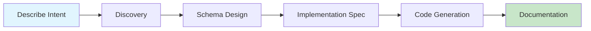

# Shogo AI

> AI-first app builder. Build anything with English.

A schema-first development platform where AI agents guide you from natural language intent to working applications. Describe what you need, iterate through conversation, and deploy—with schemas as the single source of truth throughout.

## Quick Start

### For App Builders

Use AI-powered skills to build applications through guided conversation:

1. Open an AI coding assistant in this repository
2. Describe what you want to build
3. Follow the 5-phase guided process

The system captures your intent, generates schemas, creates implementation specs, and produces TDD-ready code.

→ See the [App Builder Guide](docs/SKILL_USER_GUIDE.md)

### Local Development

**Prerequisites:**
- [Bun](https://bun.sh) — JavaScript runtime
- [Node.js](https://nodejs.org) — Required for npx/Expo CLI
- [Docker](https://www.docker.com/) — For infrastructure (Postgres, Redis, MinIO)

**1. Install dependencies and start infrastructure:**

```bash
bun install

# Start Docker infrastructure (Postgres, Redis, MinIO)
bun run docker:infra
```

**2. Run database migrations (first time only):**

```bash
bun run db:migrate:deploy
```

**3. Start all services:**

```bash
bun run dev:all
```

This starts three services concurrently:

| Service | Port | Description |
|---------|------|-------------|
| API Server | `localhost:8002` | Hono API, auth, chat proxy, agent runtimes |
| Web Frontend | `localhost:8081` | Expo web app (React Native for Web) |

Open **http://localhost:8081** in your browser.

Logs are written to `logs/api.log` and `logs/web.log` so you can `tail -f logs/api.log` to debug issues.

**Environment:** Copy `.env.local.template` to `.env.local` and fill in your API keys (at minimum `ANTHROPIC_API_KEY`). The dev server script will create a minimal `.env.local` for you if one doesn't exist.

#### Running Services Individually

If you prefer separate terminals:

```bash
bun run api:dev        # Terminal 1 — API server on :8002 (with --watch)
bun run web:dev        # Terminal 2 — Expo web on :8081
```

Or run just the backend (no frontend):

```bash
bun run dev:backend    # API only
```

#### Full Setup with Infrastructure

For a one-command start that also handles Docker and migrations:

```bash
bun run dev:start      # Starts Docker infra + app services
```

→ See [Getting Started](docs/GETTING_STARTED.md) and [Architecture](docs/ARCHITECTURE.md)

## The Pipeline



Each phase has a dedicated AI skill that captures structured output, enabling traceability from requirements to code.

## Why Shogo AI?

| Traditional Approach | Shogo AI |
|---------------------|----------|
| Code generators disconnect after generation | Schemas remain live, queryable, modifiable |
| Low-code platforms limit customization | Full code access, fully extensible |
| Separate tools for design, code, docs | Single pipeline from intent to deployment |
| Manual sync between spec and implementation | Schema is the source of truth |

**Core differentiators:**
- **Schemas as living entities** — not build artifacts, but runtime-queryable state
- **Isomorphic execution** — same models run on client, server, and edge
- **AI-native design** — agents use the same APIs as developers
- **Full provenance** — trace any code back to the requirement that created it

## Packages

| Package | Description |
|---------|-------------|
| [@shogo/state-api](packages/state-api) | Schema-to-MST transformation engine |
| [@shogo/agent-runtime](packages/agent-runtime) | Agent gateway, tools, Composio integrations |
| [@shogo/api](apps/api) | Hono API server, auth, chat proxy |
| [@shogo/mobile](apps/mobile) | Expo app (React Native for Web + iOS + Android) |
| [@shogo-ai/sdk](packages/sdk) | Published SDK for Shogo apps |

## Commands

### Development

| Command | Description |
|---------|-------------|
| `bun run dev:all` | Start API + Web concurrently |
| `bun run dev:backend` | Start API only (no frontend) |
| `bun run dev:start` | Full setup: Docker infra + app services |
| `bun run api:dev` | API server with hot reload (`:8002`) |
| `bun run web:dev` | Expo web frontend (`:8081`) |

### Infrastructure

| Command | Description |
|---------|-------------|
| `bun run docker:infra` | Start Postgres, Redis, MinIO containers |
| `bun run docker:infra:down` | Stop infrastructure containers |
| `bun run docker:infra:clean` | Stop and remove all volumes |
| `bun run db:migrate` | Run Prisma migrations (dev) |
| `bun run db:migrate:deploy` | Run Prisma migrations (deploy) |
| `bun run db:studio` | Open Prisma Studio |

### Build & Test

| Command | Description |
|---------|-------------|
| `bun install` | Install all dependencies |
| `bun run build` | Build all packages (Turbo) |
| `bun run test` | Run all tests |
| `bun run typecheck` | Type check all packages |
| `bun run lint` | Lint all packages |

## How It Works

Shogo AI uses a **schema-first architecture** where Enhanced JSON Schemas drive everything:

```
Enhanced JSON Schema
        ↓
   MST Models (reactive state trees)
        ↓
   Runtime Stores (with persistence, validation)
        ↓
   UI Projections (forms, tables, views)
```

Schemas define entities, relationships, and constraints. The system generates MobX-State-Tree models with full type safety, then projects these into UI components. Changes to the schema automatically propagate through the entire stack.

## Documentation

### Concepts
- [Architecture](docs/ARCHITECTURE.md) — System design and patterns
- [Core Concepts](docs/CONCEPTS.md) — Key abstractions explained

### Guides
- [App Builder Guide](docs/SKILL_USER_GUIDE.md) — Using the 5-phase pipeline
- [Getting Started](docs/GETTING_STARTED.md) — Developer setup
- [Creating Schemas](docs/guides/CREATING_SCHEMAS.md) — Schema design patterns

### Reference
- [State API](docs/api/STATE_API.md) — Core library reference
- [Enhanced JSON Schema](docs/api/ENHANCED_JSON_SCHEMA.md) — Schema format spec

### Contributing
- [Contributing Guide](CONTRIBUTING.md) — How to contribute
- [Extending Shogo AI](docs/EXTENDING.md) — Adding new capabilities

## Project Structure

```
shogo-ai/
├── apps/
│   ├── api/               # Hono API server (auth, chat, runtime management)
│   └── mobile/            # Expo app (web + iOS + Android)
├── packages/
│   ├── state-api/         # Schema-to-MST transformation engine
│   ├── agent-runtime/     # Agent gateway, tool system, Composio
│   ├── sdk/               # Published SDK (@shogo-ai/sdk)
│   ├── shared-app/        # Shared app logic (auth, chat, domain)
│   └── domain-store/      # Domain CRUD stores
├── prisma/                # Database schema & migrations
├── scripts/               # Dev scripts (docker, codegen)
├── workspaces/            # Agent runtime workspaces (gitignored)
└── docs/                  # Documentation
```
