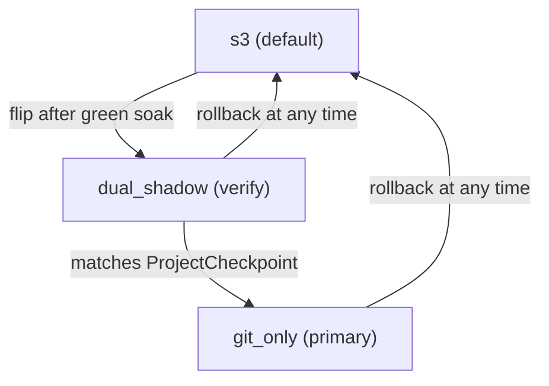

# Cloud pod sync architecture

How an agent-runtime pod keeps its workspace durable. This page is the
SRE / platform-engineering reference for the three sync modes
(`s3`, `dual_shadow`, `git_only`), the failure-isolation contract that
lets us flip projects between them safely, and the rollout playbook
for moving cohorts forward.

If you're looking for the user-facing pull / checkpoint story, see
[My Machines → Project pull](../features/my-machines/project-pull.md)
and [Checkpoints on the VPS](../features/my-machines/checkpoints-on-the-vps.md).

## What we're protecting

Two durability invariants must hold for every chat turn that writes
files:

1. **No data loss.** Whatever the agent wrote to disk has to land in
   durable storage before the pod can evict.
2. **Cold-start recoverability.** A fresh pod has to be able to bring
   up the same workspace bytes in under a couple of seconds, including
   `node_modules`.

The historical design did both of these via `S3Sync` (see
[packages/shared-runtime/src/s3-sync.ts](https://github.com/shogo-ai/shogo-ai/blob/main/packages/shared-runtime/src/s3-sync.ts))
with a two-layer tarball strategy:

| Layer | What it carries | Update cadence |
|---|---|---|
| Layer 1 | `node_modules/` (content-addressed by lockfile hash) | only on lockfile change |
| Layer 2 | source + dist + config (no `node_modules`) | every chat turn (~2–10 MB) |

Layer 2 is the part this work touches. The smart-HTTP git backend at
`/api/projects/:id/git/*` ([apps/api/src/routes/git-http.ts](https://github.com/shogo-ai/shogo-ai/blob/main/apps/api/src/routes/git-http.ts))
is a strictly better transport for "what changed in this turn" — pack
deltas, atomic refs, real history — and the post-receive hook already
writes `ProjectCheckpoint` rows authoritatively. But cold start still
needs the tarball.

## Three modes

`Project.cloudSyncMode` is a Postgres enum. Default `s3` keeps today's
behavior; the other two unlock the git-backed path.



### `s3` — today's behavior

`S3Sync` writes both layers. `apps/api/src/routes/project-chat.ts`
inserts `ProjectCheckpoint` rows directly. No git push from the pod.

This is the default for every existing row (the migration's
`DEFAULT 's3'`), so the rollout is a strict no-op for anything you
don't opt in.

### `dual_shadow` — verification

Both `S3Sync` and `GitWorkspaceSync` write on every turn. S3 stays
authoritative for reads (cold-start hydration). The post-receive hook
writes `ProjectCheckpoint` rows; `project-chat.ts`'s `createCheckpoint`
short-circuits via the existing `SHOGO_CLOUD_SYNC`-style guard so we
get exactly one row per turn (no duplicates).

This mode exists to compare git-side vs S3-side outcomes for a small
internal cohort before flipping to `git_only`. Doubles write traffic;
not a steady state. Keep cohorts ≤10 projects, ≤7 days.

### `git_only` — primary

`GitWorkspaceSync` is the per-turn writer. `S3Sync`:

- still runs **Layer 1** (`deps-<hash>.tar.gz`) unchanged
- stays **initialized** with `suppressProjectArchive=true` so Layer 2
  doesn't fire on every chat turn
- writes the **cold-start tarball** at evict via
  `flushAndShutdown({ forceProjectArchive: true })` or
  `snapshotProjectArchiveFromGit()` — whichever the runtime picks
  based on git's health

Critically, **S3 is not turned off** — it's armed for fallback. See
the next section.

## Failure isolation: S3 stays armed even in `git_only`

The safety invariant: *no chat turn should ever lose file state
because the git push path is unhealthy.*

`GitWorkspaceSync` tracks consecutive push failures. After
`degradeAfterFailures` in a row (default 3) it fires `onDegrade`,
which the agent-runtime wires to
`S3Sync.setSuppressProjectArchive(false)`. Layer 2 re-engages
immediately and the project is dual-written to S3 for the rest of the
pod's life. On the next successful push `onRecovered` fires and S3
Layer 2 returns to suppressed.

```mermaid
stateDiagram-v2
    [*] --> gitOnlyHealthy
    gitOnlyHealthy --> degraded: 3 consecutive push failures
    degraded --> gitOnlyHealthy: next successful push
    gitOnlyHealthy: GitWorkspaceSync writes; S3 Layer 2 suppressed
    degraded: GitWorkspaceSync keeps retrying; S3 Layer 2 re-enabled (dual write)
```

What this gets you:

- **Transient failures are invisible to the user.** A 60-second
  outage in the smart-HTTP backend doesn't block any chat turn — the
  3rd retry trips degrade and S3 starts writing in parallel.
- **The eviction snapshot is always produced.** If the pod gets
  SIGTERM during degraded state, we tar the live workspace
  (`forceProjectArchive: true`) instead of `git archive HEAD`, since
  HEAD may lag actual disk content.
- **Recovery is automatic.** The first successful push resets the
  counter, fires `onRecovered`, and we return to single-writer mode.

### What triggers a degrade

Anything that makes a `git push` exit non-zero, three times in a row:

- Network partition between pod and API
- API replica restart mid-deploy
- Smart-HTTP backend bug (e.g. a `git http-backend` regression)
- Auth rotation race (runtime token rotated but cache stale)
- Bare-repo lock contention (extreme rare)

These are all expected to be transient. If a project sits in
degraded mode across many pod lifetimes, see the runbook below.

### Observability

When the runtime transitions:

```
[agent-runtime] cloud-sync degraded (mode=git_only): fatal: unable to push
[S3Sync] suppressProjectArchive=false
```

Recovery:

```
[GitWorkspaceSync] recovered after push success — re-suppressing S3 Layer 2
[agent-runtime] cloud-sync recovered (mode=git_only)
[S3Sync] suppressProjectArchive=true
```

If you wire log-based metrics: count occurrences of
`cloud-sync degraded` per project. Spikes mean either a real git
backend regression or a per-project config issue (auth, runtime
token, etc.).

## The shutdown sequence

In `git_only` mode `gracefulShutdown` runs:

1. Drain in-flight streams (existing behavior).
2. `gitSyncInstance.flushAndShutdown(5_000)` — one last push.
   Succeeds → we exit degraded (if we were) → HEAD is authoritative.
   Fails → we stay degraded → live disk is authoritative.
3. If healthy `git_only`: `s3SyncInstance.snapshotProjectArchiveFromGit()`
   — tar `git archive HEAD`, upload to `project-src.tar.gz`. No
   `node_modules`, no junk.
4. Else (degraded git_only, dual_shadow, or s3):
   `s3SyncInstance.flushAndShutdown({ timeoutMs: 10_000, forceProjectArchive: <bool> })`
   where `forceProjectArchive=true` in `git_only` so the snapshot is
   guaranteed to land even when Layer 2 was suppressed all session.

Either way the cold-start tarball is always written; only the source
differs.

## Rollout playbook

Default `s3` everywhere. Roll forward project-by-project / cohort-by-cohort.

### Phase 1 — soak `dual_shadow` (week 1)

- Pick 3–5 internal projects.
- `UPDATE projects SET "cloudSyncMode" = 'dual_shadow' WHERE id IN (...)`.
- Verify in Postgres each turn produces:
  - one `ProjectCheckpoint` row (post-receive hook),
  - matching `s3://.../project-src.tar.gz` heads (HEAD object on S3),
  - no duplicates from `project-chat.ts` (the `workerOwnsSync` guard).
- Watch logs for `cloud-sync degraded` lines. Any occurrence in this
  phase is a bug — git should always succeed when S3 succeeds. Fix
  before promoting any project.

Parity query:

```sql
-- Per chat turn, expect exactly one ProjectCheckpoint row, regardless of mode.
SELECT
  p."id", p."cloudSyncMode",
  count(c.id) AS checkpoints_last_24h
FROM projects p
LEFT JOIN project_checkpoints c
  ON c."projectId" = p.id
  AND c."createdAt" > now() - interval '24 hours'
WHERE p."cloudSyncMode" IN ('dual_shadow', 'git_only')
GROUP BY p.id
ORDER BY checkpoints_last_24h DESC;
```

### Phase 2 — flip to `git_only` (week 2)

- For each project that ran clean in `dual_shadow`:
  `UPDATE projects SET "cloudSyncMode" = 'git_only' WHERE id = '...'`.
- Verify the next pod restart for that project boots in
  `cloudSyncMode=git_only` (env contains `SHOGO_CLOUD_SYNC_MODE=git_only`).
- Watch the same `cloud-sync degraded` log for ~24 hours.

### Phase 3 — expand the cohort (weeks 3+)

- Move next batch of internal projects to `dual_shadow`, repeat.
- When the internal cohort has soaked for two weeks with zero
  degrades, batch-flip via a backfill script. Default for new
  projects can flip later still.

### Rolling back

`UPDATE projects SET "cloudSyncMode" = 's3' WHERE id = '...'`. Takes
effect on the next pod assignment for that project (env is rebuilt by
`buildProjectEnv`). No data migration needed — both layers are still
intact in S3.

### When to manually flip a project back from `git_only` → `dual_shadow`

If you see persistent degradation for a single project (i.e. the
`cloud-sync degraded` warning fires across multiple pod lifetimes),
the most likely causes are:

- Auth: a stale or mis-rotated `RUNTIME_AUTH_SECRET`.
- Workspace: a corrupted local `.git/` directory in the workspace dir.
- Backend: a bug in `apps/api/src/routes/git-http.ts` that's specific
  to this project's repo state (e.g. a malformed ref).

Move the project back to `dual_shadow` while you investigate. S3 will
be authoritative again immediately; git keeps pushing in the
background and you can fix the underlying issue without users
noticing.

## Implementation map

| Concern | File |
|---|---|
| Cloud-pod git writer | [packages/shared-runtime/src/git-sync.ts](https://github.com/shogo-ai/shogo-ai/blob/main/packages/shared-runtime/src/git-sync.ts) |
| S3Sync suppress flag + git snapshot | [packages/shared-runtime/src/s3-sync.ts](https://github.com/shogo-ai/shogo-ai/blob/main/packages/shared-runtime/src/s3-sync.ts) |
| Mode resolution | `resolveCloudSyncMode` in `git-sync.ts` |
| Runtime wiring | [packages/agent-runtime/src/server.ts](https://github.com/shogo-ai/shogo-ai/blob/main/packages/agent-runtime/src/server.ts) |
| Env injection | [apps/api/src/lib/runtime/build-project-env.ts](https://github.com/shogo-ai/shogo-ai/blob/main/apps/api/src/lib/runtime/build-project-env.ts) |
| Smart-HTTP backend | [apps/api/src/routes/git-http.ts](https://github.com/shogo-ai/shogo-ai/blob/main/apps/api/src/routes/git-http.ts) |
| Schema | `Project.cloudSyncMode` + `CloudSyncMode` enum in `prisma/schema.prisma` |
