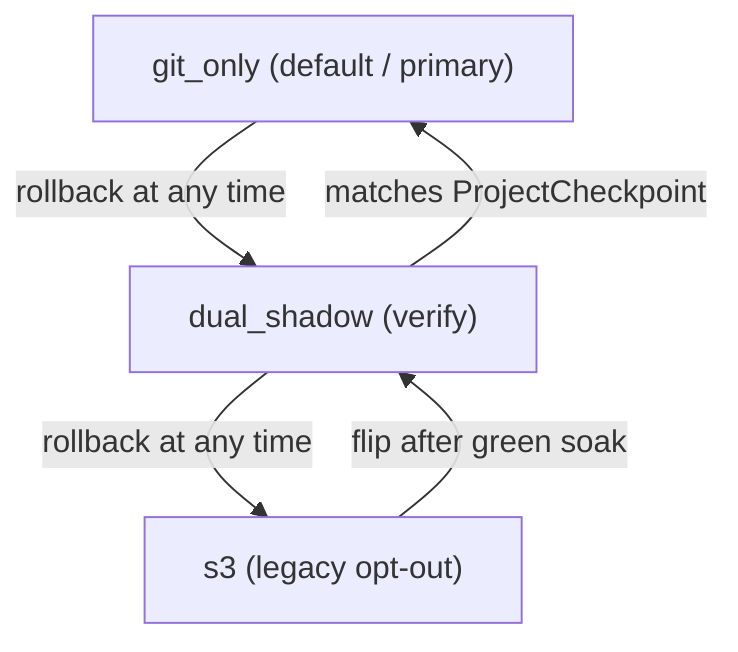
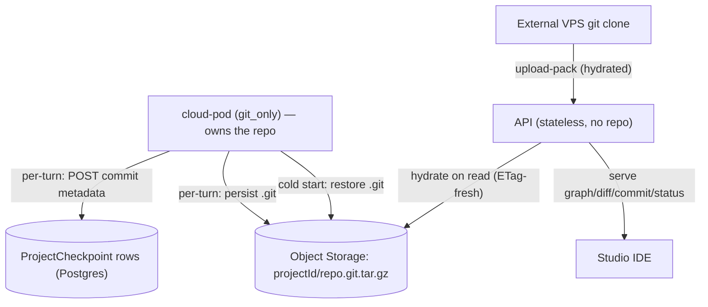

# Cloud pod sync architecture

How an agent-runtime pod keeps its workspace durable. This page is the
SRE / platform-engineering reference for the three sync modes
(`s3`, `dual_shadow`, `git_only`), the failure-isolation contract that
lets us flip projects between them safely, and the rollout playbook
for moving cohorts forward.

:::info Default is now `git_only` (pod-owned)
As of the durable-cloud-git work, **`git_only` is the default** for all
projects, and the model is **pod-owned**: the agent-runtime pod owns the
project's git repo (working tree + `.git` in `WORKSPACE_DIR`) and is the
sole writer. Durability is the pod's job — it persists its own `.git` to
object storage (`<projectId>/repo.git.tar.gz`) every turn and restores it
on cold start. After each commit the pod records the `ProjectCheckpoint`
row via a runtime-authed internal API endpoint. The API holds **no repo
of its own**: it hydrates the pod-persisted `.git` on demand (with an ETag
freshness check) only to serve reads — the commit graph / diff / commit /
status endpoints, and the external VPS `git clone`. Publishes are recorded
as annotated git tags created by the pod. `s3` is an explicit opt-out for
legacy/debug only.

Why pod-owned: the checkpoint graph, diff and rollback are only ever
viewed in Studio while the project is open — i.e. while the pod is up. The
pod already has the authoritative repo at that moment, so there's no need
for the API to be a durable git *origin*; it only needs a cheap, fresh
read cache hydrated from the pod's durable object. The pod is up when you
write **and** when you read.

The old default (`s3`) never produced checkpoints in the cloud at all:
the auto-checkpoint in `project-chat.ts` ran on the **API** pod against
`WORKSPACES_DIR/<id>`, a path that only exists on the **runtime** pod, so
`existsSync(workspacePath)` was always false and the insert silently
no-op'd. Staging confirmed 632 projects / 0 checkpoints. Recording rows
from the pod (which actually has the repo) is what fixes this.
:::

If you're looking for the user-facing pull / checkpoint story, see
[My Machines → Project pull](../features/my-machines/project-pull.md)
and [Checkpoints on the VPS](../features/my-machines/checkpoints-on-the-vps.md).

## What we're protecting

Two durability invariants must hold for every chat turn that writes
files:

1. **No data loss.** Whatever the agent wrote to disk has to land in
   durable storage before the pod can evict.
2. **Cold-start recoverability.** A fresh pod has to be able to bring
   up the same workspace bytes in under a couple of seconds, including
   `node_modules`.

The historical design did both of these via `S3Sync` (see
[packages/shared-runtime/src/s3-sync.ts](https://github.com/shogo-ai/shogo-ai/blob/main/packages/shared-runtime/src/s3-sync.ts))
with a two-layer tarball strategy:

| Layer | What it carries | Update cadence |
|---|---|---|
| Layer 1 | `node_modules/` (content-addressed by lockfile hash) | only on lockfile change |
| Layer 2 | source + dist + config (no `node_modules`) | every chat turn (~2–10 MB) |

Layer 2 is the part this work touches. In the pod-owned `git_only` model
the per-turn durable artifact is the project's `.git` itself, persisted to
object storage by the pod (`<projectId>/repo.git.tar.gz`) — full history,
not just the latest tree. Layer 1 (deps) is unchanged. The smart-HTTP git
backend at `/api/projects/:id/git/*`
([apps/api/src/routes/git-http.ts](https://github.com/shogo-ai/shogo-ai/blob/main/apps/api/src/routes/git-http.ts))
remains, but only to serve the external VPS `git clone`/pull (it hydrates
the pod-persisted `.git` on demand); it is no longer the per-turn write
path.

## Three modes

`Project.cloudSyncMode` is a Postgres enum. Default is now `git_only`;
`dual_shadow` is the verification cohort and `s3` is the legacy opt-out.



### `git_only` — default / primary (pod-owned)

See the dedicated section below. The pod owns the repo: `GitWorkspaceSync`
commits **locally** per turn, then `afterCommit` persists `.git` to object
storage and records the `ProjectCheckpoint` row via the internal API
endpoint. No per-turn push to the API. S3 stays armed as a fallback.

### `s3` — legacy opt-out

`S3Sync` writes both layers and `apps/api/src/routes/project-chat.ts`
attempts to insert `ProjectCheckpoint` rows directly. **In the cloud
topology this never produced checkpoints** (the API pod has no
workspace fs — see the warning at the top). Retained only for local
dev parity and as a debug escape hatch; new and backfilled cloud
projects are `git_only`.

### `dual_shadow` — verification

Both `S3Sync` and `GitWorkspaceSync` write on every turn. S3 stays
authoritative for reads (cold-start hydration). The post-receive hook
writes `ProjectCheckpoint` rows; `project-chat.ts`'s `createCheckpoint`
short-circuits via the existing `SHOGO_CLOUD_SYNC`-style guard so we
get exactly one row per turn (no duplicates).

This mode exists to compare git-side vs S3-side outcomes for a small
internal cohort before flipping to `git_only`. Doubles write traffic;
not a steady state. Keep cohorts ≤10 projects, ≤7 days.

### `git_only` — primary (pod-owned)

`GitWorkspaceSync` runs in `localOnly` mode: each turn it stages, commits
locally, then invokes `afterCommit(sha)` →
`persistAndRecordCheckpoint` in
[server.ts](https://github.com/shogo-ai/shogo-ai/blob/main/packages/agent-runtime/src/server.ts),
which (1) persists `.git` to `<projectId>/repo.git.tar.gz` and (2) POSTs
the commit metadata to the internal record endpoint. `S3Sync`:

- still runs **Layer 1** (`deps-<hash>.tar.gz`) unchanged
- stays **initialized** with `suppressProjectArchive=true` so Layer 2
  doesn't fire on every chat turn
- writes the **cold-start tarball** at evict via
  `flushAndShutdown({ forceProjectArchive: true })` or
  `snapshotProjectArchiveFromGit()` — whichever the runtime picks
  based on git's health

Critically, **S3 is not turned off** — it's armed for fallback. See
the next section.

## Failure isolation: S3 stays armed even in `git_only`

The safety invariant: *no chat turn should ever lose file state
because the durable git path is unhealthy.*

`GitWorkspaceSync` tracks consecutive durability failures. In `git_only`
the durability step is `afterCommit` (persist `.git` to object storage);
in `dual_shadow` it's the push. Either way, after `degradeAfterFailures`
in a row (default 3) it fires `onDegrade`, which the agent-runtime wires
to `S3Sync.setSuppressProjectArchive(false)`. Layer 2 re-engages
immediately and the project is dual-written to S3 for the rest of the
pod's life. On the next success `onRecovered` fires and S3 Layer 2
returns to suppressed. (A checkpoint-row POST failure does **not** trip
degrade — the commit is already durable in the persisted `.git`; the row
is reconciled on the next API read-hydrate.)

```mermaid
stateDiagram-v2
    [*] --> gitOnlyHealthy
    gitOnlyHealthy --> degraded: 3 consecutive push failures
    degraded --> gitOnlyHealthy: next successful push
    gitOnlyHealthy: GitWorkspaceSync writes; S3 Layer 2 suppressed
    degraded: GitWorkspaceSync keeps retrying; S3 Layer 2 re-enabled (dual write)
```

What this gets you:

- **Transient failures are invisible to the user.** A 60-second
  outage in the smart-HTTP backend doesn't block any chat turn — the
  3rd retry trips degrade and S3 starts writing in parallel.
- **The eviction snapshot is always produced.** If the pod gets
  SIGTERM during degraded state, we tar the live workspace
  (`forceProjectArchive: true`) instead of `git archive HEAD`, since
  HEAD may lag actual disk content.
- **Recovery is automatic.** The first successful push resets the
  counter, fires `onRecovered`, and we return to single-writer mode.

### What triggers a degrade

Anything that makes a `git push` exit non-zero, three times in a row:

- Network partition between pod and API
- API replica restart mid-deploy
- Smart-HTTP backend bug (e.g. a `git http-backend` regression)
- Auth rotation race (runtime token rotated but cache stale)
- Bare-repo lock contention (extreme rare)

These are all expected to be transient. If a project sits in
degraded mode across many pod lifetimes, see the runbook below.

### Observability

When the runtime transitions:

```
[agent-runtime] cloud-sync degraded (mode=git_only): fatal: unable to push
[S3Sync] suppressProjectArchive=false
```

Recovery:

```
[GitWorkspaceSync] recovered after push success — re-suppressing S3 Layer 2
[agent-runtime] cloud-sync recovered (mode=git_only)
[S3Sync] suppressProjectArchive=true
```

If you wire log-based metrics: count occurrences of
`cloud-sync degraded` per project. Spikes mean either a real git
backend regression or a per-project config issue (auth, runtime
token, etc.).

## Durable git repo store (object storage)

The repo lives on the **pod**, and the pod owns its durability. A project
is pinned to a single runtime pod at a time, so there's exactly one
writer (no Redis lock needed). The pod persists `.git` to the same
object-storage bucket it already uses (`S3_WORKSPACES_BUCKET`) under
`<projectId>/repo.git.tar.gz`, and restores it on cold start.

Pod side —
[packages/shared-runtime/src/repo-store.ts](https://github.com/shogo-ai/shogo-ai/blob/main/packages/shared-runtime/src/repo-store.ts):

- `persistRepoToStore(workspaceDir, cfg)` — tar just `.git` (source-only,
  so it stays small) and PUT it. Called from `afterCommit` each turn, on
  `/agent/git-flush`, and at shutdown.
- `restoreRepoFromStore(workspaceDir, cfg)` — download + extract + `git
  reset --hard HEAD` on cold start. No-op when `.git` is already local.
- `seedRepoIfAbsent(workspaceDir)` — `git init` + initial commit from the
  on-disk tree when no durable object exists yet (brand-new / legacy
  `s3`-mode migration).

API side (hydrate-only) —
[apps/api/src/services/git-repo-store.ts](https://github.com/shogo-ai/shogo-ai/blob/main/apps/api/src/services/git-repo-store.ts):

- `hydrateRepo(projectId, workspacePath)` — downloads + extracts the
  **pod-persisted** `.git` to serve reads. It keeps a per-pod ETag cache
  and re-hydrates only when the durable object's ETag changes (a HEAD
  probe per read; full download only when the repo actually advanced), so
  a warm API pod never serves a stale graph. It **never persists** — that
  would clobber the authoritative pod-owned object.

The read endpoints in
[checkpoints.ts](https://github.com/shogo-ai/shogo-ai/blob/main/apps/api/src/routes/checkpoints.ts)
(graph / commit / diff / status) call a `withHydratedRepo` guard. The
smart-HTTP backend
([git-http.ts](https://github.com/shogo-ai/shogo-ai/blob/main/apps/api/src/routes/git-http.ts))
also hydrates before serving `git-upload-pack` (the external VPS pull).
Its `git-receive-pack` path (VPS push-back) still writes a
`ProjectCheckpoint` row for visibility but deliberately does **not**
persist — that's not a durability path in the pod-owned model.



## Pod-side git lifecycle (cold start)

A cold pod restores deps from S3 but has no `.git`. Before
`GitWorkspaceSync` can run, `initializeEssentials` reconciles the repo
from the pod's durable object store:

- **`git_only` (pod-owned)** — `restoreRepoFromStore` downloads + extracts
  `.git` and `reset --hard HEAD` (untracked / gitignored offloaded assets
  are preserved). If no durable object exists, `seedRepoIfAbsent` does a
  `git init` + initial commit from the on-disk tree and persists it — the
  migration path for legacy `s3`-mode projects with no git history yet.
  Then `restoreLargeFiles` repopulates the offloaded assets.
- **`dual_shadow`** — still uses `ensureWorkspaceRepo`
  ([packages/shared-runtime/src/git-bootstrap.ts](https://github.com/shogo-ai/shogo-ai/blob/main/packages/shared-runtime/src/git-bootstrap.ts))
  to fetch/seed against the API origin (the legacy push model is the
  durability path in that mode).

## Large / binary file offload (hybrid)

Git stays small by keeping only text/source. There are two strategies; which
one runs depends on `LFS_ENABLED`.

### Git LFS (`LFS_ENABLED=true`, `git_only` only) — versioned

Real Git LFS replaces the legacy offload
([packages/shared-runtime/src/lfs.ts](https://github.com/shogo-ai/shogo-ai/blob/main/packages/shared-runtime/src/lfs.ts)):

- On repo setup the pod writes a curated `.gitattributes` (`filter=lfs` for
  images/video/archives/model weights/…) and `git lfs install --local
  --skip-smudge`. Before each `git add -A`, any file `> LARGE_FILE_BYTES`
  (default 5 MB) not already matched is `git lfs track`-ed, preserving the
  old "anything large" behavior.
- The LFS **clean filter** commits a tiny pointer blob into the tree (so the
  file **is** versioned and shows in the git graph/diff) and stores the bytes
  in a local cache. After the commit, `git lfs push` uploads the bytes to the
  API **batch endpoint** ([apps/api/src/routes/git-lfs.ts](https://github.com/shogo-ai/shogo-ai/blob/main/apps/api/src/routes/git-lfs.ts)),
  which mints **presigned OCI URLs** so bytes flow pod→OCI directly under
  `<projectId>/lfs/objects/<oid>` (content-addressed sha256 → free dedup).
- `persistRepoToStore` then excludes `.git/lfs/objects` from the `.git`
  tarball (only when the push succeeded — otherwise the bytes stay in the
  tarball as a fallback). On cold start, after `.git` is restored, `git lfs
  pull` materializes the object bytes (smudge is skipped on checkout for
  speed). The **API hydrate path has no git-lfs**, so its `reset --hard`
  intentionally leaves pointer files — the graph still lists the files.
- Auth: every `git lfs` call passes the runtime bearer via
  `-c http.extraHeader` and the endpoint via `-c lfs.url`, so neither the
  token nor an env-specific URL is ever persisted into `.git/config`.
  External (laptop/CI) git-lfs clients are out of scope (no Basic→token).
- Projects on the legacy offload migrate lazily on pod start
  (`migrateOffloadedAssetsToLfs`): the managed `.git/info/exclude` block is
  cleared and the restored assets are LFS-tracked; the next sync commits the
  pointers and pushes the bytes. **GC:** LFS objects are immutable and never
  auto-pruned, so a reachability-based retention job is a required follow-up.

### Legacy size-based offload (default / non-LFS) — latest-only

Any file `> LARGE_FILE_BYTES` is classified as an offloaded asset
([packages/shared-runtime/src/large-file-sync.ts](https://github.com/shogo-ai/shogo-ai/blob/main/packages/shared-runtime/src/large-file-sync.ts)):

- git-excluded via `.git/info/exclude` (never touches the user's
  `.gitignore`) so `git add -A` never stages it,
- uploaded per-file to `<projectId>/assets/<relpath>` in object storage
  on each turn-complete and at shutdown (with prune of removed files),
- restored into the working tree on cold start alongside the git
  bootstrap.

Semantics (intentional, matches the old S3 tar): offloaded files are
**latest-only** and don't appear in the git graph/diff. Checkpoints and
publish tags pin the *source* commit; the asset snapshot is whatever
object storage holds.

## Publish as a git tag

Publishing
([apps/api/src/routes/publish.ts](https://github.com/shogo-ai/shogo-ai/blob/main/apps/api/src/routes/publish.ts))
records the deployed commit as an immutable annotated tag instead of the
old (broken) auto-checkpoint. Since the pod owns the repo, the tag is
created **on the pod**:

1. API `POST /agent/git-flush` with `{ tag: 'publish/<subdomain>/<unix-ts>',
   tagMessage }`.
2. Pod: flush large files, awaited `GitWorkspaceSync.flush()` (commit +
   persist), then `createTagLocal(...)` and re-persist `.git` (now carrying
   the tag). Returns the tagged sha.
3. API records `Project.publishedCommitSha` + `publishedTag` for the
   publish panel. The tag shows up in the graph on the API's next
   read-hydrate (ETag advanced); the graph surfaces `publish/*` tags as a
   "Published" badge.

## The shutdown sequence

In `git_only` mode `gracefulShutdown` runs:

1. Drain in-flight streams (existing behavior).
2. `gitSyncInstance.flushAndShutdown(5_000)` — one last push.
   Succeeds → we exit degraded (if we were) → HEAD is authoritative.
   Fails → we stay degraded → live disk is authoritative.
3. If healthy `git_only`: `s3SyncInstance.snapshotProjectArchiveFromGit()`
   — tar `git archive HEAD`, upload to `project-src.tar.gz`. No
   `node_modules`, no junk.
4. Else (degraded git_only, dual_shadow, or s3):
   `s3SyncInstance.flushAndShutdown({ timeoutMs: 10_000, forceProjectArchive: <bool> })`
   where `forceProjectArchive=true` in `git_only` so the snapshot is
   guaranteed to land even when Layer 2 was suppressed all session.

Either way the cold-start tarball is always written; only the source
differs.

## Rollout playbook

The safe sequence toward the now-default `git_only` is below. The
default flip + backfill (Phase 3) ships in
`prisma/migrations/20260603000000_default_git_only_and_publish_commit`
and **must deploy together with** the pod-side durable store
(persist/restore/seed), local-only commit + checkpoint recording,
large-file offload, the internal record endpoint, and the API
hydrate-only read-guard — otherwise a `git_only` project lands on a pod
with no durable path.
If you need to stage the rollout more conservatively, hold that
migration and drive cohorts manually via the phases below first.

### Phase 1 — soak `dual_shadow` (week 1)

- Pick 3–5 internal projects.
- `UPDATE projects SET "cloudSyncMode" = 'dual_shadow' WHERE id IN (...)`.
- Verify in Postgres each turn produces:
  - one `ProjectCheckpoint` row (post-receive hook in `dual_shadow`; the
    pod's internal record endpoint in `git_only`),
  - matching `s3://.../project-src.tar.gz` heads (HEAD object on S3),
  - no duplicates from `project-chat.ts` (the `workerOwnsSync` guard).
- Watch logs for `cloud-sync degraded` lines. Any occurrence in this
  phase is a bug — git should always succeed when S3 succeeds. Fix
  before promoting any project.

Parity query:

```sql
-- Per chat turn, expect exactly one ProjectCheckpoint row, regardless of mode.
SELECT
  p."id", p."cloudSyncMode",
  count(c.id) AS checkpoints_last_24h
FROM projects p
LEFT JOIN project_checkpoints c
  ON c."projectId" = p.id
  AND c."createdAt" > now() - interval '24 hours'
WHERE p."cloudSyncMode" IN ('dual_shadow', 'git_only')
GROUP BY p.id
ORDER BY checkpoints_last_24h DESC;
```

### Phase 2 — flip to `git_only` (week 2)

- For each project that ran clean in `dual_shadow`:
  `UPDATE projects SET "cloudSyncMode" = 'git_only' WHERE id = '...'`.
- Verify the next pod restart for that project boots in
  `cloudSyncMode=git_only` (env contains `SHOGO_CLOUD_SYNC_MODE=git_only`).
- Watch the same `cloud-sync degraded` log for ~24 hours.

### Phase 3 — flip the default + backfill (shipped)

- Verify the durable repo persists/hydrates across an API redeploy and
  that graph/diff/rollback + publish tags work after the redeploy for
  the soaked cohort.
- Deploy `20260603000000_default_git_only_and_publish_commit`: it sets
  `cloudSyncMode DEFAULT 'git_only'` and backfills
  `UPDATE projects SET "cloudSyncMode"='git_only' WHERE "cloudSyncMode"='s3'`.
  `dual_shadow` rows are left untouched.
- Legacy projects seed their durable repo on the next cold start
  (`seedRepoIfAbsent` → `persistRepoToStore`), so the backfill is safe
  without a data migration of git objects.

### Rolling back

`UPDATE projects SET "cloudSyncMode" = 's3' WHERE id = '...'`. Takes
effect on the next pod assignment for that project (env is rebuilt by
`buildProjectEnv`). No data migration needed — both layers are still
intact in S3.

### When to manually flip a project back from `git_only` → `dual_shadow`

If you see persistent degradation for a single project (i.e. the
`cloud-sync degraded` warning fires across multiple pod lifetimes),
the most likely causes are:

- Object storage: persistent failures PUT-ing `<projectId>/repo.git.tar.gz`
  (bucket perms, credentials, endpoint).
- Workspace: a corrupted local `.git/` directory in the workspace dir.
- Auth: a stale or mis-rotated `RUNTIME_AUTH_SECRET` (affects the
  checkpoint-record POST and the external VPS pull).

Move the project back to `dual_shadow` while you investigate. S3 will
be authoritative again immediately; git keeps pushing in the
background and you can fix the underlying issue without users
noticing.

## Implementation map

| Concern | File |
|---|---|
| Cloud-pod git writer (`localOnly` + `afterCommit` + `flush()`) | [packages/shared-runtime/src/git-sync.ts](https://github.com/shogo-ai/shogo-ai/blob/main/packages/shared-runtime/src/git-sync.ts) |
| Pod durable repo store (persist/restore/seed/tag) | [packages/shared-runtime/src/repo-store.ts](https://github.com/shogo-ai/shogo-ai/blob/main/packages/shared-runtime/src/repo-store.ts) |
| Pod commit-metadata gathering | [packages/shared-runtime/src/checkpoint-record.ts](https://github.com/shogo-ai/shogo-ai/blob/main/packages/shared-runtime/src/checkpoint-record.ts) |
| Cold-start bootstrap / seed (`dual_shadow`) | [packages/shared-runtime/src/git-bootstrap.ts](https://github.com/shogo-ai/shogo-ai/blob/main/packages/shared-runtime/src/git-bootstrap.ts) |
| Large/binary file offload (legacy, latest-only) | [packages/shared-runtime/src/large-file-sync.ts](https://github.com/shogo-ai/shogo-ai/blob/main/packages/shared-runtime/src/large-file-sync.ts) |
| Git LFS pod ops (track/push/pull/migrate) | [packages/shared-runtime/src/lfs.ts](https://github.com/shogo-ai/shogo-ai/blob/main/packages/shared-runtime/src/lfs.ts) |
| Git LFS batch + verify API (presigned OCI) | [apps/api/src/routes/git-lfs.ts](https://github.com/shogo-ai/shogo-ai/blob/main/apps/api/src/routes/git-lfs.ts) |
| API repo store (hydrate-only, ETag-fresh) | [apps/api/src/services/git-repo-store.ts](https://github.com/shogo-ai/shogo-ai/blob/main/apps/api/src/services/git-repo-store.ts) |
| Internal checkpoint-record endpoint | [apps/api/src/routes/internal.ts](https://github.com/shogo-ai/shogo-ai/blob/main/apps/api/src/routes/internal.ts) (`POST /internal/projects/:id/checkpoints/record`) |
| Pod → API record POST | `postCheckpointRecord` in [packages/agent-runtime/src/internal-api.ts](https://github.com/shogo-ai/shogo-ai/blob/main/packages/agent-runtime/src/internal-api.ts) |
| S3Sync suppress flag + git snapshot | [packages/shared-runtime/src/s3-sync.ts](https://github.com/shogo-ai/shogo-ai/blob/main/packages/shared-runtime/src/s3-sync.ts) |
| Mode resolution (default `git_only`) | `resolveCloudSyncMode` in `git-sync.ts` |
| Runtime wiring + `/agent/git-flush` (commit/tag/persist) | [packages/agent-runtime/src/server.ts](https://github.com/shogo-ai/shogo-ai/blob/main/packages/agent-runtime/src/server.ts) |
| Env injection | [apps/api/src/lib/runtime/build-project-env.ts](https://github.com/shogo-ai/shogo-ai/blob/main/apps/api/src/lib/runtime/build-project-env.ts) |
| Smart-HTTP backend (hydrate for VPS pull) | [apps/api/src/routes/git-http.ts](https://github.com/shogo-ai/shogo-ai/blob/main/apps/api/src/routes/git-http.ts) |
| Publish-as-tag (pod-created) | [apps/api/src/routes/publish.ts](https://github.com/shogo-ai/shogo-ai/blob/main/apps/api/src/routes/publish.ts) + `repo-store.createTagLocal` |
| Schema | `Project.cloudSyncMode` (default `git_only`), `publishedCommitSha`/`publishedTag` in `prisma/schema.prisma` |
