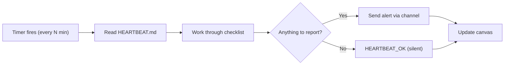

# How the Heartbeat Works

The heartbeat is what makes an agent **proactive**. Without it, an agent only responds when you message it. With it, the agent wakes up on a schedule, reads its checklist, and takes action — sending alerts, refreshing dashboards, checking APIs, or delivering briefings — all without you asking.

## The basic cycle

Every N seconds (configurable — 30 minutes by default), the agent:

1. Wakes up and reads `HEARTBEAT.md`
2. Works through each item in the checklist
3. Sends alerts via connected channels if anything needs attention
4. Updates the canvas dashboard with fresh data
5. Responds `HEARTBEAT_OK` internally if nothing needs attention (no message sent)

If `HEARTBEAT.md` is empty or missing, the heartbeat tick is skipped entirely — no tokens consumed.



## HEARTBEAT.md format

`HEARTBEAT.md` is a plain Markdown checklist in your agent's workspace. Each item is a task the agent executes on every tick.

```markdown
# Heartbeat Checklist

## Every heartbeat
- Check https://api.myapp.com/health — alert if non-200
- Scan GitHub repo acme/api for new issues labeled "critical"
- Alert immediately on any CI failures on the main branch

## Daily at 9am
- Summarize yesterday's GitHub activity (open PRs, merged, new issues)
- Check Stripe for any failed payments in the last 24 hours
- Send morning digest to Slack #engineering

## Weekly on Monday
- Review all open PRs older than 3 days and flag for attention
```

### What to put in it

- **System checks** — URLs to ping, APIs to query, log files to scan
- **Notification rules** — what counts as urgent, what gets batched
- **Periodic digests** — daily summaries, weekly reports
- **Behavioral hints** — "only alert if 3+ failures in a row", "batch non-critical alerts"

### Keep it focused

Every heartbeat reads the entire file. Shorter checklists are faster and cheaper. Group time-sensitive checks at the top and periodic summaries at the bottom.

:::tip
The agent can update `HEARTBEAT.md` on your behalf. Just say: _"Update the heartbeat to also check disk usage on my server"_ and it will edit the file.
:::

## Intervals

Each template sets a default interval chosen for that use case. You can adjust anytime through chat.

| Template | Default interval | Why |
|----------|-----------------|-----|
| Incident Commander | 10 minutes | Service health needs fast response |
| GitHub Ops | 15 minutes | CI results and PR alerts |
| Support Desk | 30 minutes | Ticket triage cadence |
| Research Assistant | 60 minutes | Web research can be slower |
| Revenue Tracker | 24 hours | Daily financials are sufficient |

For from-scratch agents, the heartbeat starts disabled. Ask the AI to enable it:

> "Enable the heartbeat and check our API health every 15 minutes."

## Quiet hours

Quiet hours pause non-urgent heartbeat messages during a defined window. By default: **11pm–7am UTC**.

The agent still runs its checklist during quiet hours — it just holds non-critical alerts until the window ends. Urgent alerts (like a complete service outage) break through quiet hours.

Configure quiet hours through chat:

> "Set quiet hours to midnight–8am in US Eastern time."

## The `HEARTBEAT_OK` contract

When the agent finds nothing to report, it responds internally with `HEARTBEAT_OK`. This is stripped before delivery — you never see it. It simply means: _"I checked everything; nothing needs your attention."_

When something does need attention, the agent sends the alert text to your connected channel (Slack, Telegram, Discord, etc.) and omits `HEARTBEAT_OK`.

## Cost awareness

Heartbeats run full agent turns — they consume credits. A few guidelines:

- **Longer intervals cost less.** Every tick consumes tokens. Going from 15-minute to 30-minute intervals roughly halves heartbeat costs.
- **Shorter HEARTBEAT.md costs less.** More items = more context = more tokens per tick.
- **Use `HEARTBEAT_OK`** — when the checklist finds nothing, the response is short. Don't add unnecessary tasks that always produce output.

For agents where cost matters more than latency (like daily financial summaries), use a long interval (1–24 hours). For agents monitoring live systems, shorter intervals are worth the cost.

## Triggering manually

You can fire an immediate heartbeat tick at any time through chat:

> "Trigger the heartbeat now."

Useful for testing your checklist or getting an immediate status check without waiting for the next scheduled tick.

## Enabling and disabling

The heartbeat can be turned on or off without losing its configuration.

> "Pause the heartbeat while I'm on vacation."

> "Re-enable the heartbeat."

Your `HEARTBEAT.md` and settings are preserved — only the tick timer is paused.

## Related

- [Workspace Files](/concepts/workspace-files) — the full list of workspace Markdown files
- [Canvas](/concepts/canvas) — how the agent updates the visual dashboard each tick
- [Channels](/getting-started/quick-start#step-5-connect-tools-and-channels) — where heartbeat alerts are delivered
