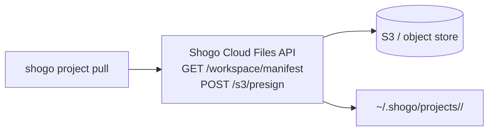

# `shogo project pull` and auto-pull

When you pin a project to a paired machine (Studio → Channels → **Run on**, or
`client.machines.pinProject()` from the SDK), external traffic for that project
is relayed through that machine's outbound tunnel. But "relayed" only covers
the request itself — the agent on the machine still needs the project's
workspace files (skills, plans, `config.json`, `AGENTS.md`, custom code).

`shogo project pull` is the single command that clones a project's workspace
from Shogo Cloud onto your paired machine. The `shogo worker` does this
automatically on first request by default, but you can also run it manually
when you want a local copy ahead of time.

## TL;DR

```bash
# One-time setup
shogo login                              # pair this machine with cloud
shogo runtime install                    # download the agent-runtime

# Manual clone (creates ~/.shogo/projects/<projectId>/)
shogo project pull <projectId>

# Or rely on auto-pull — start the worker and the first inbound
# request triggers the clone.
shogo worker start
```

## How it works

Workspace files for every Shogo project live in cloud-side S3, behind the
**Files API** at `https://api.shogo.ai/api/projects/<id>/...`. `shogo project
pull` walks the project's manifest via:

```
GET    /api/projects/:id/workspace/manifest      ← list every file in the project
POST   /api/projects/:id/s3/presign              ← batch read URLs
```

then downloads each file in parallel using your paired machine's
`shogo_sk_*` API key. No AWS credentials are exchanged with your machine — the
cloud mints short-lived presigned URLs per request, and they're scoped to your
workspace.



The same code path drives the worker's **auto-pull**: when an inbound request
(a pinned webhook, a Jira ticket, a chat message) arrives for a project the
worker hasn't seen before, it pulls the workspace into
`~/.shogo/projects/<id>/` and then spawns the `agent-runtime` against that
directory.

## Manual pull / push

### Pull

```bash
shogo project pull <projectId>
shogo project pull <projectId> --into ./myproj      # custom destination
shogo project pull <projectId> --include "src/**,*.md"   # filter
shogo project pull <projectId> --watch              # pull + live bidirectional sync
```

`--watch` keeps a Node `fs.watch` running over the destination directory and
pushes any local edits back to cloud via `PUT /api/projects/:id/files/...`
(debounced 1.5s). Use this when you want to edit files locally with your
editor of choice and have those changes show up in Studio.

The pull is atomic: files land in `<dest>.shogo-pull-tmp/` first and rename
over the target on success, so a Ctrl-C mid-pull never leaves a half-populated
workspace.

### Push

```bash
shogo project push <projectId>
shogo project push <projectId> --from ./myproj
shogo project push <projectId> --delete-remote   # mirror local deletions (DESTRUCTIVE)
```

`shogo project push` uploads everything under the source directory back to
cloud. By default it only adds/updates files; `--delete-remote` makes it a
strict mirror — any file present in cloud but absent locally is deleted.

## Auto-pull (default for `cli_worker` instances)

`shogo worker start` enables auto-pull by default. When a tunneled request for
project `<id>` arrives:

1. If `~/.shogo/projects/<id>/` is empty, the worker calls the same
   `CloudFileTransport.downloadAll()` the CLI uses.
2. It starts a {@link CloudSyncWatcher} on that directory so writes made by
   the local `agent-runtime` (channel config edits, skill writes, etc.) sync
   back to cloud automatically.
3. It then spawns the `agent-runtime` with `PROJECT_DIR=<that dir>` and
   `SHOGO_CLOUD_SYNC=1`. The latter tells the runtime to skip its own
   built-in S3Sync — the worker already owns sync, and running both would
   double-upload.

If the cloud is unreachable when the request arrives, auto-pull fails
**softly**: the runtime still starts with an empty workspace and falls back to
template defaults. The next request retries the pull.

### Disabling auto-pull

For users who manage their workspaces externally (git-backed projects, NFS
mounts, etc.), pass `--no-auto-pull`:

```bash
shogo worker start --no-auto-pull --worker-dir /path/to/my/repo
```

The worker will still route tunneled traffic — it just won't try to clone
anything.

### Changing the projects directory

```bash
shogo worker start --projects-dir /mnt/big-disk/shogo
# or persist it:
shogo config set projectsDir /mnt/big-disk/shogo
```

## SDK equivalent

`client.projects.pull/push` does the same thing programmatically. Useful when
you're scripting CI or building a custom dashboard:

```ts
import { createClient } from '@shogo-ai/sdk'

const shogo = createClient({
  apiUrl: 'https://api.shogo.ai',
  shogoApiKey: process.env.SHOGO_API_KEY,
})

await shogo.projects.pull('proj_abc123', {
  into: './staging-snapshot',
  include: ['src/**', 'AGENTS.md', 'config.json'],
  onProgress: ({ kind, path, index, total }) => {
    console.log(`[${kind}] ${index + 1}/${total} ${path}`)
  },
})

// edit some files locally...

await shogo.projects.push('proj_abc123', {
  from: './staging-snapshot',
  deleteRemote: false,
})
```

The SDK accepts an injected `fetch` and `fs` adapter so you can pull inside an
edge function, a browser sandbox, or a unit test.

## Troubleshooting

**"No API key configured"** — the CLI couldn't find a `shogo_sk_*` key. Run
`shogo login` again or set `SHOGO_API_KEY=...` in your shell.

**"manifest_failed: HTTP 403"** — the API key doesn't have access to that
project. Check it's the right workspace key and the project hasn't been moved.

**"Pull aborted with N errors"** — at least one file failed to download. The
staging directory at `<dest>.shogo-pull-tmp/` is left intact so you can
inspect; once you've fixed the underlying issue, just rerun `shogo project
pull`.

**Auto-pull never fires** — confirm `shogo worker status` shows the worker is
running, and that the project is pinned to this machine in Studio. The pull
only triggers on the first **tunneled** request; chat requests that go to a
cloud pod won't kick it off.

## Sensitive files

The cloud Files API refuses to expose paths matching `.env*`, `*.pem`,
`*.key`, `id_rsa*`, or `credentials*`. They're stripped from the manifest and
`DELETE` is forbidden. Keep secrets in environment variables on each machine,
not in the project workspace.
