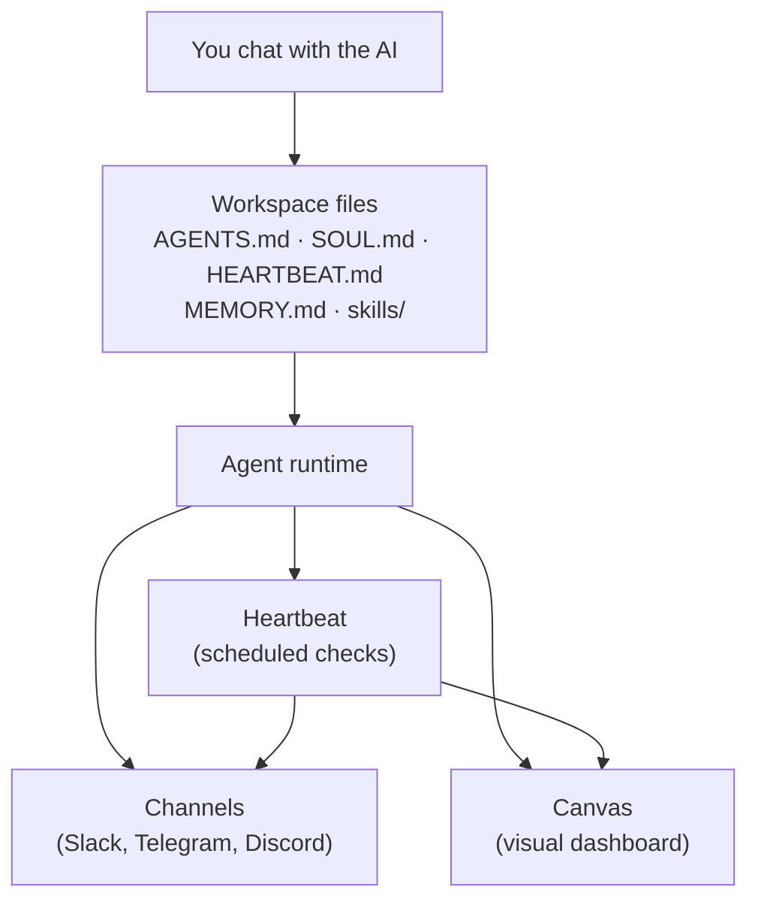

# Welcome to Shogo

**Shogo is an AI-powered platform for building autonomous AI agents through conversation. Describe what you want your agent to do, and Shogo handles the rest.**

You chat with an AI assistant to configure your agent's identity, skills, memory, and integrations. Your agent runs as a long-lived process that can monitor systems, process messages, execute scheduled tasks, and display results on a visual canvas.

## Why use Shogo?

### Build agents by chatting

Describe your agent's purpose in everyday language. Shogo configures the identity, skills, heartbeat schedule, and connected tools for you.

### Agents that act on their own

Your agent doesn't just respond to messages — it proactively checks for work on a schedule using the heartbeat system. Monitor repos, triage tickets, send daily briefings, and more.

### Connect to 250+ tools

Integrate with GitHub, Slack, Stripe, Google Calendar, Zendesk, Linear, Sentry, and hundreds more via Composio. Connect tools through the **Capabilities** panel with OAuth or API keys.

### Start from templates

Choose from 8 purpose-built agent templates — a research assistant, GitHub ops monitor, support desk, and more — so you don't have to start from scratch.

### Visual dashboards on canvas

Your agent builds canvas dashboards with metrics, charts, tables, and status indicators to present information clearly.

## Who is Shogo for?

**Developers and engineering teams** — Monitor CI/CD, triage PRs, track incidents, and automate DevOps workflows.

**Founders and operators** — Track revenue, manage support tickets, prepare for meetings, and stay on top of projects.

**Researchers and analysts** — Monitor topics across the web, synthesize findings, and get daily briefings.

**Anyone who wants a personal AI assistant** — Track habits, manage reminders, and get proactive daily check-ins.

## What can you build?

- **Monitoring agents** — Service health checks, CI status, GitHub repo watching
- **Support agents** — Ticket triage, SLA tracking, escalation alerts
- **Research agents** — Web research, topic tracking, daily digests
- **Project management agents** — Sprint boards, velocity tracking, standup collection
- **Financial agents** — Revenue dashboards, invoice management, payment alerts
- **Personal productivity agents** — Habit tracking, reminders, meeting prep

## How Shogo works

1. **Describe** what kind of agent you want, or pick a template
2. **Configure** your agent's skills, heartbeat, and connected tools through chat
3. **Connect** channels like Slack, Telegram, or Discord via the **Channels** panel
4. **Enable** the heartbeat so your agent checks for work on a schedule
5. **Iterate** — refine your agent's behavior anytime by chatting

### Under the hood

When you chat with your agent, the AI reads and writes a set of [workspace files](/concepts/workspace-files) — Markdown files that define the agent's identity, behavior rules, memory, heartbeat checklist, and skills. The agent runtime reads these files and runs accordingly.

The chat configures the workspace files. The runtime acts on them.

---

**Ready to get started?** Head to the [Quick Start guide](./quick-start) to create your first agent in minutes.
