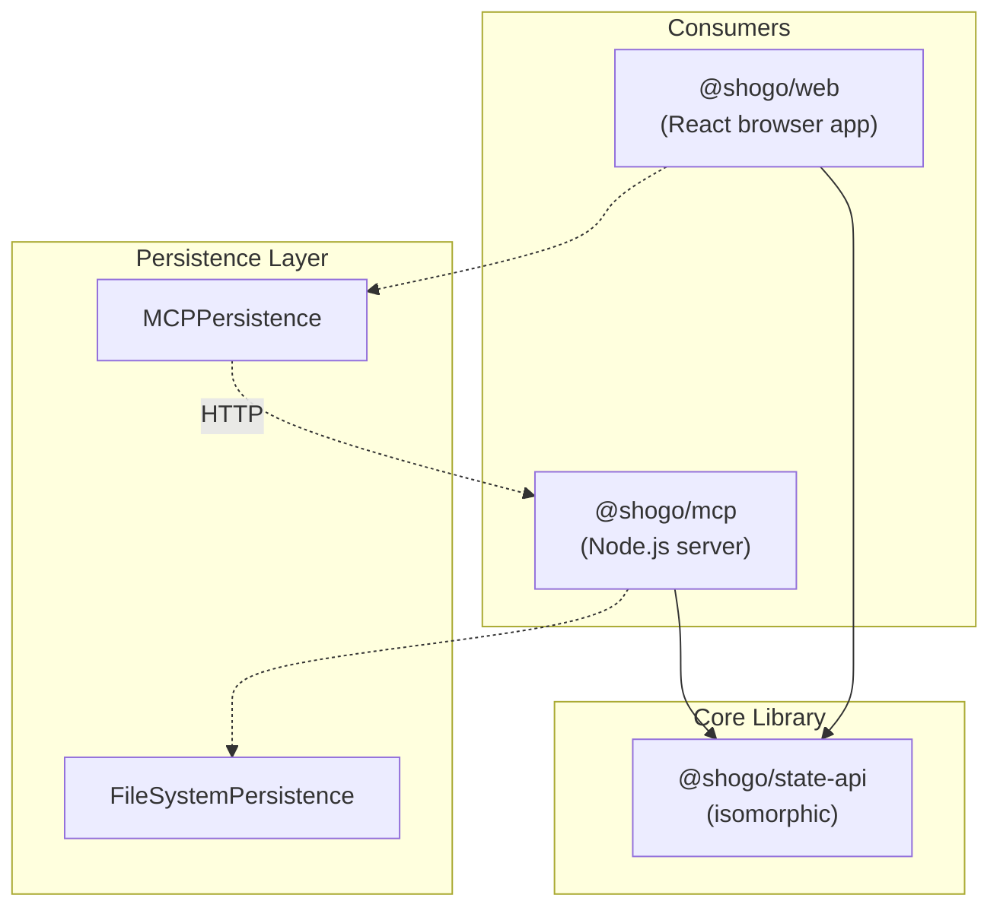
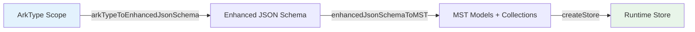
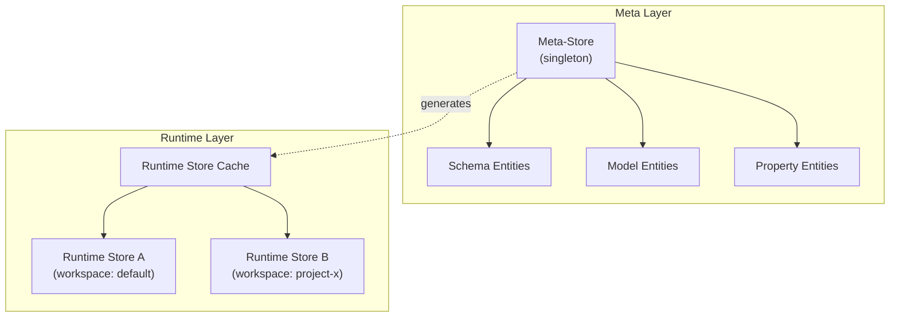

# Architecture

Shogo AI is a schema-first reactive state management system. You define schemas using ArkType or Enhanced JSON Schema, and the system generates fully-typed MobX-State-Tree models with persistence, validation, and CRUD operations. The same code runs isomorphically on Node.js servers, in browsers, and inside Sandpack virtual environments.

## Package Structure



**@shogo/state-api** is the standalone core with no runtime dependencies on mcp or web. It provides schema transformation, meta-store management, and persistence abstractions.

**@shogo/mcp** wraps state-api in a FastMCP server, exposing 16 tools for AI agents. Uses `FileSystemPersistence` to write schemas and data to `.schemas/`.

**@shogo/web** is a React application demonstrating three integration patterns. Uses `MCPPersistence` to bridge browser state to the MCP server via HTTP.

## Transformation Pipeline

Schemas flow through a three-stage pipeline to become reactive stores:



### Stage 1: ArkType → Enhanced JSON Schema

`arkTypeToEnhancedJsonSchema(scope)` converts ArkType definitions to JSON Schema with metadata extensions:

- `x-original-name` — Preserves model names for MST generation
- `x-reference-type` — "single" or "array" for relationship cardinality
- `x-mst-type` — "identifier", "reference", or "maybe-reference"
- `x-computed` — Marks inverse relationship arrays (auto-calculated)

### Stage 2: Enhanced JSON Schema → MST

`enhancedJsonSchemaToMST(schema, options)` generates MobX-State-Tree models:

- Each `$defs` entry becomes an MST model with typed properties
- References become `types.reference()` or `types.array(types.reference())`
- Collections wrap models in maps with `add()`, `get()`, `has()`, `all()` methods
- Returns `{ models, collectionModels, RootStoreModel, createStore }`

### Stage 3: Store Creation

`createStore(environment)` instantiates the root store with injected services:

```typescript
const store = createStore({
  services: { persistence: new FileSystemPersistence() },
  context: { schemaName: 'my-app', location: '.schemas' }
})
```

## Two-Layer Store Architecture

The system uses two distinct store layers:



**Meta-Store** — A singleton MST store that manages schema definitions as queryable entities. When you call `schema.set`, the meta-store ingests the schema and tracks its models and properties. Access via `getMetaStore()`.

**Runtime Stores** — Dynamically-generated MST stores for actual application data. Each schema can have multiple runtime stores, keyed by workspace. Access via `getRuntimeStore(schemaId, location)`.

### Key Functions

```typescript
// Meta-store access
import { getMetaStore, createMetaStoreInstance } from '@shogo/state-api'
const metaStore = getMetaStore()  // singleton
const isolated = createMetaStoreInstance(env)  // for testing

// Runtime store cache
import { getRuntimeStore, cacheRuntimeStore } from '@shogo/state-api'
cacheRuntimeStore(schemaId, store, location)
const store = getRuntimeStore(schemaId, location)
```

## Isomorphic Execution

The same state-api code runs in three environments with different persistence adapters:

| Environment | Persistence | Data Location |
|-------------|-------------|---------------|
| Node.js (MCP server) | `FileSystemPersistence` | `.schemas/{name}/` on disk |
| Browser (React) | `MCPPersistence` | HTTP calls to MCP server |
| Sandpack | `MCPPersistence` | HTTP calls (same as browser) |

### Browser Integration

The web app loads all 32 state-api TypeScript files into Sandpack's virtual filesystem using Vite `?raw` imports. This enables the full transformation pipeline to run in the browser:

```typescript
// Unit 2 Demo: Complete pipeline in browser
import schematicIndex from '@shogo/state-api/src/schematic/index.ts?raw'
// ... 31 more files

const sandpackFiles = {
  '/src/schematic/index.ts': schematicIndex,
  // Maps workspace package to /src paths
}
```

The `MCPPersistence` adapter implements `IPersistenceService` by calling MCP tools over HTTP:

```typescript
class MCPPersistence implements IPersistenceService {
  async loadCollection(ctx) {
    return this.mcp.callTool('store.query', {
      schema: ctx.schemaName,
      model: ctx.modelName
    })
  }

  async saveEntity(ctx, snapshot) {
    return this.mcp.callTool('store.update', {
      schema: ctx.schemaName,
      model: ctx.modelName,
      id: ctx.entityId,
      changes: snapshot
    })
  }
}
```

## Environment Injection

Services are injected at store creation, not imported directly. This enables the same model code to work with different backends:

```typescript
// Define environment interface
interface IEnvironment {
  services: {
    persistence: IPersistenceService
  }
  context: {
    schemaName: string
    location?: string
  }
}

// Inject at creation
const store = RootStoreModel.create({}, {
  services: { persistence: new FileSystemPersistence() },
  context: { schemaName: 'my-app' }
})

// Access in models via getEnv()
.actions(self => ({
  async save() {
    const env = getEnv<IEnvironment>(self)
    await env.services.persistence.saveEntity(...)
  }
}))
```

### CollectionPersistable Mixin

All collections automatically receive persistence methods via MST composition:

```typescript
const CollectionPersistable = types.model()
  .actions(self => ({
    async loadAll() { /* loads from persistence */ },
    async loadById(id) { /* loads single entity */ },
    async saveAll() { /* persists entire collection */ },
    async saveOne(id) { /* persists single entity */ }
  }))
```

## MCP Tool Integration

The MCP server consumes state-api through a consistent pattern:

```typescript
// 1. Access meta-store
const metaStore = getMetaStore()

// 2. Ingest schema (creates meta-entities + caches runtime store)
metaStore.ingestEnhancedJsonSchema(schema)

// 3. Get runtime store for operations
const store = getRuntimeStore(schemaId, workspace)

// 4. Perform CRUD on collections
const entity = store.userCollection.add({ name: 'Alice' })
await store.userCollection.saveOne(entity.id)
```

### Tool Namespaces

| Namespace | Tools | Purpose |
|-----------|-------|---------|
| `schema.*` | set, get, load, list | Schema management |
| `store.*` | models, create, get, list, update | Entity CRUD |
| `view.*` | execute, define, delete, project | Query & templates |
| `data.*` | load, loadAll | Bulk data loading |
| `agent.*` | chat | Conversational interface |

## File Organization

```
packages/state-api/src/
├── schematic/          # Transformation pipeline
│   ├── index.ts        # createStoreFromScope entry point
│   ├── arktype-to-json-schema.ts
│   └── enhanced-json-schema-to-mst.ts
├── meta/               # Meta-store system
│   ├── bootstrap.ts    # getMetaStore, runtime cache
│   ├── meta-store.ts   # Store factory
│   └── meta-registry.ts # Schema for meta-entities
├── persistence/        # Storage adapters
│   ├── filesystem.ts   # Node.js file I/O
│   └── null.ts         # In-memory (testing)
├── composition/        # MST mixins
│   └── persistable.ts  # CollectionPersistable
└── environment/        # DI types
    └── types.ts        # IEnvironment interfaces

packages/mcp/src/
├── server.ts           # FastMCP entry point
└── tools/              # 16 tool implementations
    ├── registry.ts     # Tool registration
    ├── schema.set.ts
    └── ...

apps/web/src/
├── contexts/           # React providers
│   ├── WavesmithStoreContext.tsx
│   └── WavesmithMetaStoreContext.tsx
├── persistence/
│   └── MCPPersistence.ts  # Browser HTTP adapter
└── components/
    └── Unit2_WavesmithMetaSystem/  # Sandpack demo
```

## See Also

- [Core Concepts](CONCEPTS.md) — Key abstractions explained
- [MCP Tools Reference](api/MCP_TOOLS.md) — All 16 tools documented
- [State API Reference](api/STATE_API.md) — Function signatures and types
- [Enhanced JSON Schema](api/ENHANCED_JSON_SCHEMA.md) — Schema format specification
