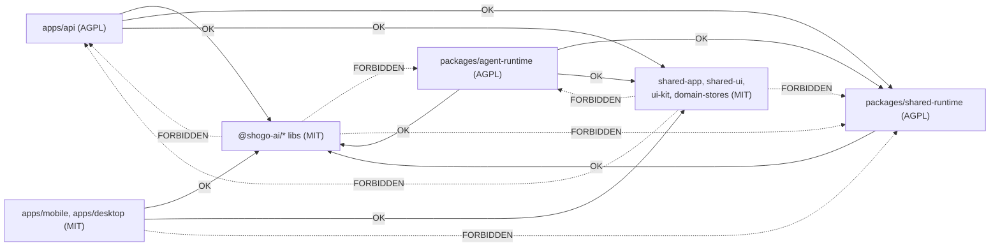

# Licensing Strategy

Shogo AI uses a deliberate split-license model. AGPL-3.0-or-later guards the
pieces a competitor would need to ship a hosted clone; everything else
(libraries, clients, scaffolding) is MIT so adoption is friction-free.

This document explains the model, the per-directory map, the compatibility
rules our CI enforces, and why we chose AGPL over alternatives like
FSL/BSL.

## Goal

The license layout is designed to do two things at once:

1. **Stop cloud resellers from running a hosted Shogo clone proprietarily.**
   The server-side, "if you change it and host it as a service, you must
   share your changes" guarantee comes from AGPL-3.0-or-later on the
   minimum surface needed to run Shogo Cloud (`apps/api/`,
   `packages/agent-runtime/`, `packages/shared-runtime/`).
2. **Keep adoption friction at zero for everything else.** Library code
   (`@shogo-ai/*`), the Expo / Electron clients, and the shared UI / domain
   layers are MIT. Pulling them into a downstream product never invokes
   AGPL.

We want AGPL to act as a moat against **resellers**, not a moat against
**developers**. The only people the license should slow down are those
trying to run modified Shogo as their own SaaS without contributing
changes back.

### What AGPL does and doesn't do

- AGPL **does** require anyone hosting a *modified* version of an AGPL
  package as a network service to publish their modifications under
  AGPL.
- AGPL **does not** forbid running unmodified Shogo as a service. It
  also does not forbid commercial use, internal use, or single-company
  self-hosting.

That's why our realistic moat is **AGPL + Trademark + proprietary hosting
infrastructure**:

- AGPL covers code modifications.
- [TRADEMARK.md](../TRADEMARK.md) covers the "Shogo" brand layer.
- [INFRASTRUCTURE-LICENSE.md](../INFRASTRUCTURE-LICENSE.md) keeps
  `terraform/`, `k8s/`, `deploy-examples/`, and `.github/workflows/`
  proprietary.

Together those three layers, not AGPL alone, make a hostile fork
expensive.

## License tiers

| Tier | Path | License | Why |
|------|------|---------|-----|
| AGPL moat | `apps/api/` | AGPL-3.0-or-later | Cloud API + auth + billing + AI proxy. Anyone reselling Shogo Cloud runs this. |
| AGPL moat | `packages/agent-runtime/` | AGPL-3.0-or-later | Agent gateway, tool execution, preview manager, security policy. Anyone hosting Shogo runtimes uses this. |
| AGPL moat | `packages/shared-runtime/` | AGPL-3.0-or-later | Server-side glue (s3-sync, server-framework, AI proxy/client shims) consumed only by `apps/api/` and `packages/agent-runtime/`. Stays AGPL with the rest of the runtime stack until it's fully shimmed out. |
| MIT libraries (npm) | `packages/sdk/`, `packages/core/`, `packages/agent/`, `packages/db/`, `packages/email/`, `packages/voice/`, `packages/cli/` | MIT | Library code, max adoption. Published in lockstep on the `sdk-v*` tag. |
| MIT libraries (npm) | `packages/shogo-worker/` (`@shogo-ai/worker`) | MIT | Self-host CLI worker (`shogo-worker login` and runtime install). |
| MIT shim (workspace) | `packages/model-catalog/` (`@shogo/model-catalog`) | MIT | Thin re-export shim around `@shogo-ai/sdk/model-catalog`. Imported by the MIT mobile client; tracks the license of the underlying MIT code it forwards. |
| MIT clients | `apps/mobile/` | MIT | Expo client. Brand surface, not moat. |
| MIT clients | `apps/desktop/` | MIT | Local desktop wrapper. |
| MIT shared layers | `packages/shared-app/` | MIT | Domain logic shared between mobile and api. |
| MIT shared layers | `packages/shared-ui/` | MIT | Cross-platform UI primitives and screens. |
| MIT shared layers | `packages/ui-kit/` | MIT | Theme + routing helpers. |
| MIT shared layers | `packages/domain-stores/` | MIT | MobX stores generated from Prisma. |
| MIT scaffolding | `templates/runtime-template/` | MIT | Project template. |
| Documentation | `apps/docs/`, `docs/` | CC BY 4.0 | Documentation. |
| Proprietary infra | `terraform/`, `k8s/`, `deploy-examples/`, `.github/workflows/` | INFRASTRUCTURE-LICENSE | Hosting infra is an additional moat layer. |

The "delete test" sanity-checks each tier:

- Delete `apps/api/` -> no Shogo Cloud. AGPL is correct.
- Delete `packages/agent-runtime/` -> no agent execution. AGPL is correct.
- Delete `packages/shared-ui/` -> trivial to recreate. MIT is correct.
- Delete `apps/mobile/` -> Shogo still works headlessly via the API. The
  mobile app is the brand surface, not the product. MIT is correct.

## Compatibility rules

Two simple rules govern what depends on what:

1. **AGPL packages may depend on MIT packages.** Always fine. AGPL's
   copyleft is one-way: bringing in MIT code into an AGPL codebase is
   permitted by both licenses.
2. **MIT packages must not depend on AGPL packages.** A `dependencies`
   entry, `import`, or `require()` from an MIT-licensed file into an
   AGPL package would create a license leak: anyone consuming the MIT
   package would, transitively, be subject to AGPL terms. CI rejects
   this.

These rules are enforced bidirectionally by
[`packages/sdk/scripts/verify-license-isolation.mjs`](../packages/sdk/scripts/verify-license-isolation.mjs):

- Forward direction: every published `@shogo-ai/*` package is scanned
  for `import`/`require`/`dependencies` references to AGPL workspace
  packages (`@shogo/api`, `@shogo/agent-runtime`,
  `@shogo/shared-runtime`).
- Reverse direction: every newly-MIT directory (`apps/mobile/`,
  `apps/desktop/`, `packages/shared-app/`, `packages/shared-ui/`,
  `packages/ui-kit/`, `packages/domain-stores/`) is scanned for the
  same references. Same rule, same script.

Run locally:

```bash
bun run --filter @shogo-ai/sdk verify:license-isolation
```

The check runs in CI on every PR.



## How the moat actually works

A practical scenario: someone wants to run a "Cloud Lite" service backed
by Shogo.

1. They fork the repo and modify `apps/api/` to add their own billing or
   authentication. AGPL kicks in: any user of their hosted service has
   the right to receive their modified source code.
2. They build a mobile or web client on top of the MIT
   `apps/mobile/` or `@shogo-ai/sdk` to reach those users. That part is
   theirs to keep proprietary if they want — MIT.
3. They cannot brand their product "Shogo" or use Shogo logos. That's
   blocked by the trademark, not by AGPL.
4. They cannot copy our hosting stack (`terraform/`, `k8s/`,
   `deploy-examples/`). That's proprietary under
   `INFRASTRUCTURE-LICENSE.md`.

Net effect: the path of least resistance for a hostile fork is to
contribute upstream, run a non-Shogo-branded fork, or pay for a
commercial license — all of which are outcomes we're happy with.

## Why not FSL or BSL?

Functional Source License (FSL) and Business Source License (BSL) are
attractive for SaaS projects because they explicitly forbid competitive
hosting for a window of years before flipping to an open license.

We chose AGPL because:

- AGPL is **OSI-approved**. FSL/BSL are not. That matters for
  organizations with policies that require OSI-approved open-source
  dependencies.
- AGPL is **older and better understood**. Legal departments have
  precedent. FSL/BSL are still gaining adoption.
- AGPL's reach is **already enough**, in combination with the
  Trademark and Infrastructure layers, to disincentivize the cloud
  reseller scenario.

We may revisit this — either by re-licensing AGPL packages to FSL/BSL,
or by switching the entire repo, or by adding a license exception that
permits non-commercial mirrors. None of that is in scope right now.
Everything below is the v1 model.

## Per-directory map

The same information rendered as a directory tree (handy for grep
searches):

```
apps/
  api/                       AGPL-3.0-or-later
  desktop/                   MIT
  docs/                      CC BY 4.0
  mobile/                    MIT
docs/                        CC BY 4.0
packages/
  agent/                     MIT (npm: @shogo-ai/agent)
  agent-runtime/             AGPL-3.0-or-later
  cli/                       MIT (npm: @shogo-ai/cli)
  core/                      MIT (npm: @shogo-ai/core)
  db/                        MIT (npm: @shogo-ai/db)
  domain-stores/             MIT
  email/                     MIT (npm: @shogo-ai/email)
  model-catalog/             MIT (workspace: @shogo/model-catalog, shim)
  sdk/                       MIT (npm: @shogo-ai/sdk)
  shared-app/                MIT
  shared-runtime/            AGPL-3.0-or-later
  shared-ui/                 MIT
  shogo-worker/              MIT (npm: @shogo-ai/worker)
  ui-kit/                    MIT
  voice/                     MIT (npm: @shogo-ai/voice)
templates/
  runtime-template/          MIT
terraform/                   INFRASTRUCTURE-LICENSE
k8s/                         INFRASTRUCTURE-LICENSE
deploy-examples/             INFRASTRUCTURE-LICENSE
.github/workflows/           INFRASTRUCTURE-LICENSE
```

Each directory has either its own `LICENSE` file or inherits from the
top-level `LICENSE` (AGPL) and is overridden by SPDX headers and
`package.json#license` declarations.

## Brand and trademark

AGPL alone is not the moat. The brand layer matters at least as much.
[TRADEMARK.md](../TRADEMARK.md) covers Shogo, the Shogo logo, and
related marks. A fork is welcome to ship under its own name and brand;
it is not welcome to ship as "Shogo". This is what stops a
"`shogo.com.example`" knockoff site even when AGPL would otherwise
permit it.

## Contributor licensing

Contributors agree to [CLA.md](../CLA.md). Section 2 grants Shogo
Technologies the right to relicense contributions, which means future
license changes (e.g. flipping more directories to MIT, or moving to a
different copyleft) do not require chasing past contributors for
consent.

## Changelog

- **2026-05** — v1: split-license map established. AGPL retained on
  `apps/api/`, `packages/agent-runtime/`, and `packages/shared-runtime/`
  as the cloud-resale moat. `apps/mobile/`, `apps/desktop/`,
  `packages/shared-app/`, `packages/shared-ui/`, `packages/ui-kit/`,
  `packages/domain-stores/`, and the thin shim `packages/model-catalog/`
  flipped from AGPL to MIT. `verify-license-isolation.mjs` extended with
  the bidirectional check.
