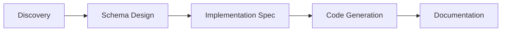

# App Builder User Guide

This guide walks you through using the 5-phase AI skill pipeline to build applications from natural language descriptions. You describe what you need, and the skills guide you through structured discovery, schema design, implementation planning, code generation, and documentation.

## Who This Is For

App builders who have a problem to solve but don't want to write everything from scratch. You provide the problem and examples; the pipeline produces structured requirements, schemas, and TDD-ready code.

**Prerequisites**: Claude Code environment with Wavesmith MCP configured.

## Pipeline Overview



| Phase | What You Provide | What You Get |
|-------|------------------|--------------|
| Discovery | Problem, pain points, example files | Requirements, solution proposal |
| Schema Design | Approval of domain model | Entity schema with relationships |
| Implementation Spec | Approval of modules/interfaces | Function contracts, test specs |
| Code Generation | Target language confirmation | Python project with stubs and tests |
| Documentation | Doc type selection | Architecture guides, API reference |

Each skill builds on the previous phase's output. Everything is stored in Wavesmith and remains queryable throughout.

---

## Phase 1: Discovery

**When to use**: Starting a new project from a problem statement.

**Trigger phrases**:
- "I have a problem..." / "I need to build..."
- "Help me design..." / "Let's start a new project"

### What You Provide

- **Problem description** — What you're trying to solve and why
- **Pain points** — Current frustrations with existing approaches
- **Desired outcome** — What success looks like
- **Artifacts** — Example files, templates, wireframes, existing schemas

### What You Get

| Entity | Description |
|--------|-------------|
| ProblemStatement | Your problem with pain points and desired outcome |
| Artifact | Each uploaded file with domain-adaptive tags |
| Analysis | Findings from artifact analysis with complexity rating |
| Requirement | Derived requirements with acceptance criteria |
| SolutionProposal | Implementation phases with deliverables |

### Workflow

1. **Problem Capture** — Describe what you need and why
2. **Artifact Collection** — Upload relevant files and examples
3. **Analysis** — AI analyzes complexity (low/medium/high)
4. **Requirements Elicitation** — Requirements derived from analysis
5. **Solution Proposal** — Phased implementation plan presented

### Tips

- Provide concrete examples when possible
- Be specific about what's painful with current approaches
- Describe your desired outcome in measurable terms

---

## Phase 2: Schema Design

**When to use**: After discovery is complete and approved.

**Trigger phrases**:
- "Design the schema for..." / "Create the domain model..."
- "Generate schema from discovery..."

### What You Provide

- Completed discovery session (loaded automatically)
- Answers to clarifying questions about entities
- Approval of conceptual model before schema generation

### What You Get

| Output | Description |
|--------|-------------|
| Enhanced JSON Schema | Entity definitions with types and constraints |
| Relationships | Composition and reference links between entities |
| Field constraints | Required fields, enums, validation rules |
| Coverage report | Requirements mapped to schema elements |

### Workflow

1. **Context Loading** — Load discovery session
2. **Domain Model Design** — Define entities, relationships, constraints
3. **Schema Generation** — Translate to Enhanced JSON Schema
4. **Requirements Coverage** — Verify all requirements have schema coverage
5. **Schema Extension** — Fill any identified gaps
6. **Error Modeling** — Add failure state handling
7. **Coverage Report** — Document any remaining gaps
8. **Registration** — Register schema with Wavesmith

### Tips

- Review the conceptual model before approving schema generation
- Check the coverage report for unmapped requirements
- Error modeling makes the schema production-ready

---

## Phase 3: Implementation Spec

**When to use**: After schema design is complete.

**Trigger phrases**:
- "Create implementation spec..." / "Define the modules..."
- "Plan the implementation..."

### What You Provide

- Completed schema (loaded automatically from project)
- Answers to ambiguity resolution questions
- Approval of module design and interface contracts

### What You Get

| Entity | Description |
|--------|-------------|
| ModuleSpecification | Functional units categorized as input/process/output |
| InterfaceContract | Function signatures with algorithm strategies |
| TestSpecification | Test scenarios in Given/When/Then format |

### Workflow

1. **Context Loading** — Load discovery and schema
2. **Module Design** — Extract modules from solution phases
3. **Interface Definition** — Define function contracts
4. **Ambiguity Scan** — Identify undefined algorithms or strategies
5. **Strategy Resolution** — Resolve ambiguities with documented rationale
6. **Gap Review** — Address any gaps inherited from schema phase
7. **Test Specification** — Create Given/When/Then scenarios
8. **Review** — Generate traceability matrix

### Ambiguity Examples

The skill identifies patterns like:
- "Extract X from Y" — How exactly?
- "Validate Z" — What rules?
- "Calculate confidence" — What formula?

You'll be asked to choose between code-based logic, LLM-based processing, or provide specific algorithms.

### Tips

- Review algorithm strategies for clarity before approval
- Ensure every requirement maps to at least one module
- Test scenarios should cover happy path and edge cases

---

## Phase 4: Code Generation

**When to use**: After implementation spec is complete.

**Trigger phrases**:
- "Generate code from specs..." / "Create Python project..."
- "Implement the specification..."

### What You Provide

- Completed implementation spec (loaded automatically)
- Target language confirmation (Python is the baseline)
- Optional: domain-specific library requirements

### What You Get

| Output | Description |
|--------|-------------|
| Project structure | Python project with virtual environment |
| Pydantic models | Type-safe models from schema (`generated/models.py`) |
| Function stubs | `NotImplementedError` bodies with docstrings |
| Test scaffolding | pytest tests ready to run (all fail initially) |
| TODO.md | Prioritized implementation backlog |
| ARCHITECTURE_DECISIONS.md | Design rationale from spec |
| README.md | Project overview with known limitations |

### Workflow

1. **Context Loading** — Load all previous layers
2. **Project Scaffolding** — Create directory structure and venv
3. **Type Generation** — Generate Pydantic models from schema
4. **Stub Generation** — Create type-safe function stubs
5. **Test Generation** — Create pytest scaffolding
6. **Validation** — Verify syntax, types, and test collection
7. **Gap Analysis** — Identify requirement/code gaps
8. **Documentation** — Generate TODO, ADRs, README
9. **Presentation** — Summary with next steps

### TDD Workflow

The generated code follows Test-Driven Development:

1. **RED** — All tests fail (this is the generated state)
2. **GREEN** — You implement stubs to make tests pass
3. **REFACTOR** — Clean up while keeping tests green

Use `TODO.md` as your implementation roadmap.

### Tips

- Tests fail on purpose — that's TDD working correctly
- Start with P0 (critical) items in TODO.md
- Review ARCHITECTURE_DECISIONS.md for design context

---

## Phase 5: Documentation

**When to use**: After implementation spec is complete (can run in parallel with code generation).

**Trigger phrases**:
- "Generate documentation..." / "Create architecture guides..."
- "Document the implementation..."

### What You Provide

- Implementation session name or ID
- Documentation type selection (if needed):
  - Architecture overview
  - API reference
  - Implementation guides
  - Test documentation
  - Provenance visualization

### What You Get

| Output | Description |
|--------|-------------|
| Architecture docs | System overview with dependency diagrams |
| API reference | Interface specifications and usage |
| Implementation guides | Per-module implementation guidance |
| Test documentation | Formatted Given/When/Then scenarios |
| Provenance visualization | Interactive HTML showing full traceability |
| Coverage matrix | Requirements to modules to tests mapping |

### Workflow

1. **Contextualization** — Load implementation spec and cross-layer data
2. **Alignment** — Map entities to documentation structure
3. **Synthesis** — Generate documents and diagrams
4. **Validation** — Check coverage and export files

### Tips

- Specify which doc types you need to avoid generating everything
- The provenance visualization shows the full chain from requirement to code
- Use the coverage matrix to verify nothing was missed

---

## Working Across Skills

### Resuming Sessions

Each skill tracks state in a project entity. To resume:
- "Continue with [project name]..."
- "Load [session name] and proceed..."

### When Requirements Change

Changes cascade through the pipeline:

| Change Type | Re-run From |
|-------------|-------------|
| New requirement discovered | Discovery |
| Entity structure change | Schema Design |
| Algorithm strategy change | Implementation Spec |
| Regenerate code | Code Generation |
| Refresh documentation | Documentation |

### Cross-Skill Traceability

Every artifact traces back to requirements:

```
Requirement → Module → Interface → Test → Code → Documentation
```

The provenance visualization makes this chain visible and navigable.

---

## Quick Reference

### Trigger Phrases

| Skill | Triggers |
|-------|----------|
| Discovery | "I need to build...", "Help me design...", "New project" |
| Schema Design | "Design the schema...", "Create domain model..." |
| Implementation Spec | "Create implementation spec...", "Define modules..." |
| Code Generation | "Generate code...", "Create Python project..." |
| Documentation | "Generate documentation...", "Create architecture guide..." |

### Where to Find Outputs

| Output | Location |
|--------|----------|
| All entities | Wavesmith store (queryable via MCP) |
| Schema files | `.schemas/[project]/` |
| Generated code | `[workspace]/` with Python project structure |
| Documentation | `[workspace]/docs/` or exported markdown |

---

## See Also

- [Core Concepts](CONCEPTS.md) — Understand the vocabulary
- [Architecture](ARCHITECTURE.md) — How the system works internally
- [Getting Started](GETTING_STARTED.md) — Developer setup guide
