# IQueryable System Architecture

**Status**: Implemented
**Version**: 1.0
**Date**: 2025-12-15
**Branch**: `feat/iqueryable-and-persistence-as-projection`

---

## Introduction

The IQueryable system represents a fundamental evolution in how Shogo AI applications interact with data. Rather than treating persistence as a mechanical concern of "storing and retrieving bytes," it embraces the platform's core philosophy: **runtime is a projection of intent over capabilities**.

This document guides you through the system's design from philosophy to implementation, explaining not just *what* was built, but *why* each decision matters.

---

## Part I: Philosophy & Vision

### The Problem Space

Traditional persistence layers conflate two distinct concerns:

1. **Storage mechanics**: How bytes move between memory and durable storage
2. **Query semantics**: What data you want and how it should be filtered

This conflation creates several problems:

- Switching backends (filesystem → database) requires rewriting query logic
- Testing queries requires real storage infrastructure
- Client and server can't share query logic (different execution contexts)
- Queries can't be validated against schema at build time

### The Core Insight: Persistence as Projection

Just as the view system **projects schema intent into files**, the persistence layer **projects MST state into queryable backends**.

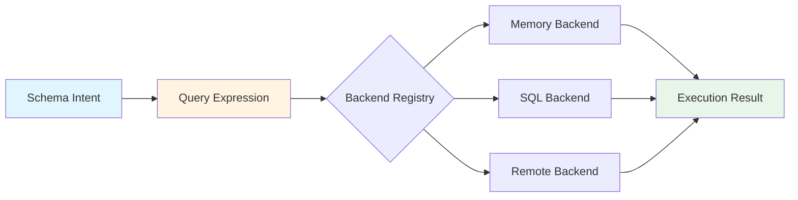

This creates a powerful abstraction:

- **Schema** declares *what* can be queried (types, operators)
- **Query Expression** declares *what* you want (filters, ordering)
- **Backend** determines *how* to execute (in-memory, SQL, remote)

The application code remains unchanged regardless of execution strategy.

### Design Principles

**1. Separation of Concerns**

Two distinct, composable layers:

- **Write Path** (`IPersistenceService`): CRUD operations, collection persistence
- **Read Path** (`IQueryable`): Query comprehension, filtering, ordering

**2. Schema-Driven Everything**

- Query capabilities derived from Enhanced JSON Schema
- Operators validated against property types
- Backend selection configured via `x-persistence` metadata

**3. Isomorphic by Design**

The *same query code* works in different contexts:

- **Browser**: Queries execute in-memory OR are sent to backend via MCP
- **Server**: Queries execute against databases, filesystems, or external APIs
- **Tests**: Queries execute against mock backends

Backend binding resolves at runtime via environment dependency injection.

**4. MST Reactivity Preserved**

- Queries return MST model instances, not plain objects
- Changes trigger MobX observers naturally
- No abstraction leakage between persistence and state management

**5. Pragmatic Over Pure**

- Use MongoDB-style query syntax (familiar, proven)
- Build what's unique to us (MST integration, schema validation)
- Leverage ecosystem where it fits (@ucast for parse-compile)
- Defer non-essential features (observable queries, aggregations)

---

## Part II: System Architecture

### High-Level Architecture

The system comprises seven major components working together:

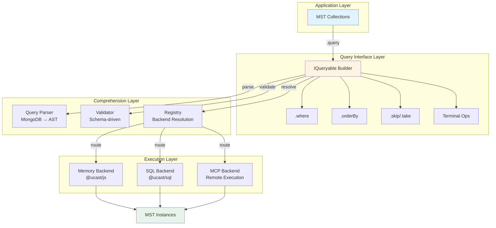

### The Three Phases of Query Execution

Every query flows through three distinct phases:

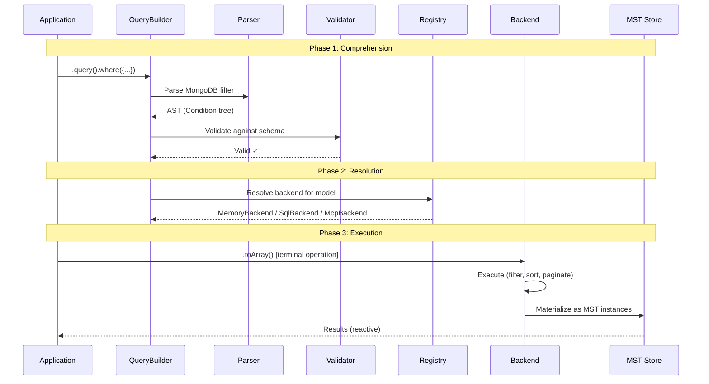

**Phase 1: Comprehension**
- Parse MongoDB-style query into canonical AST
- Validate operators against schema property types
- Build immutable query builder with chainable methods

**Phase 2: Resolution**
- Determine which backend to use (via schema metadata + registry)
- Check backend capabilities (does it support these operators?)
- Prepare query context (schema name, model type, meta-store)

**Phase 3: Execution**
- Backend translates AST to native operations
- Execute query (in-memory filter, SQL query, MCP call)
- Materialize results as MST instances
- Return to application

### Component Interaction Map

```mermaid
graph TB
    subgraph "Foundation Layer"
        AST[Query AST<br/>@ucast/core types]
        Meta[Meta-Store<br/>Schema introspection]
    end
    
    subgraph "Abstraction Layer"
        Parser[Parser<br/>@ucast/mongo]
        Validator[Validator<br/>Operator-type compatibility]
        IBackend[IBackend Interface<br/>Capability declaration]
    end
    
    subgraph "Implementation Layer"
        Memory[Memory Backend<br/>@ucast/js interpreter]
        SQL[SQL Backend<br/>@ucast/sql compiler]
        MCP[MCP Backend<br/>Remote execution]
    end
    
    subgraph "Integration Layer"
        Registry[Backend Registry<br/>Cascade resolution]
        Mixin[Collection Mixin<br/>MST integration]
    end
    
    Parser --> AST
    Validator --> AST
    Validator --> Meta
    Memory --> IBackend
    SQL --> IBackend
    MCP --> IBackend
    Registry --> Memory
    Registry --> SQL
    Registry --> MCP
    Mixin --> Registry
    Mixin --> Parser
    Mixin --> Validator
    
    style AST fill:#e1f5ff
    style Meta fill:#e1f5ff
    style Mixin fill:#e8f5e9
```

**Dependency Flow** (bottom-up build order):
1. **Foundation**: AST types, Meta-store (no dependencies)
2. **Abstraction**: Parser, Validator, IBackend interface
3. **Implementation**: Concrete backend implementations
4. **Integration**: Registry, Collection Mixin (ties everything together)

---

## Part III: Core Components

### 1. Query AST: The Canonical Representation

Every query, regardless of its original syntax, transforms into a canonical Abstract Syntax Tree (AST).

**Why AST?**
- **Backend-agnostic**: Same representation for memory, SQL, remote
- **Serializable**: Can be sent over MCP for remote execution
- **Inspectable**: Can analyze, optimize, cache queries
- **Extensible**: Can add custom operators without changing backends

**Example Transformation**:

```typescript
// MongoDB-style query (user writes)
{
  status: 'active',
  age: { $gte: 18 },
  role: { $in: ['admin', 'moderator'] }
}

// ↓ Parser converts to AST

CompoundCondition {
  operator: 'and',
  value: [
    FieldCondition { operator: 'eq', field: 'status', value: 'active' },
    FieldCondition { operator: 'gte', field: 'age', value: 18 },
    FieldCondition { operator: 'in', field: 'role', value: ['admin', 'moderator'] }
  ]
}
```

**Implementation**: Uses `@ucast` ecosystem
- **Why @ucast?** Battle-tested parse-compile separation, extensible, pairs naturally with multiple backends
- **Location**: `packages/state-api/src/query/ast/`
- **Key Files**:
  - `types.ts` - TypeScript types (re-exports from @ucast/core)
  - `parser.ts` - MongoDB parser with custom operator support
  - `serialization.ts` - JSON serialization for MCP transport
  - `operators.ts` - Custom operator definitions (e.g., `$contains`)

**Supported Operators**:

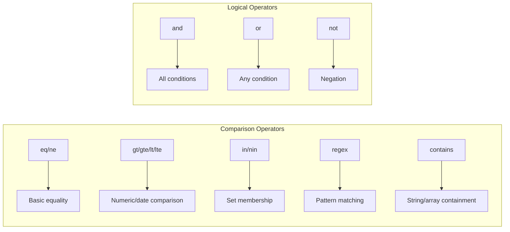

### 2. Validation: Schema-Aware Operator Checking

The validator ensures queries are semantically valid *before* execution.

**The Problem It Solves**:

```typescript
// Without validation, this fails at runtime
user.query().where({ age: { $regex: /pattern/ } })
// ❌ Error: Can't use regex on integer field

// Validator catches this at query-build time
// ✅ Error: "Operator '$regex' not valid for field 'age' of type 'integer'"
```

**Operator-Type Compatibility Matrix**:

The validator uses a compatibility matrix derived from JSON Schema types:

| JSON Schema Type | Valid Operators |
|------------------|----------------|
| `string` | `eq`, `ne`, `gt`, `gte`, `lt`, `lte`, `in`, `nin`, `regex`, `contains` |
| `integer`/`number` | `eq`, `ne`, `gt`, `gte`, `lt`, `lte`, `in`, `nin` |
| `boolean` | `eq`, `ne` |
| `array` | `in`, `nin`, `contains` |
| `date-time` | `eq`, `ne`, `gt`, `gte`, `lt`, `lte`, `in`, `nin` |
| `reference` | `eq`, `ne`, `in`, `nin` |

**Two-Tier Validation**:

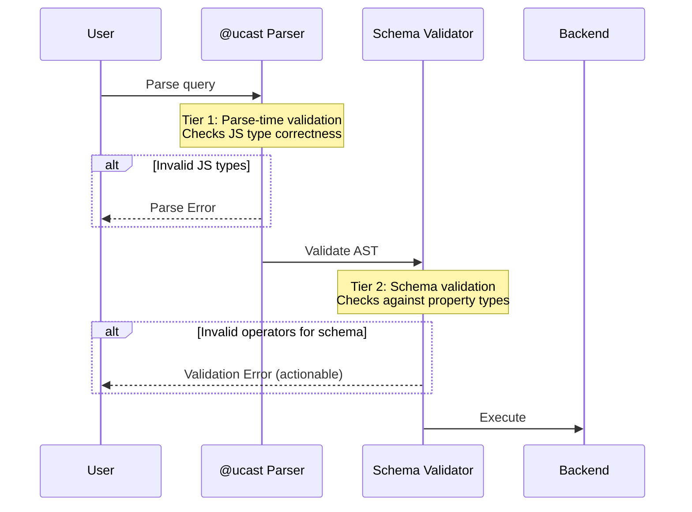

**Implementation Details**:
- **Location**: `packages/state-api/src/query/validation/`
- **Pattern**: Lazy memoization (cache operator validity per property)
- **Meta-Store Integration**: Looks up property types at runtime
- **Performance**: Negligible overhead after first query on a property

### 3. Backend Abstraction: The Execution Contract

The `IBackend` interface defines the contract for query execution:

```typescript
interface IBackend {
  // Declare what this backend supports
  capabilities: BackendCapabilities

  // Execute a query and return results
  execute<T>(
    ast: Condition,
    collection: T[],
    options?: QueryOptions
  ): Promise<QueryResult<T>>
}
```

**Capability Declaration**:

Backends explicitly declare what they can do:

```typescript
// Memory Backend capabilities
{
  operators: ['eq', 'ne', 'gt', 'gte', 'lt', 'lte', 'in', 'nin', 'regex', 'contains'],
  features: {
    sorting: true,
    pagination: true,
    relations: false,    // Can't join across collections
    aggregation: false   // No groupBy/sum/etc
  }
}

// SQL Backend capabilities
{
  operators: ['eq', 'ne', 'gt', 'gte', 'lt', 'lte', 'in', 'nin', 'regex', 'contains'],
  features: {
    sorting: true,
    pagination: true,
    relations: true,     // Can do JOINs
    aggregation: true    // Supports GROUP BY, COUNT, etc
  }
}
```

This enables:
- **Validation**: Check query against backend before execution
- **Optimization**: Choose best backend for query characteristics
- **Error Messages**: Tell user why a query won't work

### 4. Memory Backend: In-Memory Execution

Executes queries against in-memory MST collections using JavaScript filtering.

```mermaid
graph LR
    A[AST] --> B[Memory Backend]
    B --> C[@ucast/js interpreter]
    C --> D[JavaScript filter function]
    D --> E[MST Collection]
    E --> F[Filtered items]
    F --> G[Apply orderBy]
    G --> H[Apply skip/take]
    H --> I[Results<br/>same MST references]
    
    style A fill:#e1f5ff
    style I fill:#e8f5e9
```

**Key Characteristics**:
- **No Cloning**: Returns same MST references (preserves reactivity)
- **Custom Operators**: Implements `$contains` for strings/arrays
- **Multi-Field Sort**: Supports orderBy with multiple fields
- **Performance**: 10k items filter+sort+paginate < 200ms

**Critical API Pattern**:
```typescript
// ✅ CORRECT: interpret(ast, item)
items.filter(item => interpret(ast, item))

// ❌ WRONG: interpret(ast)(item)
// This pattern will fail with "Unable to get field X out of undefined"
items.filter(interpret(ast))
```

**Location**: `packages/state-api/src/query/backends/memory.ts`
**Tests**: 50 passing tests covering all operators and features

### 5. SQL Backend: Database Compilation

Compiles queries to SQL for execution against PostgreSQL/SQLite databases.

```mermaid
graph LR
    A[AST] --> B[SQL Backend]
    B --> C[@ucast/sql compiler]
    C --> D[WHERE clause]
    B --> E[Manual builders]
    E --> F[ORDER BY]
    E --> G[LIMIT/OFFSET]
    D --> H[Parameterized SQL]
    F --> H
    G --> H
    H --> I[Consumer executes<br/>via connection pool]
    
    style A fill:#e1f5ff
    style H fill:#fff4e1
    style I fill:#e8f5e9
```

**Compile-Only Architecture**:

The SQL backend does NOT execute queries itself—it compiles them:

```typescript
const backend = new SqlBackend()
const [sql, params] = backend.compileSelect(
  parseQuery({ status: 'active', age: { $gte: 18 } }),
  'users',
  { orderBy: [{ field: 'createdAt', direction: 'desc' }], take: 10 }
)

// Returns:
// sql: "SELECT * FROM users WHERE status = $1 AND age >= $2 ORDER BY createdAt DESC LIMIT 10"
// params: ['active', 18]

// Consumer executes via their connection pool
const results = await db.query(sql, params)
```

**Why Compile-Only?**
- Backend doesn't manage connections (that's app infrastructure)
- Enables query inspection and optimization before execution
- Consumer controls transaction boundaries
- Easier to test (no real database required)

**Methods**:
- `compileSelect()` - Full SELECT with WHERE/ORDER BY/LIMIT/OFFSET
- `compileCount()` - COUNT(*) optimization (no field selection)
- `compileExists()` - EXISTS check with LIMIT 1 (early termination)

**Known Limitations**:
- `$eq: null` generates `= NULL` instead of `IS NULL` (upstream @ucast/sql bug)
- Auto-joins not supported—consumer must add JOIN clauses
- Only generates WHERE clause, not full query execution

**Location**: `packages/state-api/src/query/backends/sql.ts`
**Tests**: 39 passing tests covering all operators and SQL generation

### 6. Backend Registry: Schema-Driven Resolution

The registry determines *which backend* to use for a given query.

**Cascade Resolution**:

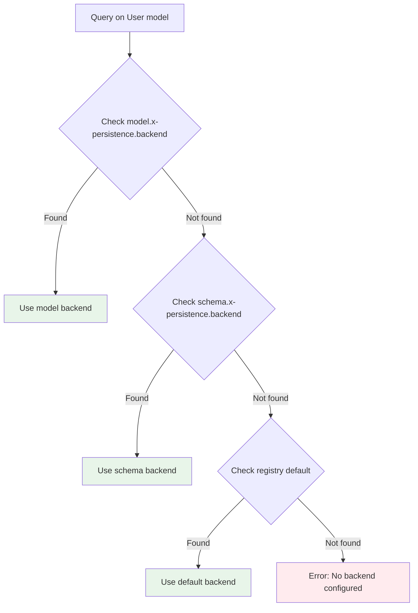

**Configuration Example**:

```json
{
  "$defs": {
    "User": {
      "type": "object",
      "x-persistence": {
        "backend": "postgres",  // ← Model-level override
        "table": "users"
      }
    },
    "AuditLog": {
      "type": "object",
      "x-persistence": {
        "backend": "s3",  // ← Different backend for different model
        "bucket": "audit-logs"
      }
    }
  }
}
```

**Per-Environment Instance**:

Unlike a global singleton, each environment gets its own registry:

```typescript
// Test environment
const testRegistry = createBackendRegistry({
  default: 'memory',
  backends: { memory: new MemoryBackend() }
})

// Production environment
const prodRegistry = createBackendRegistry({
  default: 'postgres',
  backends: {
    postgres: new PostgresBackend(),
    redis: new RedisBackend()
  }
})
```

**Benefits**:
- Test isolation (no global state pollution)
- Different backends per environment
- Matches MST environment DI pattern

**Location**: `packages/state-api/src/query/registry.ts`
**Tests**: 22 passing tests covering resolution cascade and error cases

### 7. IQueryable Mixin: MST Integration

The collection mixin adds the `.query()` method to MST collections.

**LINQ-Style Chainable API**:

```typescript
interface IQueryable<T> {
  // Chainable methods (return new IQueryable)
  where(filter: QueryFilter): IQueryable<T>
  orderBy(field: string, direction?: 'asc' | 'desc'): IQueryable<T>
  skip(count: number): IQueryable<T>
  take(count: number): IQueryable<T>

  // Terminal operations (execute query, return Promise)
  toArray(): Promise<T[]>
  first(): Promise<T | undefined>
  count(): Promise<number>
  any(): Promise<boolean>
}
```

**Immutable Builder Pattern**:

Each chainable method returns a *new* query builder:

```typescript
const query1 = collection.query().where({ status: 'active' })
const query2 = query1.where({ age: { $gte: 18 } })

// query1 and query2 are different instances
// Enables functional composition and reuse
```

**Collection Composition**:

```typescript
const MyCollection = types.compose(
  BaseCollection,          // Basic map storage
  CollectionPersistable,   // Adds loadAll/saveAll (write path)
  CollectionQueryable      // Adds .query() (read path)
).named('MyCollection')
```

**Auto-Composition via Pipeline**:

```typescript
const enhanceCollections = buildEnhanceCollections({
  enablePersistence: true,  // Auto-adds CollectionPersistable
  enableQueryable: true,    // Auto-adds CollectionQueryable
  userEnhance: (models) => ({
    // Custom enhancements
  })
})
```

**Location**: `packages/state-api/src/composition/queryable.ts`
**Tests**: 49 passing tests covering API, composition, and edge cases

---

## Part IV: Execution Contexts

### Understanding Isomorphic Execution

"Isomorphic" means the *same query code* runs in different contexts with different execution strategies.

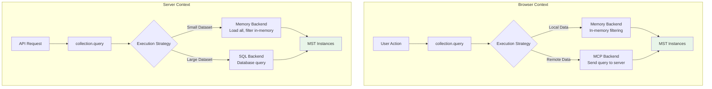

**Key Point**: The application code is identical. The backend choice determines execution:

```typescript
// This exact code works in both browser and server
const activeUsers = await store.users.query()
  .where({ status: 'active' })
  .orderBy('createdAt', 'desc')
  .take(10)
  .toArray()
```

### Browser Execution Patterns

In the browser, queries can execute in **three ways**:

**1. Local In-Memory (Most Common)**

Data already loaded into MST store, query filters in-memory:

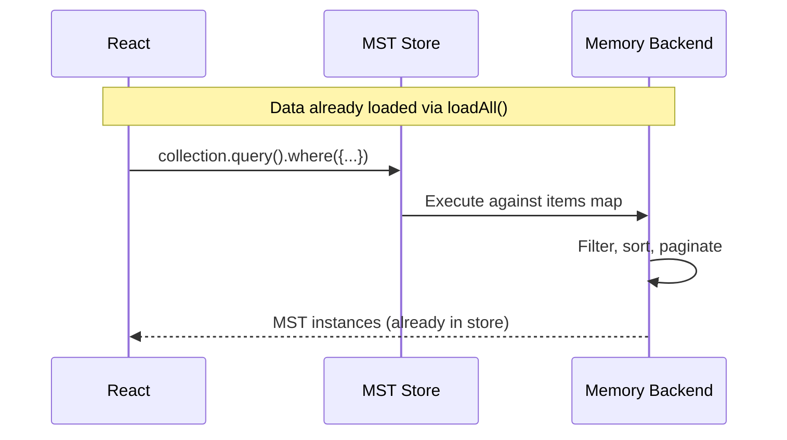

**Use Cases**:
- Client-side filtering of loaded data
- Reactive UI updates based on filter changes
- Offline-first applications
- Small datasets (< 10k items)

**2. Remote Execution via MCP**

Query sent to server for execution, results returned:

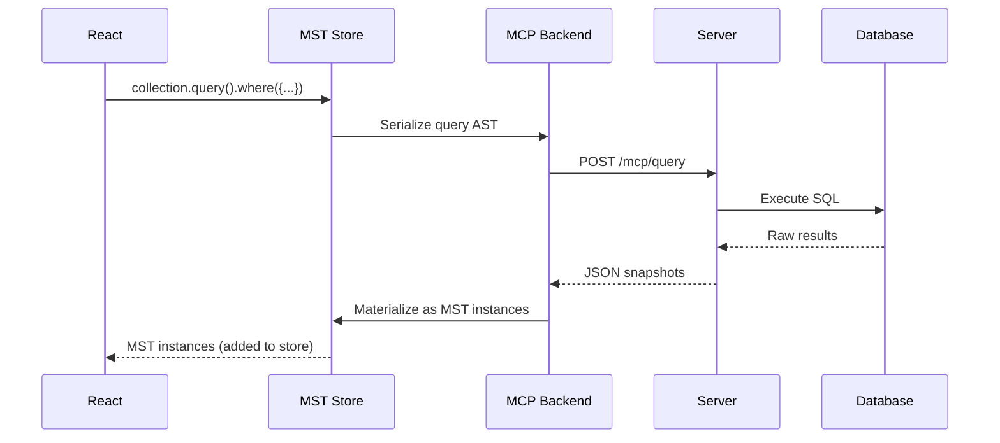

**Use Cases**:
- Large datasets (pagination, targeted loading)
- Complex queries (joins, aggregations)
- Data not yet loaded in client
- Search/filtering before loading full dataset

**3. Hybrid Strategy**

Initial query goes to server, subsequent filters in-memory:

```typescript
// First query: Remote execution (targeted load)
const recentUsers = await store.users.query()
  .where({ createdAt: { $gte: '2025-01-01' } })
  .toArray()  // ← MCP call loads 1000 users

// Subsequent queries: In-memory (no network)
const activeRecent = await store.users.query()
  .where({ createdAt: { $gte: '2025-01-01' }, status: 'active' })
  .toArray()  // ← Memory backend, instant
```

**Configuration**:

Backend choice configured per model:

```json
{
  "User": {
    "x-persistence": {
      "backend": "mcp",  // ← Use remote execution in browser
      "strategy": "lazy-load"
    }
  }
}
```

### Server Execution Patterns

On the server, the choice is typically between **in-memory** (fast, small datasets) and **SQL** (scalable, large datasets).

**Decision Matrix**:

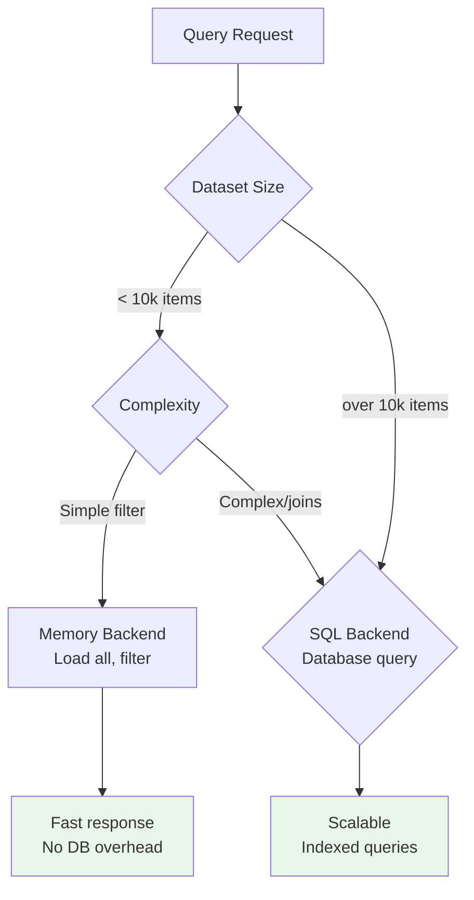

**Example: Adaptive Strategy**

```typescript
const backendRegistry = createBackendRegistry({
  default: 'memory',
  backends: {
    memory: new MemoryBackend(),
    postgres: createPostgresBackend()
  }
})

// Small dataset model: Use memory
{
  "UserSettings": {
    "x-persistence": {
      "backend": "memory",
      "strategy": "flat"
    }
  }
}

// Large dataset model: Use database
{
  "AuditLog": {
    "x-persistence": {
      "backend": "postgres",
      "table": "audit_logs"
    }
  }
}
```

### Meta-Store Loading

The meta-store (schema introspection) loads differently per context:

**Browser**:
```typescript
// Load via MCP at app startup
const metaStore = await loadMetaStoreViaMCP('/mcp')

// Cached in memory for query validation
// No network calls during query building
```

**Server**:
```typescript
// Load from filesystem at startup
const metaStore = loadMetaStoreFromFilesystem('./schemas')

// Available for all query validation
// No I/O during query building
```

**Why This Matters**: Query validation is instant in both contexts—schema introspection happens once at startup, not per query.

---

## Part V: Design Decisions & Tradeoffs

### MongoDB-Style Query Syntax

**Decision**: Use MongoDB operators as canonical format

**Why This Choice?**

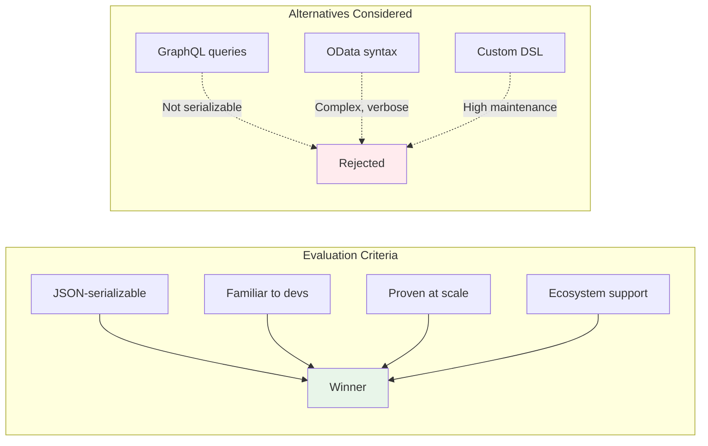

**Tradeoffs**:
- ✅ Familiar (most devs know MongoDB syntax)
- ✅ JSON-serializable (works over MCP, REST, etc.)
- ✅ Expressive (handles 95% of query patterns)
- ✅ Ecosystem support (@ucast, tools, docs)
- ❌ Not SQL-native (requires translation)
- ❌ Different from GraphQL (but consistent internally)

**Example Comparison**:

```typescript
// MongoDB-style (our choice)
{ status: 'active', age: { $gte: 18 } }

// GraphQL
query { users(where: { status: { eq: "active" }, age: { gte: 18 } }) }

// OData
$filter=status eq 'active' and age ge 18

// SQL
WHERE status = 'active' AND age >= 18
```

### Parse-Compile Separation (@ucast)

**Decision**: Use @ucast ecosystem for AST and execution

**Why This Choice?**

After evaluating multiple approaches via proof-of-concept:

| Approach | Pros | Cons | Verdict |
|----------|------|------|---------|
| **@ucast ecosystem** | Battle-tested, extensible, pairs naturally (mongo→js→sql) | External dependency (~50KB) | ✅ **Adopted** |
| `sift.js` | Simple, in-memory only | No SQL compilation | ❌ Insufficient |
| `mingo` | Full MongoDB impl | Overkill, large bundle | ❌ Too heavy |
| Custom implementation | Full control | High maintenance, reinvent edge cases | ❌ Not worth it |

**The Math**:
- @ucast: ~50KB gzipped, saves ~3-6 months of development
- Custom: 0KB dependency, costs 3-6 months + ongoing maintenance

**Tradeoff accepted**: External dependency is worth the time savings and battle-tested edge cases.

### Backend Abstraction Granularity

**Decision**: Schema/model-level backend selection (not CQRS)

**Why Not CQRS?**

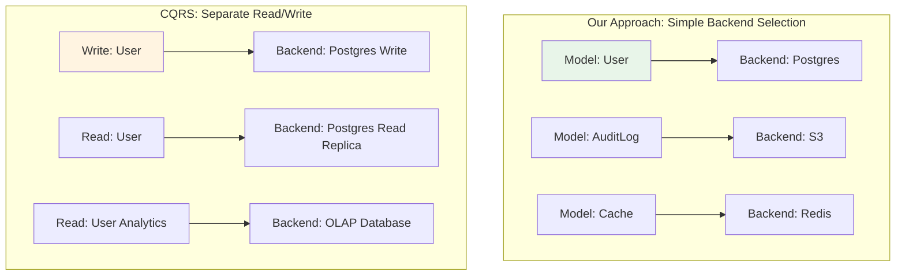

**Rationale**:
- ✅ Simple mental model (one backend per model)
- ✅ Covers 90% of use cases
- ✅ Can add CQRS later without breaking changes
- ❌ No built-in read-write split
- ❌ No built-in read replicas
- ✅ But these can be added as specialized backends

**Extension Path**: If CQRS needed, add `x-persistence.readBackend` and `x-persistence.writeBackend`:

```json
{
  "User": {
    "x-persistence": {
      "writeBackend": "postgres-primary",
      "readBackend": "postgres-replica"
    }
  }
}
```

### Validation Integration

**Decision**: Integrate validation via isomorphic meta-store

**The Alternative**:

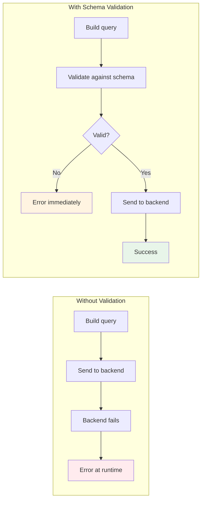

**Tradeoffs**:
- ✅ Catches errors before backend execution
- ✅ Rich, actionable error messages
- ✅ Same code in browser and server
- ❌ Runtime overhead (mitigated by lazy memoization)
- ❌ Requires meta-store loaded

**Performance Impact**: Negligible (<1ms) after first query on a property due to lazy memoization.

### MST Result Materialization

**Decision**: Return MST instances, not plain objects

**Why This Matters**:

```typescript
// With MST instances (our choice)
const users = await collection.query().where({...}).toArray()
users[0].name = 'Updated'  // ← Triggers MobX observers
// React components re-render automatically

// With plain objects (alternative)
const users = await collection.query().where({...}).toArray()
users[0].name = 'Updated'  // ← Nothing happens
// Must manually sync back to store
```

**Tradeoffs**:
- ✅ Preserves MobX reactivity
- ✅ Consistent with rest of system
- ✅ Enables computed properties
- ❌ Cannot query across store instances
- ❌ Results tied to one store
- ✅ But matches MST's single-store philosophy

---

## Part VI: Implementation Status

### Completed Components

All six core components are **fully implemented and tested**:

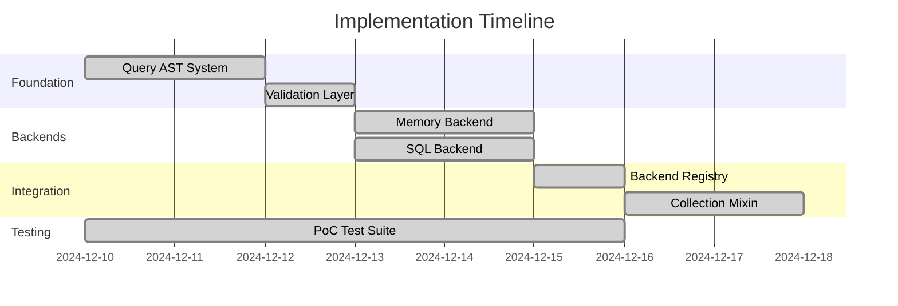

**Test Coverage**: 231 passing tests across 8 PoC files

| Component | Tests | Coverage |
|-----------|-------|----------|
| Query AST Parser | 30 | All operators, serialization, extensibility |
| Validation Layer | 23 | Operator-type matrix, error messages |
| Memory Backend | 50 | All operators, sorting, pagination, performance |
| SQL Backend | 39 | SQL generation, parameterization, all operators |
| Backend Registry | 22 | Resolution cascade, error cases |
| Collection Mixin | 49 | API, composition, integration |
| SQL Boundaries | 18 | Edge cases, null handling |
| Integration | All | End-to-end flows |

### File Structure

```
packages/state-api/src/
├── query/
│   ├── ast/
│   │   ├── types.ts           ← AST type definitions
│   │   ├── parser.ts          ← MongoDB parser
│   │   ├── serialization.ts   ← JSON serialization
│   │   └── operators.ts       ← Custom operators
│   ├── validation/
│   │   ├── types.ts           ← Validator interfaces
│   │   └── validator.ts       ← Schema-driven validation
│   ├── backends/
│   │   ├── types.ts           ← IBackend interface
│   │   ├── memory.ts          ← In-memory execution
│   │   └── sql.ts             ← SQL compilation
│   ├── registry.ts            ← Backend resolution
│   └── index.ts               ← Public API exports
├── composition/
│   ├── queryable.ts           ← IQueryable mixin
│   └── enhance-collections.ts ← Composition pipeline
└── environment/
    └── types.ts               ← Extended with backendRegistry
```

### Remaining Work

**DDL Generation** (In Progress):

Three approaches under evaluation:

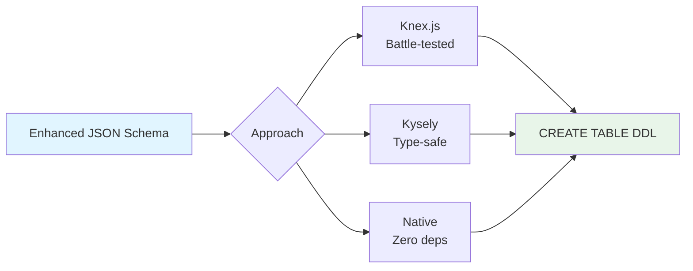

**Test Files**:
- `ddl-knex.test.ts` - Evaluating Knex schema builder
- `ddl-kysely.test.ts` - Evaluating Kysely query builder
- `ddl-native.test.ts` - Evaluating pure TypeScript approach

**Decision Pending**: Choose between battle-tested ecosystem (Knex), type safety (Kysely), or zero dependencies (Native).

---

## Part VII: Usage Patterns

### Basic Query Patterns

**Simple Equality**:
```typescript
const active = await collection.query()
  .where({ status: 'active' })
  .toArray()
```

**Comparison Operators**:
```typescript
const adults = await collection.query()
  .where({ age: { $gte: 18 } })
  .toArray()

const recentUsers = await collection.query()
  .where({ createdAt: { $gt: '2025-01-01' } })
  .toArray()
```

**Multiple Conditions** (implicit `$and`):
```typescript
const results = await collection.query()
  .where({
    status: 'active',
    age: { $gte: 18 },
    role: { $in: ['admin', 'moderator'] }
  })
  .toArray()
```

### Logical Operators

**Explicit OR**:
```typescript
const results = await collection.query()
  .where({
    $or: [
      { status: 'active' },
      { featured: true }
    ]
  })
  .toArray()
```

**Nested Logic**:
```typescript
const results = await collection.query()
  .where({
    $and: [
      { category: 'electronics' },
      {
        $or: [
          { price: { $lt: 100 } },
          { onSale: true }
        ]
      }
    ]
  })
  .toArray()
```

**Multiple Where Calls** (combined with `$and`):
```typescript
const query = collection.query()
  .where({ status: 'active' })
  .where({ age: { $gte: 18 } })
  // Equivalent to: { $and: [{ status: 'active' }, { age: { $gte: 18 } }] }
```

### Sorting and Pagination

**Single Sort**:
```typescript
const recent = await collection.query()
  .where({ status: 'active' })
  .orderBy('createdAt', 'desc')
  .toArray()
```

**Multi-Field Sort**:
```typescript
const sorted = await collection.query()
  .orderBy('priority', 'desc')  // Primary sort
  .orderBy('createdAt', 'asc')  // Secondary sort
  .toArray()
```

**Pagination Pattern**:
```typescript
// Page 1 (items 0-19)
const page1 = await collection.query()
  .where({ status: 'active' })
  .orderBy('id', 'asc')
  .take(20)
  .toArray()

// Page 2 (items 20-39)
const page2 = await collection.query()
  .where({ status: 'active' })
  .orderBy('id', 'asc')
  .skip(20)
  .take(20)
  .toArray()

// Page 3 (items 40-59)
const page3 = await collection.query()
  .where({ status: 'active' })
  .orderBy('id', 'asc')
  .skip(40)
  .take(20)
  .toArray()
```

### Terminal Operations

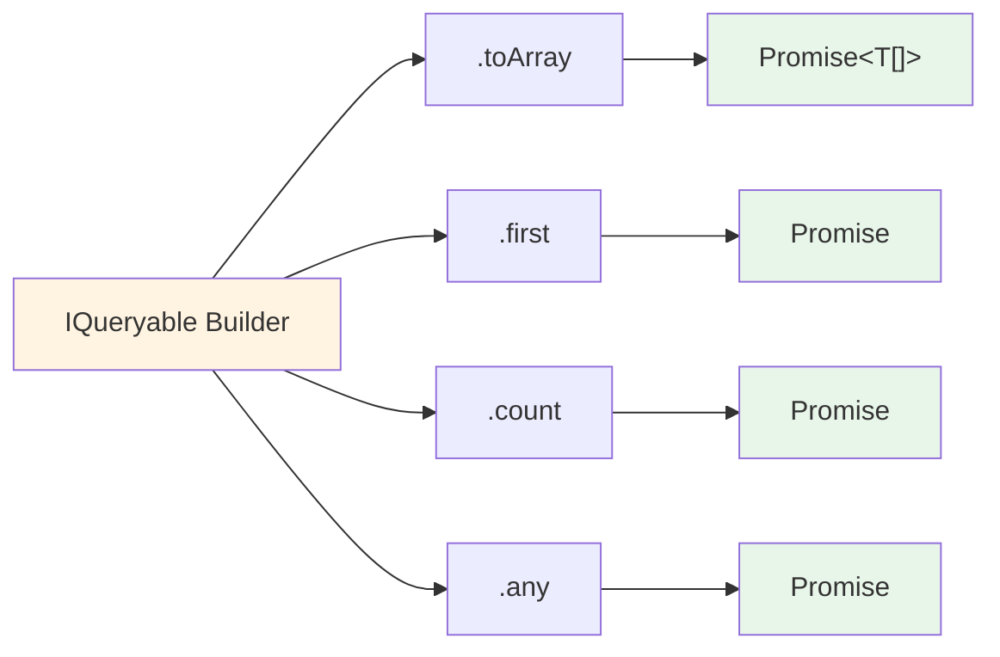

**Get All Results**:
```typescript
const all = await collection.query()
  .where({ status: 'active' })
  .toArray()
```

**Get First Match**:
```typescript
const user = await collection.query()
  .where({ email: 'admin@example.com' })
  .first()

if (user) {
  console.log('Found:', user.name)
} else {
  console.log('Not found')
}
```

**Count Matches**:
```typescript
const count = await collection.query()
  .where({ status: 'active' })
  .count()

console.log(`${count} active users`)
```

**Check Existence**:
```typescript
const hasActive = await collection.query()
  .where({ status: 'active' })
  .any()

if (hasActive) {
  console.log('At least one active user exists')
}
```

### Advanced Patterns

**Query Reuse**:
```typescript
// Build base query
const activeUsersQuery = collection.query()
  .where({ status: 'active' })

// Extend for different use cases
const recentActive = await activeUsersQuery
  .where({ createdAt: { $gte: '2025-01-01' } })
  .toArray()

const adminActive = await activeUsersQuery
  .where({ role: 'admin' })
  .toArray()
```

**Dynamic Query Building**:
```typescript
let query = collection.query()

// Conditionally add filters
if (filters.status) {
  query = query.where({ status: filters.status })
}

if (filters.minAge) {
  query = query.where({ age: { $gte: filters.minAge } })
}

if (filters.search) {
  query = query.where({ name: { $contains: filters.search } })
}

// Execute
const results = await query.toArray()
```

**Custom Operators**:
```typescript
// Using the custom $contains operator
const withTag = await collection.query()
  .where({ tags: { $contains: 'featured' } })
  .toArray()

const withKeyword = await collection.query()
  .where({ description: { $contains: 'discount' } })
  .toArray()
```

---

## Part VIII: Key Learnings & Gotchas

### Critical API Patterns

**@ucast/js interpret() Gotcha**:

```typescript
// ❌ WRONG - Will fail with "Unable to get field X out of undefined"
const filtered = items.filter(interpret(ast))

// ✅ CORRECT - Pass both ast and item
const filtered = items.filter(item => interpret(ast, item))
```

**Why?** The @ucast/js API is `interpret(condition, object)`, not `interpret(condition)(object)`.

### Known Limitations

**SQL Null Equality Bug**:

```typescript
// This query generates incorrect SQL
{ deletedAt: { $eq: null } }

// Generates: WHERE deletedAt = $1 (with params: [null])
// Should be:  WHERE deletedAt IS NULL
```

**Workaround**: Document limitation, or add custom `$isNull` operator.

**SQL Backend Doesn't Execute**:

The SQL backend is compile-only:

```typescript
// ❌ Backend doesn't execute
const backend = new SqlBackend()
const results = backend.execute(ast, [], options)  // Returns [sql, params]

// ✅ Consumer executes
const [sql, params] = backend.compileSelect(ast, 'users', options)
const results = await db.query(sql, params)
```

### Performance Characteristics

**Memory Backend**:
- **10k items**: < 200ms for filter + sort + paginate
- **No overhead**: Returns same MST references (no cloning)
- **Multi-field sort**: JavaScript native sort (fast)

**SQL Backend**:
- **Compilation**: ~1-2ms per query (negligible)
- **No execution overhead**: Consumer controls connection pooling
- **Parameterized**: Safe from SQL injection

**Validation**:
- **First query on property**: ~1-5ms (meta-store lookup)
- **Subsequent queries**: < 0.1ms (lazy memoization)
- **Schema reload**: Cache cleared, re-memoize on next query

---

## Part IX: Future Directions

### Observable Queries (Phase 2)

Enable reactive query execution that auto-refreshes when data changes:

```typescript
// Create observable query
const activeUsersQuery = collection.query()
  .where({ status: 'active' })
  .asObservable()

// Auto-refresh when status changes
autorun(() => {
  console.log('Active users:', activeUsersQuery.value)
})

// When user.status changes → query auto-refreshes
someUser.setStatus('inactive')  // ← Triggers re-query
```

**Implementation Path**:
1. Add `asObservable()` terminal operation
2. Track property access during query execution
3. Register MobX reactions on accessed properties
4. Re-execute query when properties change

### Advanced Query Features (Phase 3)

**Projection** (select specific fields):
```typescript
const userEmails = await collection.query()
  .where({ status: 'active' })
  .select(user => ({ email: user.email, name: user.name }))
  .toArray()
```

**Aggregation**:
```typescript
const stats = await collection.query()
  .where({ status: 'active' })
  .groupBy('role')
  .select(group => ({
    role: group.key,
    count: group.items.length,
    avgAge: group.items.reduce((sum, u) => sum + u.age, 0) / group.items.length
  }))
  .toArray()
```

**Cross-Collection Joins**:
```typescript
const ordersWithCustomers = await orders.query()
  .where({ status: 'pending' })
  .include('customer')  // ← Load related customer
  .toArray()
```

### Additional Backends

**S3Backend** (Document Storage):
```typescript
const s3Backend = createS3Backend({
  bucket: 'my-data',
  region: 'us-east-1',
  partitionKey: 'userId'
})
```

**RedisBackend** (Caching Layer):
```typescript
const redisBackend = createRedisBackend({
  url: 'redis://localhost:6379',
  ttl: 3600  // 1 hour
})
```

**ElasticsearchBackend** (Full-Text Search):
```typescript
const esBackend = createElasticsearchBackend({
  node: 'http://localhost:9200',
  index: 'users'
})

// Full-text search queries
const results = await collection.query()
  .where({ $text: { $search: 'software engineer' } })
  .toArray()
```

### Performance Optimizations

**Query Plan Analysis**:
```typescript
const plan = await collection.query()
  .where({ status: 'active', age: { $gte: 18 } })
  .explain()

console.log('Estimated cost:', plan.cost)
console.log('Index used:', plan.index)
console.log('Rows scanned:', plan.rowsScanned)
```

**Index Recommendations**:
```typescript
const recommendations = await analyzeQueryPatterns(collection, {
  threshold: 1000  // Suggest indexes for slow queries
})

recommendations.forEach(rec => {
  console.log(`Consider adding index: ${rec.fields.join(', ')}`)
  console.log(`Would speed up ${rec.queryCount} queries`)
})
```

---

## Part X: Summary & Next Steps

### What We've Built

The IQueryable system successfully implements "Persistence as Projection":

✅ **Backend-agnostic query abstraction** with pluggable execution strategies
✅ **MongoDB-style query operators** (comparison, logical, custom)
✅ **Schema-driven validation** via meta-store integration
✅ **Isomorphic execution** (browser + server, in-memory + remote)
✅ **MST integration** with environment dependency injection
✅ **231 passing tests** validating all patterns and integrations

### Architectural Achievements

**Separation of Concerns**: Clean boundaries between query comprehension (IQueryable) and execution (IBackend)

**Extensibility**: New backends, operators, and features can be added without changing application code

**Type Safety**: Full TypeScript support with generic types and schema-driven validation

**Performance**: Optimized execution with lazy memoization, compile-only SQL, and no-clone memory operations

### Using This System

**For Application Developers**:
```typescript
// Just write queries, the system handles the rest
const users = await store.users.query()
  .where({ status: 'active' })
  .orderBy('createdAt', 'desc')
  .take(10)
  .toArray()
```

**For Platform Developers**:
- Add new backends by implementing `IBackend`
- Add new operators by extending parser instructions
- Configure per model via `x-persistence` metadata

**For Contributors**:
- All components fully tested with PoC coverage
- Clear separation of concerns enables parallel development
- Documented patterns and gotchas prevent common mistakes

### Next Steps

**Immediate**:
1. ✅ Complete DDL generation (choose Knex/Kysely/Native)
2. Document migration path from old `loadAll()` pattern
3. Add MCP backend for remote query execution

**Short-Term**:
1. Observable queries for reactive execution
2. Query result caching layer
3. Performance monitoring and optimization

**Long-Term**:
1. Advanced query features (select, groupBy, join)
2. Additional backends (S3, Redis, Elasticsearch)
3. Query plan analysis and index recommendations

---

## References

### Related Documentation

- [[design-alignment-rev1]] - Original vision document
- [[spec/_overview]] - First-level specification
- [[../postgres-branch-analysis]] - Initial analysis that sparked this work

### Code Locations

- **Query System**: `packages/state-api/src/query/`
- **Collection Mixin**: `packages/state-api/src/composition/queryable.ts`
- **PoC Tests**: `packages/state-api/src/query/discovery/`

### Wavesmith Feature

- **Feature Session**: `.schemas/platform-features/data/FeatureSession/iqueryable-persistence-projection/`
- **Requirements**: 7 requirements (REQ-01 through REQ-07)
- **Findings**: 14 analysis findings from PoC work
- **Integration Points**: 18 documented file locations

### External Dependencies

- **@ucast/core** - AST types and base classes
- **@ucast/mongo** - MongoDB query parser
- **@ucast/js** - In-memory interpreter
- **@ucast/sql** - SQL compilation

---

**Document Status**: Complete
**Last Updated**: 2025-12-15
**Maintainer**: Shogo AI Platform Team