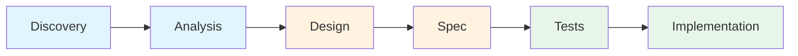

# Platform Feature Development Overview

> A guide to adding features to Shogo AI through AI-orchestrated development

---

## What This System Does

The platform-feature skill tree is a **6-stage pipeline** that transforms your intent into production-ready code. You describe what you need, and Claude orchestrates the entire development lifecycle—from requirements capture through tested, working implementation.

This isn't just code generation. Each stage captures structured data about your feature, creating a traceable path from your original request to the final code. You can run the entire pipeline end-to-end, or work through it incrementally, picking up where you left off.

---

## The Core Philosophy: Runtime as Projection over Intent

Traditional development starts with code. This system starts with **intent**.

When you say "I need authentication for the platform," that intent gets captured as queryable data—not just processed and forgotten. As the pipeline progresses, your intent is progressively refined:

```
Intent (natural language)
    ↓
Requirements (structured, prioritized)
    ↓  
Analysis (patterns found, gaps identified)
    ↓
Schema (domain model defined)
    ↓
Tasks (implementation plan with acceptance criteria)
    ↓
Tests (specifications in Given/When/Then)
    ↓
Code (tested, working implementation)
```

At every stage, the system captures **what was decided and why**. This means:
- You can trace any piece of generated code back to the requirement that drove it
- You can resume work after days or weeks without losing context
- The system learns from your codebase patterns and applies them consistently

**The runtime (your working code) is a projection over your captured intent.**

---

## The 6-Skill Pipeline



| Stage | What Happens | What Gets Captured |
|-------|--------------|-------------------|
| **Discovery** | Capture your intent, classify the feature type, derive requirements | `PlatformFeatureSession`, `Requirement` entities |
| **Analysis** | Explore codebase for existing patterns, identify integration points | `AnalysisFinding`, `IntegrationPoint` entities |
| **Design** | Create domain schema, record key design decisions | Enhanced JSON Schema, `DesignDecision` entities |
| **Spec** | Break down into tasks with acceptance criteria | `ImplementationTask` entities |
| **Tests** | Generate test specifications from acceptance criteria | `TestSpecification` entities |
| **Implementation** | Execute TDD: write tests, implement code, verify | Actual code files, execution tracking |

Each skill knows what it needs from previous stages and what it should produce for the next. You invoke them in sequence, and the system handles the handoffs.

---

## How the Architecture Supports This

### Wavesmith: Capturing Intent as Data

Every entity mentioned above (`PlatformFeatureSession`, `Requirement`, `AnalysisFinding`, etc.) is stored in **Wavesmith**—a schema-first reactive state system. Think of it as a structured database for your feature development process.

Two schemas power the pipeline:
- **`platform-features`**: Your intent and requirements (Discovery, Design phases)
- **`platform-feature-spec`**: Implementation artifacts (Analysis through Implementation)

When you invoke a skill, it queries these schemas to understand context, then writes its outputs back. This is how state persists across sessions.

### The 7 Architectural Patterns

Generated code follows consistent patterns that make it testable, maintainable, and idiomatic to Shogo:

1. **Isomorphism** - Domain logic goes in `packages/state-api`, React UI goes in `apps/web`
2. **Service Interface** - External services abstracted behind `IService` contracts
3. **Environment Extension** - Services injected via MST environment for testability
4. **Enhancement Hooks** - Domain logic added through `createStoreFromScope()` hooks
5. **Mock Service Testing** - Full mock implementations for every service
6. **Provider Synchronization** - External state synced to local reactive store
7. **React Context Integration** - Clean provider/hook pattern for React consumers

You don't need to memorize these to use the system—the skills apply them automatically. But understanding them helps when reviewing generated code.

---

## Two Ways to Work

### End-to-End: The Full Pipeline

For a new feature, you can run through all six skills in sequence:

1. Invoke `platform-feature-discovery` → Describe your feature
2. Invoke `platform-feature-analysis` → Let it explore your codebase
3. Invoke `platform-feature-design` → Review the proposed schema
4. Invoke `platform-feature-spec` → Review the task breakdown
5. Invoke `platform-feature-tests` → Review test specifications
6. Invoke `platform-feature-implementation` → Watch TDD execution

Each handoff is explicit—you review outputs before proceeding.

### Modular: Pick Up Where You Left Off

Real work doesn't always happen in one session. The system supports this:

- **Resume a session**: Query for your existing `PlatformFeatureSession` and continue
- **Re-run analysis**: If codebase changed, run analysis in VERIFY mode to detect drift
- **Iterate on design**: Update requirements, regenerate schema
- **Retry blocked tasks**: Implementation tracks what succeeded and what failed

Session state persists in Wavesmith. The skills know how to pick up from any point.

---

## What You'll Need to Know

This overview gives you the big picture. The rest of the documentation goes deeper:

| Document | When to Read |
|----------|--------------|
| [[02-pipeline/index\|Pipeline Guide]] | Before your first feature—understand each skill |
| [[03-patterns\|Architectural Patterns]] | When reviewing generated code—understand the patterns |
| [[04-wavesmith\|Working with Wavesmith]] | When curious about the data layer—how entities work |
| [[05-modular-usage\|Modular Usage]] | For longer-running features—session management |
| [[06-reference\|Quick Reference]] | Anytime—cheat sheets and lookups |

---

## Quick Start: Your First Feature

Ready to try it? Here's the minimal path:

1. **Have a feature in mind** - Something the platform needs (e.g., "add user preferences", "integrate with Stripe")

2. **Invoke discovery**:
   ```
   "I need to add [your feature] to the platform"
   ```
   The skill will ask clarifying questions and capture your intent.

3. **Follow the prompts** - Each skill will tell you when it's done and what to invoke next.

4. **Review at each stage** - The system pauses for your approval before major transitions.

That's it. The pipeline handles the rest.

---

## The Auth Example

Throughout this documentation, we use **authentication with Supabase** as the canonical example. This feature was built using the skill tree and demonstrates:

- Service interface pattern (`IAuthService`)
- Multiple implementations (Supabase + Mock)
- Domain store with enhancement hooks
- React context integration
- Full TDD test coverage

You'll see snippets from this implementation in the skill guides. The full code lives in:
- `packages/state-api/src/auth/` - Domain logic
- `apps/web/src/contexts/AuthContext.tsx` - React integration

---

## Next Steps

→ [[02-pipeline/index|Start with the Pipeline Guide]] to understand each skill in detail.
