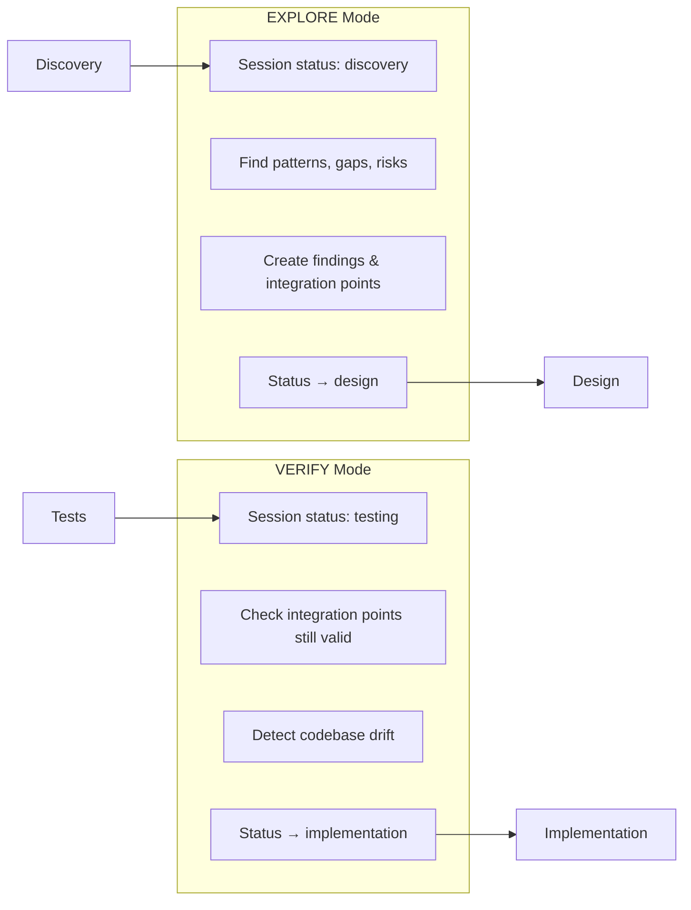

# Analysis

> Exploring codebase patterns and identifying integration points

---

## Purpose

Analysis bridges Discovery and Design. Before designing your feature's schema, you need to understand what patterns already exist in the codebase and where your feature will integrate.

This skill operates in two modes:
- **EXPLORE mode** - Find patterns before design (after Discovery)
- **VERIFY mode** - Validate spec still aligns with code (before Implementation)

**What you provide**: A session ready for analysis  
**What you get**: `AnalysisFinding` and `IntegrationPoint` entities that inform design

---

## Two Modes



| Mode | When | Input Status | Output Status | Purpose |
|------|------|--------------|---------------|---------|
| **EXPLORE** | After Discovery | `discovery` | `design` | Find patterns to inform schema design |
| **VERIFY** | Before Implementation | `testing` | `implementation` | Validate spec still matches codebase |

---

## EXPLORE Mode

### When to Use

Invoke after Discovery completes:

- "Analyze the codebase for patterns"
- "Find integration points"
- "Explore how similar features are implemented"

The skill checks session status—if it's `discovery`, it runs in EXPLORE mode.

### What Happens

#### Phase 1: Load Context

The skill loads your session and requirements to understand what it's looking for.

#### Phase 2: Codebase Exploration

For each affected package, the skill explores:

| Package | What It Looks For |
|---------|-------------------|
| `packages/state-api` | Schema patterns, persistence, environment extensions, existing services |
| `packages/mcp` | Tool registration patterns, middleware |
| `apps/web` | Component patterns, hooks, context usage, routing |
| `.claude/skills` | Skill structure, Wavesmith usage |

**Pattern recognition focuses on**:
- Existing service interfaces (`IService` patterns)
- Environment extension patterns
- Schema conventions
- Test patterns to replicate

#### Phase 3: Create Findings

For each significant discovery, the skill creates an `AnalysisFinding`:

```typescript
{
  id: "finding-001",
  sessionId: "session-uuid",
  type: "pattern",                    // pattern | gap | risk | existing_test
  description: "IPersistenceService shows service interface pattern",
  location: "packages/state-api/src/persistence/types.ts",
  relevantCode: "interface IPersistenceService { ... }",
  recommendation: "Follow this pattern for IAuthService",
  createdAt: 1733616000000
}
```

**Finding types**:

| Type | What It Means |
|------|---------------|
| `pattern` | Existing approach to follow |
| `gap` | Missing infrastructure the feature needs |
| `risk` | Potential problem or complexity |
| `existing_test` | Test pattern to replicate |

#### Phase 4: Create Integration Points

For each location where code will be added or modified:

```typescript
{
  id: "ip-auth-001",
  sessionId: "session-uuid",
  finding: "finding-001",             // Which finding identified this
  package: "packages/state-api",
  filePath: "src/auth/types.ts",
  changeType: "add",                  // add | modify | extend
  description: "Create IAuthService interface",
  rationale: "Follows IPersistenceService pattern found in analysis",
  createdAt: 1733616000000
}
```

### Typical Output

EXPLORE mode typically produces:
- **5-10 findings** for focused features
- **10-20 findings** for cross-cutting features
- **Integration points** for each file that will be created or modified

---

## The Isomorphism Principle

Analysis enforces a critical architectural rule:

> **Domain logic is NEVER "web-app specific."**

When creating findings and integration points, the skill ensures:

| Component | Must Go In | Never In |
|-----------|------------|----------|
| Service interfaces (`IAuthService`) | `packages/state-api` | `apps/web` |
| Service implementations | `packages/state-api` | `apps/web` |
| Domain store (`domain.ts`) | `packages/state-api` | `apps/web` |
| React contexts, hooks | `apps/web` | `packages/state-api` |
| UI components | `apps/web` | `packages/state-api` |

**Decision rule**: Can this code run outside a browser? Can MCP use it? → `packages/state-api`

If you see a recommendation like "keep at React layer since it's web-app specific"—that's wrong. Domain services are platform-agnostic.

---

## VERIFY Mode

### When to Use

Invoke before Implementation when time has passed since spec creation:

- "Verify the integration points"
- "Check for codebase drift"
- "Validate spec alignment"

The skill checks session status—if it's `testing`, it runs in VERIFY mode.

### What Happens

#### Phase 1: Load Existing Artifacts

The skill loads your IntegrationPoints and AnalysisFindings from the spec phase.

#### Phase 2: Validate Each Integration Point

For each integration point:

1. **Check file exists** (or doesn't, depending on `changeType`)
2. **Check patterns still present** - Are referenced functions/interfaces still there?
3. **Check for conflicts** - Has the file changed since analysis?

#### Phase 3: Report Results

**If all valid**:
```
Verification Complete ✅

All 8 integration points validated:
- ip-auth-001: src/auth/types.ts - valid
- ip-auth-002: src/auth/supabase.ts - valid
...

No codebase drift detected. Safe to proceed with implementation.
```

**If drift detected**:
```
Verification Complete ⚠️

Drift Detected:
- ip-auth-004: src/environment/types.ts
  Expected: IEnvironment with no auth slot
  Found: IEnvironment already has services.auth
  Impact: May need to modify rather than add

Options:
1. Update spec to match current codebase
2. Proceed with caution (manual review during implementation)
3. Re-run full exploration to refresh analysis
```

### When VERIFY Matters

VERIFY is especially important when:
- Days/weeks passed since spec creation
- Other developers made changes
- You're resuming a long-running feature
- Codebase underwent refactoring

---

## What to Look For

After EXPLORE mode:

- [ ] **Patterns found** - Do they make sense for your feature?
- [ ] **Gaps identified** - Are there missing capabilities?
- [ ] **Risks flagged** - Any complexity to watch for?
- [ ] **Integration points** - Do file paths look correct?
- [ ] **Package placement** - Domain in state-api, UI in apps/web?

After VERIFY mode:

- [ ] **All points validated** - Or drift clearly explained?
- [ ] **Drift impact understood** - If found, what does it mean?
- [ ] **Decision made** - Proceed, update spec, or re-analyze?

---

## Auth Example: Analysis Output

For the auth feature, EXPLORE mode found:

**Key Findings**:
- `IPersistenceService` pattern in `packages/state-api/src/persistence/types.ts` → Follow for `IAuthService`
- Environment extension pattern in `src/environment/types.ts` → Extend for auth service
- `createMetaStore()` pattern using `createStoreFromScope()` → Use for auth domain store
- React context pattern in existing components → Follow for `AuthContext`

**Integration Points Created**:
- `packages/state-api/src/auth/types.ts` (add) - IAuthService interface
- `packages/state-api/src/auth/supabase.ts` (add) - Supabase implementation
- `packages/state-api/src/auth/mock.ts` (add) - Mock implementation
- `packages/state-api/src/auth/domain.ts` (add) - Domain store
- `packages/state-api/src/environment/types.ts` (modify) - Add auth to IEnvironment
- `apps/web/src/contexts/AuthContext.tsx` (add) - React integration

These findings directly informed the Design phase's schema and the Spec phase's task breakdown.

---

## Status Transitions

| Mode | Input Status | Output Status |
|------|--------------|---------------|
| EXPLORE | `discovery` | `design` |
| VERIFY | `testing` | `implementation` |

---

## Next Step

→ [[design|Design]] uses analysis findings to create the domain schema.
