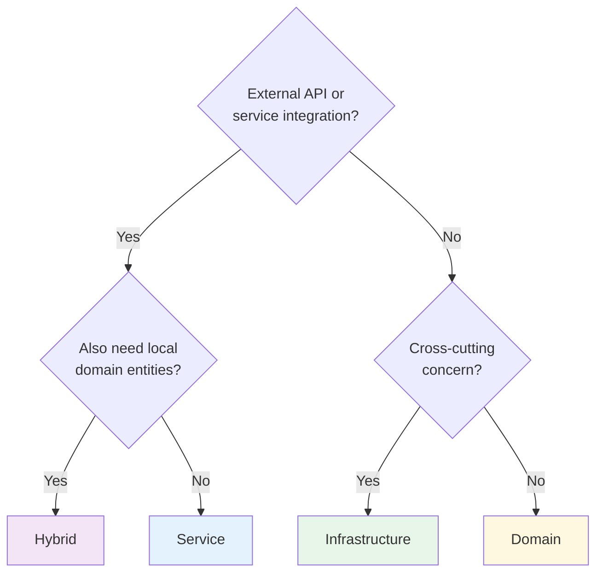

# Discovery

> Capturing intent, classifying features, deriving requirements

---

## Purpose

Discovery is where features begin. This skill captures your intent in natural language, classifies what kind of feature you're building, identifies which parts of the codebase it affects, and derives structured requirements.

**What you provide**: A description of what you need  
**What you get**: A `PlatformFeatureSession` with classified archetype and related `Requirement` entities

---

## When to Invoke

Use discovery when you're starting a new feature:

- "I need to add authentication to the platform"
- "Implement a notification system"
- "Add Stripe payment integration"
- "I want to build user preferences management"

The skill recognizes phrases like "add", "implement", "build", "I need", "I want to add".

---

## What Happens

### Phase 1: Capture Intent

The skill asks clarifying questions to understand what you're building:

- What problem does this solve?
- Who needs this capability?
- What's the scope? (e.g., "email/password only, no OAuth")

This isn't bureaucratic—it's ensuring the system captures enough context to make good decisions later.

### Phase 2: Classify the Feature

Based on your answers, discovery classifies the feature into an **archetype**:



| Archetype | When It Applies | Patterns That Apply |
|-----------|-----------------|---------------------|
| **Service** | External API, credentials, swappable providers | Service Interface, Environment, Mock Testing, Provider Sync |
| **Domain** | New business entities, rules, relationships | Enhancement Hooks, Schema design |
| **Infrastructure** | Cross-cutting capability used by multiple features | Service Interface, Environment |
| **Hybrid** | External service + local domain modeling | All of the above |

**Auth example**: Classified as **Hybrid**—external Supabase service plus local AuthUser/AuthSession entities.

### Phase 3: Identify Affected Packages

Discovery determines which packages the feature touches:

| Package | What It Contains |
|---------|------------------|
| `packages/state-api` | Domain logic, services, schemas |
| `packages/mcp` | MCP server and tools |
| `apps/web` | React UI, contexts, components |
| `.claude/skills` | Claude skills |
| `.schemas` | Schema definitions |

Most features touch `packages/state-api` (domain) and `apps/web` (UI).

### Phase 4: Derive Requirements

From your intent, the skill extracts 3-7 requirements with priorities:

| Priority | Meaning |
|----------|---------|
| **must** | Essential—feature doesn't work without it |
| **should** | Important—expected behavior |
| **could** | Nice to have—can defer |

**Auth example requirements**:
```
req-auth-001: [must] Abstract auth behind IAuthService interface
req-auth-002: [must] Local MST store for reactive auth state
req-auth-003: [must] Environment extension for service injection
req-auth-004: [must] Supabase provider implementation
req-auth-005: [should] Mock provider for testing
req-auth-006: [must] Sync auth state from provider to local store
req-auth-007: [should] Persist session across page reloads
```

---

## What Gets Created

### PlatformFeatureSession

The container for your entire feature development:

```typescript
{
  id: "session-uuid",
  name: "auth",                        // Short identifier
  intent: "Add authentication...",     // Your original request
  featureArchetype: "hybrid",          // Classification
  applicablePatterns: ["service-interface", "environment-extension", ...],
  affectedPackages: ["packages/state-api", "apps/web"],
  status: "discovery",                 // Current pipeline stage
  createdAt: 1733616000000
}
```

### Requirement Entities

Each requirement links back to the session:

```typescript
{
  id: "req-auth-001",
  session: "session-uuid",             // Reference to parent
  description: "Abstract auth behind IAuthService interface",
  priority: "must",
  status: "proposed"                   // Will become "implemented" later
}
```

---

## Key Principle: Local State Always

One important principle Discovery enforces:

> **All features that have state needs will have local MST models.**

This isn't a question the skill asks—it's how the platform works. External services own their data, but local state tracks loading/error/cached data for reactive UI.

Don't think "should we sync locally?" The answer is always yes. The question is "what local state does this feature need?"

---

## What to Look For

After Discovery completes, verify:

- [ ] **Intent captured accurately** - Does the session reflect what you want?
- [ ] **Archetype makes sense** - Service/Domain/Hybrid/Infrastructure?
- [ ] **Requirements complete** - Are the key capabilities covered?
- [ ] **Priorities correct** - Must vs should vs could?
- [ ] **Packages identified** - Will the feature touch these areas?

If something's off, you can clarify and the skill will update.

---

## Status After Discovery

Discovery creates the session with `status: "discovery"`. 

**Important**: Discovery does NOT advance the status. It stays at `discovery` to signal that Analysis should run next in EXPLORE mode. Analysis will transition it to `design`.

---

## Auth Example: Discovery Output

For the auth feature, Discovery produced:

**Session**:
- Name: `auth` (later `supabase-auth` for the schema)
- Intent: "Add authentication layer using Supabase Auth for apps/web - email/password flows only (signup, login, logout), no OAuth, no authorization/roles"
- Archetype: `hybrid`
- Affected packages: `packages/state-api`, `apps/web`

**Requirements**: 7 requirements covering service interface, local state, environment extension, Supabase implementation, mock for testing, state sync, and session persistence.

This captured intent then flowed through all subsequent stages, with each requirement traceable to generated code.

---

## Next Step

→ [[analysis|Analysis]] explores your codebase to find patterns that inform the design.
