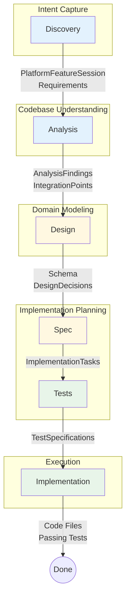
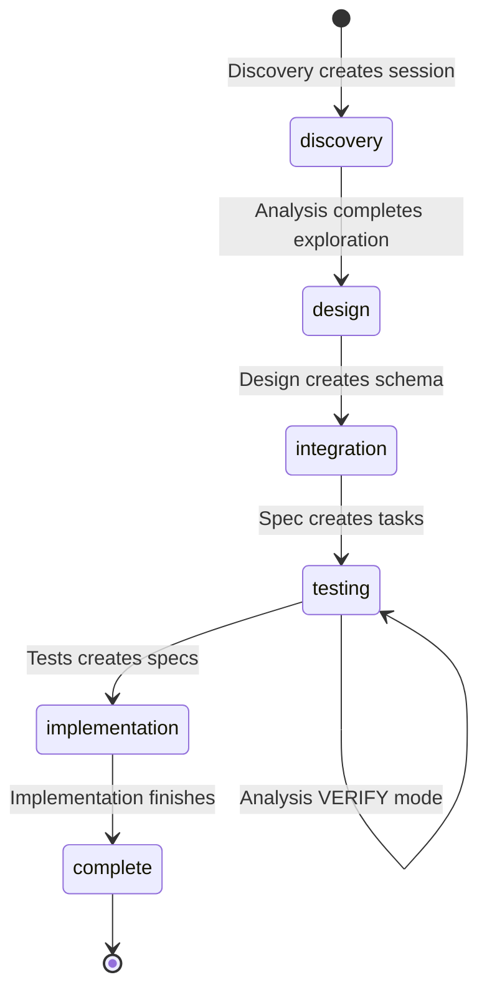

# The 6-Skill Pipeline

> From intent to validated code in six stages

---

## How the Pipeline Works

The platform-feature pipeline transforms your feature request into working, tested code through six specialized skills. Each skill has a focused responsibility and produces structured outputs that feed into the next stage.



---

## The Six Skills at a Glance

| Skill | Purpose | Key Output | Status Transition |
|-------|---------|------------|-------------------|
| [[discovery\|Discovery]] | Capture intent, classify feature, derive requirements | `PlatformFeatureSession`, `Requirement` | → `discovery` |
| [[analysis\|Analysis]] | Explore codebase, find patterns, identify integration points | `AnalysisFinding`, `IntegrationPoint` | `discovery` → `design` |
| [[design\|Design]] | Create domain schema, record design decisions | Enhanced JSON Schema, `DesignDecision` | `design` → `integration` |
| [[spec\|Spec]] | Break into tasks with acceptance criteria and dependencies | `ImplementationTask` | `integration` → `testing` |
| [[tests\|Tests]] | Generate test specifications from acceptance criteria | `TestSpecification` | `testing` → `complete` |
| [[implementation\|Implementation]] | Execute TDD: write tests, implement, verify | Code files, `ImplementationRun` | → `complete` |

---

## Session Status Flow

Each skill checks and updates the session status. This is how skills know what's expected:



**Why status matters**: When you resume a session, skills check the status to understand where you are. If status is `design`, invoking the Design skill knows it should proceed with schema creation.

---

## Invoking Skills

Each skill is invoked by describing what you want to do. The skills recognize trigger phrases:

| Skill | Trigger Phrases |
|-------|-----------------|
| **Discovery** | "add [feature]", "implement [feature]", "I need [capability]" |
| **Analysis** | "analyze the codebase", "find patterns", "explore integration points" |
| **Design** | "design the schema", "create the domain model" |
| **Spec** | "create the implementation plan", "define the tasks", "spec out the work" |
| **Tests** | "create test specs", "define the tests", "generate test cases" |
| **Implementation** | "implement the feature", "start implementing", "run TDD" |

Or simply ask to continue from where you left off—skills can determine the right next step from session status.

---

## What Each Skill Needs

### Inputs and Outputs

```
Discovery
├── Input: Your feature description
├── Output: PlatformFeatureSession, Requirements
└── Stores in: platform-features schema

Analysis  
├── Input: Session with status=discovery
├── Output: AnalysisFindings, IntegrationPoints
└── Stores in: platform-feature-spec schema

Design
├── Input: Session with status=design, Requirements, AnalysisFindings
├── Output: Domain schema, DesignDecisions
└── Stores in: .schemas/{feature}/, platform-features schema

Spec
├── Input: Session with status=integration, IntegrationPoints
├── Output: ImplementationTasks with acceptance criteria
└── Stores in: platform-feature-spec schema

Tests
├── Input: Session with status=testing, ImplementationTasks
├── Output: TestSpecifications (Given/When/Then)
└── Stores in: platform-feature-spec schema

Implementation
├── Input: Session with status=testing, Tasks, TestSpecs, IntegrationPoints
├── Output: Code files, ImplementationRun tracking
└── Stores in: platform-feature-spec schema + actual files
```

---

## Feature Archetypes

During Discovery, features are classified into archetypes that determine which architectural patterns apply:

| Archetype | Characteristics | Example | Key Patterns |
|-----------|-----------------|---------|--------------|
| **Service** | External API, credentials, swappable providers | Auth, Payment, Email | Service Interface, Environment, Mock Testing |
| **Domain** | New entities, business rules, relationships | Inventory, CRM | Enhancement Hooks, Schema design |
| **Infrastructure** | Cross-cutting, used by multiple features | Caching, Logging | Service Interface, Environment |
| **Hybrid** | External provider + local domain modeling | Auth with user profiles | All patterns |

The archetype informs later skills about which patterns to apply and what structure to expect.

---

## Review Gates

The pipeline includes natural review points where you assess outputs before proceeding:

1. **After Discovery**: Are the requirements complete? Is the archetype correct?
2. **After Analysis**: Do the findings make sense? Are integration points accurate?
3. **After Design**: Does the schema capture the domain correctly?
4. **After Spec**: Is the task breakdown reasonable? Dependencies correct?
5. **After Tests**: Do test specs cover the acceptance criteria?
6. **During Implementation**: Each task completes with test verification

You control the pace. Skills don't auto-advance—they present results and wait for you to invoke the next stage.

---

## Skill Deep Dives

Each skill has its own detailed guide:

- [[discovery|Discovery]] - Capturing intent and classifying features
- [[analysis|Analysis]] - Exploring codebase patterns (including VERIFY mode)
- [[design|Design]] - Creating domain schemas
- [[spec|Spec]] - Breaking down into implementation tasks
- [[tests|Tests]] - Generating test specifications
- [[implementation|Implementation]] - Executing TDD

---

## Common Workflows

### New Feature (Full Pipeline)
```
Discovery → Analysis → Design → Spec → Tests → Implementation
```
Standard flow for a new capability.

### Resume After Break
```
1. Query existing session by name
2. Check current status
3. Invoke appropriate skill to continue
```

### Pre-Implementation Verification
```
Analysis (VERIFY mode) → Implementation
```
When time has passed since spec was created, verify integration points still valid.

### Design Iteration
```
Discovery → Analysis → Design → [review] → Design (revised)
```
If schema needs adjustment, you can iterate on design before proceeding to spec.

---

## Next: Individual Skill Guides

Start with [[discovery|Discovery]] to understand how features begin, or jump to any skill you need to understand.
