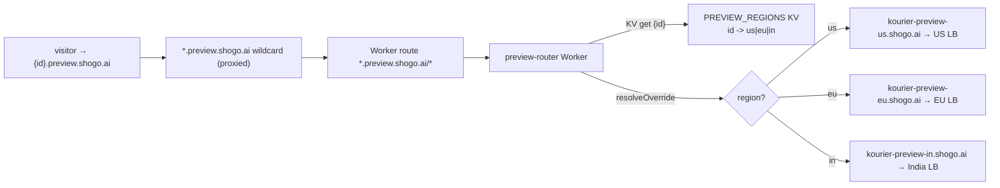

# Preview router: per-project preview routing without per-preview DNS records

Status: **implemented**, pending Terraform apply + secret wiring + cutover.

Supersedes the per-preview DNS approach in
[`cloudflare-dns-per-preview.md`](./cloudflare-dns-per-preview.md).

## Why

The previous design gave each preview a hostname `preview--<projectId>.shogo.ai`
and, because a flat `*.shogo.ai` A record can only point at one region (US),
overrode that wildcard with **one proxied A record per live preview** pointing at
the hosting region's Kourier LB.

That scales linearly with active previews and hit the `shogo.ai` zone's
**200-record quota** (Cloudflare API error `81045` "Record quota exceeded"),
which then silently blocked new EU/India previews from being created.

## Why a dedicated `*.preview.<base>` subtree

Cloudflare Worker routes only allow a wildcard at the **start** of the hostname
— `preview--*.shogo.ai/*` is rejected with error `10022`. So a single Worker
route can't target the old `preview--{id}.shogo.ai` scheme.

Instead, previews now live under a dedicated subtree the Worker owns entirely via
a valid leading-wildcard route — the same way the publish Worker owns the
dedicated `*.shogo.one` zone:

- **Production:** `{projectId}.preview.shogo.ai`
- **Staging:** `{projectId}.preview.staging.shogo.ai`

The `projectId` is the first DNS label, which the route captures and the Worker
parses.

## How it works now

The N per-preview records are replaced by a fixed footprint:



- **1 KV namespace** `PREVIEW_REGIONS`: `projectId -> region code` (`us`/`eu`/`in`).
- **1 proxied wildcard** `*.preview.<base>` → default region LB. This is the
  request host the route matches and the `resolveOverride` source (both hosts
  must be proxied in the zone).
- **1 advanced certificate pack** covering `*.preview.<base>`. Universal SSL only
  covers the apex + a single `*.<zone>` level, so the 2nd-level (or deeper)
  wildcard needs an ACM advanced cert — mirrors the zone's existing
  `*.studio.shogo.ai` advanced cert. (Total TLS only issues per-hostname certs
  for records that exist, so it can't cover a wildcard-only subtree.)
- **1 Worker** on `*.preview.<base>/*` that reads the region from KV and
  `resolveOverride`s to that region's anchor, keeping the original
  `{id}.preview.<base>` Host so the regional DomainMapping routes to the right
  ksvc.
- **N anchor records** `kourier-preview-{us,eu,in}.shogo.ai` (proxied A → each
  region's Kourier LB). Named distinctly from the publish Worker's
  `kourier-{code}` records (owned by the per-region states) to avoid cross-state
  ownership collisions.

KV is effectively unlimited, so the 200-record ceiling no longer applies. On any
KV miss / unparseable host / missing binding the Worker targets the
**default region** (same as the wildcard), so default-region previews need zero
KV state and a miss degrades to "routed to the default region" instead of a hard
failure.

## What runs where

| Piece | Location |
|---|---|
| Worker + KV + wildcard + cert + anchors + route | `terraform/modules/preview-router` (takes a `region_anchors` map + `default_region` + `preview_base_domain`); instantiated in `terraform/environments/edge-global` (production: us/eu) and `terraform/environments/staging` (single `staging` region) |
| Preview host construction | `getPreviewSubdomain()` in `apps/api/src/lib/knative-project-manager.ts` (`{projectId}.preview.{env?}.{base}`) |
| KV write/delete (per region) | `apps/api/src/lib/cloudflare-preview-region-kv.ts` |
| Wiring | `KnativeProjectManager.createPreviewDomainMapping` → `setPreviewRegion(projectId)`; `deletePreviewDomainMapping` → `clearPreviewRegion(projectId)` |
| API env | `CF_PREVIEW_REGIONS_KV_NAMESPACE_ID` in all `k8s/overlays/{staging,production-*}/api-service.yaml` (from the `custom-domains-config` secret) |
| Backfill | `scripts/backfill-preview-regions-kv.sh` (selects by `shogo.io/component=preview-domain` label) |

The module is namespaced by `preview_base_domain`, so prod (`preview.shogo.ai`)
and staging (`preview.staging.shogo.ai`) instances coexist in the same `shogo.ai`
zone with distinct wildcards, certs, anchors, routes, KV namespaces, and Worker
names.

The API derives its region code from `REGION_ID` (`us-ashburn-1`→`us`,
`eu-frankfurt-1`→`eu`, `staging`→`staging`). Writes are
best-effort: a CF failure never blocks a DomainMapping create/delete.

## Test in staging first (recommended)

Staging is single-region (`us-ashburn-1`, `REGION_ID=staging`) and its previews
are `{id}.preview.staging.shogo.ai`. Deploying the staging instance validates the
full mechanism (advanced wildcard cert goes active, route fires, KV read,
`resolveOverride`, Host preservation, the dev-server/HMR WebSocket path) at zero
production risk. The more-specific staging route `*.preview.staging.shogo.ai/*`
also takes precedence over the prod route `*.preview.shogo.ai/*`, shielding
staging once prod is applied.

Because `default_region = staging` and the lone anchor targets the staging
Kourier LB, staging previews route correctly even with an empty KV — so no
backfill is required there.

1. `terraform apply` on `staging` (scoped: `-target=module.preview_router`).
   Capture `preview_regions_kv_namespace_id`.
2. Wait for the advanced cert pack `*.preview.staging.shogo.ai` to reach
   `active` (a few minutes; DCV is automatic on CF nameservers).
3. Add the KV namespace id to the `custom-domains-config` secret in the staging
   namespace, then roll the staging API so new previews self-register in KV.
4. Verify a new staging preview loads through the Worker:
   ```bash
   curl -sI https://<staging-project-id>.preview.staging.shogo.ai   # expect 200
   ```
   Open it in the browser and confirm HMR / live reload still works.

Once staging looks good, proceed to production.

## Rollout (order matters)

The Worker route intercepts **all** `*.preview.shogo.ai` traffic the moment it
exists. Because this is a NEW subtree, no existing preview is affected until the
API starts minting `{id}.preview.shogo.ai` hostnames — so the cutover is safe:

1. **Apply Terraform** (`edge-global`, via the terraform.yml `workflow_dispatch`
   apply on the S3 backend). Creates the KV namespace, the wildcard, the advanced
   cert pack, the 3 anchors, the Worker, and the route. Capture
   `preview_regions_kv_namespace_id`. Wait for the cert pack to go `active`.
2. **Wire the secret**: add `CF_PREVIEW_REGIONS_KV_NAMESPACE_ID` (= step 1 value)
   to the `custom-domains-config` secret in **every** production region
   namespace, then roll the API. From now on new previews are
   `{id}.preview.shogo.ai` and self-register their region in KV.
3. **Backfill** any previews created in the gap (optional — new previews
   self-register; this seeds the few created between the API roll and KV being
   readable):
   ```bash
   CF_API_TOKEN=<kv-capable-token> \
   CF_ACCOUNT_ID=<account-id> \
   CF_PREVIEW_REGIONS_KV_NAMESPACE_ID=<from step 1> \
   scripts/backfill-preview-regions-kv.sh        # add --dry-run first to preview
   ```
4. **Verify** a new EU preview routes correctly:
   `curl -sI https://<eu-project-id>.preview.shogo.ai`.

## Migration of existing previews & cleanup of old records

Existing previews keep their old `preview--{id}.shogo.ai` DomainMappings and keep
working via the old `*.shogo.ai` wildcard + their per-preview records until their
pod is next (re)created, at which point the API creates a `{id}.preview.shogo.ai`
DomainMapping instead. Clients re-read `previewUrl` from the API each session, so
the URL updates transparently on the next cold start.

Once the fleet has cycled, the old `preview--*.shogo.ai` A records (and their
Total TLS certs) are fully redundant and can be deleted to reclaim quota — list
`preview--*` A records and delete those whose project has a live
`{id}.preview.shogo.ai` DomainMapping. Orphans were already cleared during the
2026-06-27 quota incident.

## Notes / caveats

- `cloudflare-dns.ts` (the old `upsert/deletePreviewDnsRecord`) is no longer
  wired into the manager. It is kept for reference/rollback but writes nothing.
- The token must carry `Workers KV Storage:Edit`. The helper prefers
  `CF_CUSTOM_HOSTNAMES_TOKEN` (already KV-capable and paired with `CF_ACCOUNT_ID`
  in `custom-domains-config`) and falls back to `CF_API_TOKEN`.
- Region codes in `REGION_CODE_BY_ID` (helper) and `anchorFor()` (Worker) must
  stay in sync.
- The Terraform `CLOUDFLARE_API_TOKEN` needs `SSL and Certificates:Edit` (for the
  advanced cert pack) in addition to `Workers Scripts:Edit`, `Workers Routes:Edit`,
  `Workers KV Storage:Edit`, and `DNS:Edit`.
```

