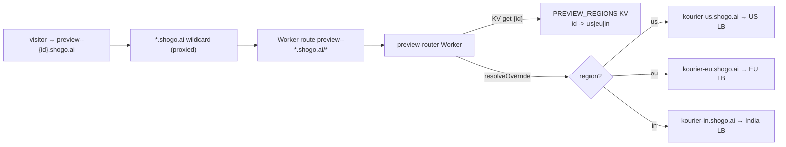

# Preview router: per-project preview routing without per-preview DNS records

Status: **implemented**, pending Terraform apply + secret wiring + cutover.

Supersedes the per-preview DNS approach in
[`cloudflare-dns-per-preview.md`](./cloudflare-dns-per-preview.md).

## Why

Preview hostnames look like `preview--<projectId>.shogo.ai`. A single flat
`*.shogo.ai` A record can only point at one region (US). The previous design
overrode that wildcard with **one proxied A record per live preview** pointing
at the hosting region's Kourier LB.

That scales linearly with active previews and hit the `shogo.ai` zone's
**200-record quota** (Cloudflare API error `81045` "Record quota exceeded"),
which then silently blocked new EU/India previews from being created.

## How it works now

The N per-preview records are replaced by a fixed footprint:



- **1 KV namespace** `PREVIEW_REGIONS`: `projectId -> region code` (`us`/`eu`/`in`).
- **1 Worker** on `preview--*.shogo.ai/*` that reads the region from KV and
  `resolveOverride`s the connection to that region's Kourier anchor, keeping the
  original `preview--{id}.shogo.ai` Host so the regional DomainMapping routes to
  the right ksvc. Same mechanism the publish Worker uses for server-backed
  `/api/*` (see `terraform/environments/production-us` `kourier_us`).
- **3 anchor records** `kourier-{us,eu,in}.shogo.ai` (proxied A → each region's
  Kourier LB). `resolveOverride` requires the override host to be proxied in the
  same zone; the `*.shogo.ai` wildcard supplies the proxied request host.

KV is effectively unlimited, so the 200-record ceiling no longer applies. On any
KV miss / unparseable host / missing binding the Worker targets the **US anchor**
(same as the wildcard), so US previews need zero KV state and a miss degrades to
"routed to US" instead of a hard failure.

## What runs where

| Piece | Location |
|---|---|
| Worker + KV + per-region anchors + route | `terraform/modules/preview-router` (takes a `region_anchors` map + `default_region`); instantiated in `terraform/environments/production-global` (us/eu/in) and `terraform/environments/staging` (single `staging` region) |
| KV write/delete (per region) | `apps/api/src/lib/cloudflare-preview-region-kv.ts` |
| Wiring | `KnativeProjectManager.createPreviewDomainMapping` → `setPreviewRegion(projectId)`; `deletePreviewDomainMapping` → `clearPreviewRegion(projectId)` |
| API env | `CF_PREVIEW_REGIONS_KV_NAMESPACE_ID` in all `k8s/overlays/{staging,production-*}/api-service.yaml` (from the `custom-domains-config` secret) |
| Backfill | `scripts/backfill-preview-regions-kv.sh` (production) |

The module is namespaced by `preview_base_domain`, so prod (`shogo.ai`) and
staging (`staging.shogo.ai`) instances coexist in the same `shogo.ai` zone with
distinct anchors, routes, KV namespaces, and Worker names.

The API derives its region code from `REGION_ID` (`us-ashburn-1`→`us`,
`eu-frankfurt-1`→`eu`, `ap-mumbai-1`→`in`). Writes are best-effort: a CF failure
never blocks a DomainMapping create/delete.

## Test in staging first (recommended)

Staging is single-region (`us-ashburn-1`, `REGION_ID=staging`) and its previews
are `preview--{id}.staging.shogo.ai` in the same `shogo.ai` zone. Deploying the
staging instance validates the full mechanism (route fires, KV read,
`resolveOverride`, Host preservation, the dev-server/HMR WebSocket path) at zero
production risk. It also matters for the prod rollout: the prod route
`preview--*.shogo.ai/*` would otherwise match staging hostnames too, but the
more-specific staging route `preview--*.staging.shogo.ai/*` takes precedence and
shields staging.

Because `default_region = staging` and the lone anchor targets the same LB as
the existing `*.staging.shogo.ai` wildcard, staging previews keep working even
with an empty KV — so no backfill is required there.

1. `terraform apply` on `staging`. Capture `preview_regions_kv_namespace_id`.
2. Add that id to the `custom-domains-config` secret in the staging namespace,
   then roll the staging API so new previews self-register their region in KV.
3. Verify a staging preview still loads through the Worker:
   ```bash
   curl -sI https://preview--<staging-project-id>.staging.shogo.ai   # expect 200
   ```
   Open a preview in the browser and confirm HMR / live reload still works.
4. (Optional) Confirm the KV write path: create a new staging preview and check
   the KV namespace has `{projectId: "staging"}`.

Once staging looks good, proceed to production.

## Rollout (order matters)

The Worker route intercepts **all** `preview--*.shogo.ai` traffic the moment it
exists. Before KV is seeded, EU/India previews would fall back to the US anchor
and break. So seed KV before the route serves real misses:

1. **Apply Terraform** (`production-global`). This creates the KV namespace, the
   3 anchors, the Worker, and the route. Capture the output
   `preview_regions_kv_namespace_id`.
2. **Backfill KV immediately** for all currently-live previews:
   ```bash
   CF_API_TOKEN=<kv-capable-token> \
   CF_ACCOUNT_ID=<account-id> \
   CF_PREVIEW_REGIONS_KV_NAMESPACE_ID=<from step 1> \
   scripts/backfill-preview-regions-kv.sh        # add --dry-run first to preview
   ```
   (KV is global with ~60s propagation; until then misses route to US.)
3. **Wire the secret**: add `CF_PREVIEW_REGIONS_KV_NAMESPACE_ID` (= step 1 value)
   to the `custom-domains-config` secret in **every** production region
   namespace, then roll the API so new previews self-register.
4. **Verify** a known EU preview routes correctly (200, not US 404), e.g.
   `curl -sI https://preview--<eu-project-id>.shogo.ai`.

## Cleaning up the old per-preview records

Existing `preview--*.shogo.ai` A records become redundant once the Worker is
live (the Worker resolveOverrides regardless of any specific record). They can be
deleted to reclaim quota. Orphans (no live DomainMapping) were already cleared
during the 2026-06-27 quota incident; the remaining live-preview records can be
removed after step 4 is verified, by listing `preview--*` A records and deleting
those whose `projectId` has a live KV entry.

## Notes / caveats

- `cloudflare-dns.ts` (the old `upsert/deletePreviewDnsRecord`) is no longer
  wired into the manager. It is kept for reference/rollback but writes nothing.
- The token must carry `Workers KV Storage:Edit`. The helper prefers
  `CF_CUSTOM_HOSTNAMES_TOKEN` (already KV-capable and paired with `CF_ACCOUNT_ID`
  in `custom-domains-config`) and falls back to `CF_API_TOKEN`.
- Region codes in `REGION_CODE_BY_ID` (helper) and `anchorFor()` (Worker) must
  stay in sync.
