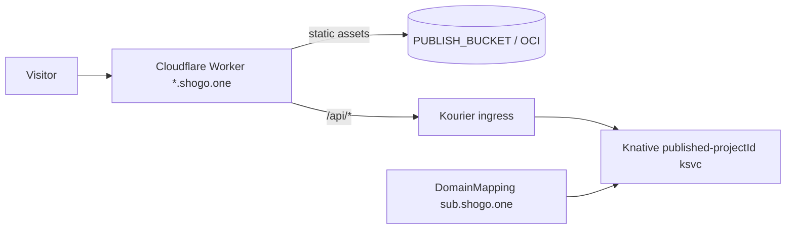
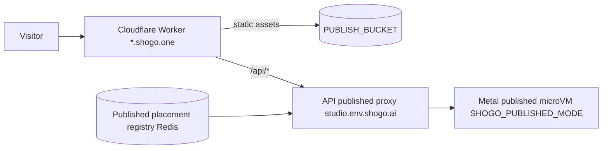

# Metal publishing — design & rollout plan

Status: **Draft / not implemented.** This is the design for bringing published
apps (`{subdomain}.shogo.one`) and published always-on to the bare-metal
(Firecracker) substrate so we can eventually decommission the Knative fleet.

Related: `docs/runbooks/metal-fleet.md`, `docs/custom-domains.md`,
`apps/api/src/routes/publish.ts`, `apps/api/src/lib/substrate/`.

---

## 1. Why

Preview/dev runtime already has metal parity behind `resolveProjectPodUrl` /
`getProjectSubstrate`. **Publishing does not.** Today publishing is
Knative + Cloudflare only:

- Build/dist download runs on the project's runtime (metal-aware via
  `getProjectPodUrl`), but
- The **live published site is always provisioned on Knative**:
  `configurePublishedService` → `createPublishedService` (static, nginx ksvc) or
  `createPublishedServerService` (server-backed, agent-runtime in
  `SHOGO_PUBLISHED_MODE`) + `createPublishedDomainMapping` +
  Cloudflare Worker/KV.
- `publishedAlwaysOn` only toggles the Knative `published-{projectId}` ksvc
  min-scale.

Consequence: **you cannot fully turn off Knative** — `{subdomain}.shogo.one`
would break — and paid "always-on published" has no metal path.

This is the last **critical** parity gap for a full metal cutover.

---

## 2. Current architecture (Knative)



Key facts:
- **Static apps**: `dist/` is uploaded to `PUBLISH_BUCKET` under `{subdomain}/`.
  The Worker serves `/`, `*.js`, etc. directly from the S3 origin. The nginx
  `published-{id}` ksvc is largely redundant for pure-static serving.
- **Server-backed apps** (`detectServerBacked` via `/agent/server-info`): need a
  long-running backend for `/api/*`. Served by `published-{id}` agent-runtime in
  `SHOGO_PUBLISHED_MODE=true`, with `PublishedDataSync` persisting writable state
  (SQLite/uploads) to S3. Worker proxies `/api/*` to Kourier.
- **Wake** for a scaled-to-zero server-backed app: `/api/published/:subdomain/wake`
  → `healthCheckPublished` (Knative-only).
- **Custom domains** (`CustomDomain`): Cloudflare for SaaS + Worker KV
  `hostname → publishedSubdomain`; backend still resolves to the above.

DB (`prisma/schema.prisma`): `publishedSubdomain`, `publishedAt`,
`publishStatus`, `publishError`, `publishedCommitSha`, `publishedTag`,
`publishedAlwaysOn`, `accessLevel`, `sitePasswordHash`.

---

## 3. Target architecture (metal)

Two serving classes, handled very differently.

### 3a. Static published apps — make serving substrate-independent

Static serving is **already** S3 + Cloudflare Worker; the nginx ksvc is not on
the hot path. Target:

- Serve **entirely** from `PUBLISH_BUCKET` + Worker. Drop the `published-{id}`
  nginx ksvc for static apps (behind a flag first).
- The build/dist-upload step already runs on metal via `getProjectPodUrl` —
  no change beyond the hydration fix already shipped (build runs on the real
  hydrated source, so we don't publish the template).

Result: **static publishing needs no Knative at all.** This is the cheap,
high-value first win and unblocks static-only workspaces from the Knative
dependency.

### 3b. Server-backed published apps — metal published runtime

Introduce a dedicated **published microVM** per server-backed published app,
managed by the metal substrate.



- **Runtime**: a Firecracker VM booting the agent-runtime image with
  `SHOGO_PUBLISHED_MODE=true`, `PUBLISHED_SUBDOMAIN`, and `PublishedDataSync`
  wired to S3 (host-side hydration, same trust model as preview: the guest holds
  no S3 creds; the metal-agent stages published state). It is **always-on by
  construction** (reuse the reaper exemption just added — `SHOGO_ALWAYS_ON`).
- **Placement**: a published placement registry (Redis), `subdomain → {region,
  hostId, vmId}`. This is the metal analog of the Knative `DomainMapping`.
- **Routing**: reuse the **API-proxy** pattern already used for metal preview
  (`/api/preview/:id/render/*`). Add `/api/published/:subdomain/*` that resolves
  the placement and proxies to the published VM's mesh IP. The Cloudflare Worker
  proxies `{sub}.shogo.one/api/*` to this API endpoint instead of Kourier.
- **Wake**: `/api/published/:subdomain/wake` resolves the placement and calls the
  metal agent `/resume` (published VMs can suspend when `publishedAlwaysOn` is
  false; stay pinned when true).

---

## 4. Substrate contract changes

Extend `ProjectSubstrate` (`apps/api/src/lib/substrate/types.ts`) with a
publishing surface (currently out of scope — only wake/stop/destroy/resize):

```ts
interface ProjectSubstrate {
  // ... existing ...
  publish(projectId: string, opts: PublishOpts): Promise<PublishResult>
  unpublish(projectId: string): Promise<void>
  wakePublished(subdomain: string): Promise<void>
  setPublishedAlwaysOn(projectId: string, on: boolean): Promise<void>
}
```

- `KnativeSubstrate.publish` = today's `configurePublishedService` path (no
  behavior change).
- `MetalSubstrate.publish`:
  - static → upload to `PUBLISH_BUCKET` + set Worker KV (no VM).
  - server-backed → provision/refresh a published microVM (always-on), register
    placement, set Worker KV to route `/api/*` via the API proxy.
- `publish.ts` calls `getProjectSubstrate(projectId).publish(...)` instead of
  `getKnativeProjectManager()` directly.

---

## 5. Data model

Reuse existing columns. Add:

- **Published placement registry** (Redis, like the preview metal placement
  registry): `published:placement:{subdomain}` → `{region, hostId, vmId,
  updatedAt}`.
- No new Prisma columns strictly required. Optionally a
  `publishedSubstrate` enum (`knative|metal`) on `Project` for observability /
  gradual migration.

---

## 6. Rollout phases

| Phase | Scope | Risk |
|-------|-------|------|
| **0** | Static publishing served purely from S3 + Worker; drop static nginx ksvc dependency (flag). Verify metal-built static apps publish real (hydrated) content. | Low |
| **1** | `MetalSubstrate.publish` for **static** (S3 + KV, no VM). Route static publish through the substrate. | Low |
| **2** | Metal **published microVM** for server-backed apps: provision (always-on), host-side published-state hydration, placement registry. | High |
| **3** | Routing: `/api/published/:subdomain/*` API proxy + Worker route to metal; `wakePublished` → agent `/resume`. | Med |
| **4** | `publishedAlwaysOn` parity on metal (pin vs allow-suspend); `/api/published/:subdomain/wake`. | Med |
| **5** | Custom domains: point Worker KV backend at metal placement (edge unchanged). | Low |
| **6** | Substrate publish contract + parity tests; then allow Knative published fleet decommission once metal is authoritative for publishing. | — |

---

## 7. Open questions

1. **Published-state durability on metal.** Server-backed apps write SQLite +
   uploads. On Knative this is `PublishedDataSync` → S3 from inside the pod. On
   metal the guest has no S3 creds, so either (a) host-side periodic export of
   the published workspace to S3 (mirror of the cold-start hydration, in
   reverse), or (b) snapshot-only durability (lose cross-host portability).
   Prefer (a) for parity with Knative's durable published data.
2. **One published VM per app vs shared.** Start with one always-on published
   microVM per server-backed published app (simplest, matches ksvc-per-app).
   Revisit multi-tenant packing later if VM count/cost is a concern.
3. **Region.** Published placement should honor the workspace home region (same
   as preview) so `{sub}.shogo.one` serves from US or EU appropriately.
4. **Zero-downtime republish.** Build new, swap placement/KV atomically, then
   tear down the old published VM (blue/green), mirroring the ksvc revision swap.
5. **Password / access level.** `accessLevel` + `sitePasswordHash` are enforced
   at the Cloudflare Worker edge today; unchanged by substrate — verify the
   metal API-proxy path preserves them.

---

## 8. Testing

- **Unit**: `MetalSubstrate.publish` static (KV + S3 writes) and server-backed
  (placement registry + VM provision call), mocked.
- **Substrate contract**: add publish/unpublish/wake to
  `substrate-contract.test.ts` so both substrates are held to the same shape.
- **e2e (staging)**: publish a server-backed app onto metal → hit
  `{sub}.shogo.one` → assert real app + `/api/*` works; toggle `publishedAlwaysOn`
  → assert the published VM stays resident (never idle-suspended); unpublish →
  assert 404 + VM torn down + placement cleared.
- **Regression tie-in**: the reopen-existing-project e2e (separate) guards that
  the *build* input is the real hydrated source, so published output is never the
  template.
```
