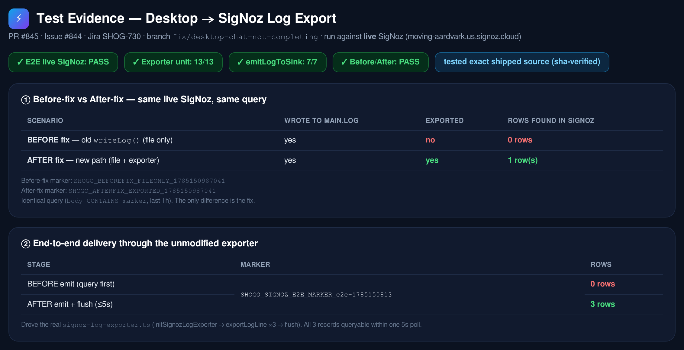
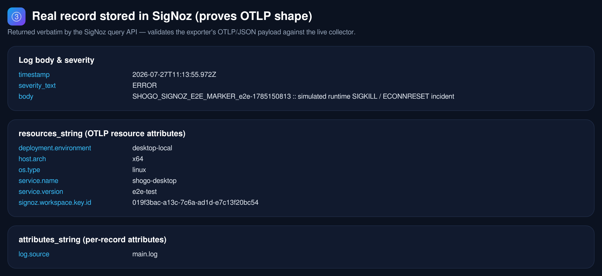
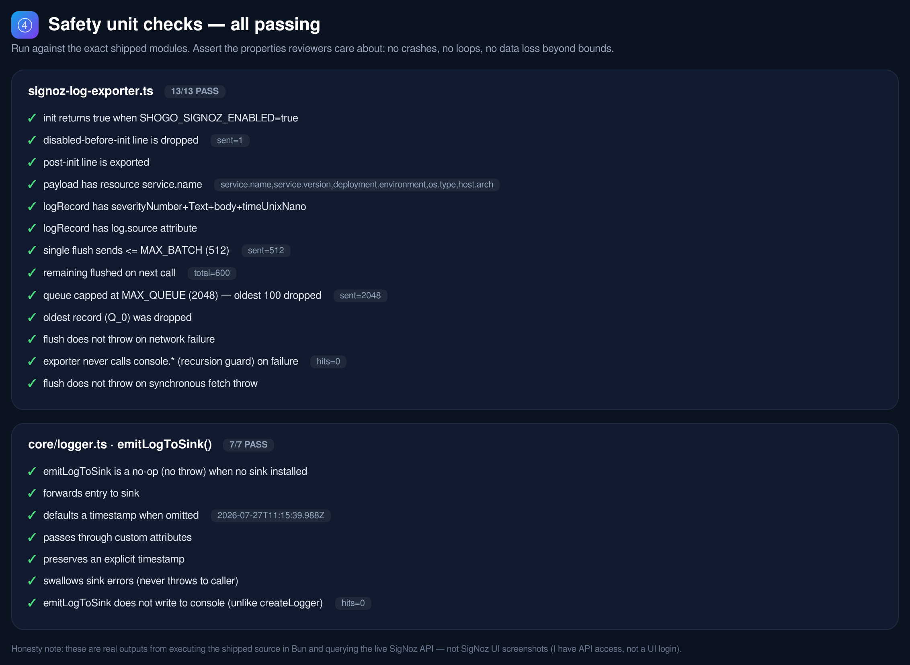

# Test Evidence — Desktop → SigNoz Log Export

Testing performed for **PR #845** / **Issue #844** / **Jira SHOG-730**
(branch `fix/desktop-chat-not-completing`).

All tests below were run against the **live** SigNoz instance
(`moving-aardvark.us.signoz.cloud`) using the **exact shipped source**
(sha-verified copies of `apps/desktop/src/signoz-log-exporter.ts` and
`packages/core/src/logger.ts` — no test-only forks).

> Honesty note: these are real outputs from executing the shipped source in Bun
> and querying the live SigNoz query API — **not** SigNoz UI screenshots (only
> API access was available, not a UI login). Every number below is reproducible
> from the harness in `harness/`.

## Summary

| Suite | Result |
|---|---|
| End-to-end delivery to live SigNoz (unmodified exporter) | ✅ PASS — before **0** rows → after **3** rows (≤5s) |
| Before-fix vs after-fix (same collector, same query) | ✅ PASS — file-only **0** rows vs exported **1** row |
| `signoz-log-exporter.ts` safety unit checks | ✅ 13/13 |
| `core/logger.ts` · `emitLogToSink()` checks | ✅ 7/7 |



## 1. Before-fix vs after-fix

Two distinct markers, identical SigNoz query (`body CONTAINS <marker>`, last 1h).
The **only** difference between the two runs is the fix:

- **Before fix** — simulates the old `writeLog()` (writes to `main.log` only, no
  exporter). Result: **0** rows in SigNoz.
- **After fix** — new path (`main.log` + `exportLogLine`). Result: **1** row in SigNoz.

Raw: [`results/beforeafter_result.json`](./results/beforeafter_result.json)

## 2. End-to-end delivery through the unmodified exporter

Drove the real module: `initSignozLogExporter()` → `exportLogLine()` ×3 →
`shutdownSignozLogExporter()` (flush). Queried SigNoz before (0) and after (3).

Raw: [`results/e2e_result.json`](./results/e2e_result.json) · full log
[`results/e2e.log`](./results/e2e.log)

## 3. Real record stored in SigNoz (proves OTLP payload shape)

The record SigNoz returned verbatim, validating the exporter's OTLP/JSON payload
against the live collector — correct `resources_string` (`service.name=shogo-desktop`,
`deployment.environment=desktop-local`, `os.type`, `host.arch`, `service.version`),
`attributes_string` (`log.source=main.log`), `severity_text`, and `body`.



Raw: [`results/found_record.json`](./results/found_record.json)

## 4. Safety unit checks

Assert the properties a reviewer cares about — no crashes, no infinite loops, no
unbounded memory, correct gating:

- `init` only activates when `SHOGO_SIGNOZ_ENABLED=true`
- disabled-before-init lines are dropped; post-init lines exported
- OTLP payload shape (resource + logRecord fields + `log.source`)
- batching respects `MAX_BATCH` (512); remainder flushed on next call
- queue bounded at `MAX_QUEUE` (2048), oldest dropped
- **never throws** on network reject or synchronous fetch throw
- **never calls `console.*`** (recursion guard — the exporter runs behind the
  patched `console.*` in `writeLog`)
- `emitLogToSink()` is a no-op without a sink, defaults timestamp, passes
  attributes, preserves explicit timestamp, swallows sink errors, and does **not**
  write to console (unlike `createLogger`)



Raw: [`results/unit_result.json`](./results/unit_result.json) ·
[`results/logger_result.json`](./results/logger_result.json)

## Reproduce

The harness scripts in [`harness/`](./harness) are self-contained Bun scripts.
They import sha-verified copies of the shipped modules and read
`SIGNOZ_BASE_URL`, `SIGNOZ_API_KEY` (query) and `SIGNOZ_INGESTION_KEY` (ingest)
from the environment.

```bash
export SIGNOZ_BASE_URL=https://<tenant>.<region>.signoz.cloud
export SIGNOZ_API_KEY=<query-api-key>
export SIGNOZ_INGESTION_KEY=<ingestion-key>

bun run harness/e2e.ts           # end-to-end delivery (before 0 -> after 3)
bun run harness/beforeafter.ts   # before-fix vs after-fix
bun run harness/unit.ts          # 13 exporter safety checks
bun run harness/logger.test.ts   # 7 emitLogToSink checks
```

## What could NOT be tested from CI/sandbox (needs a real desktop run)

- The full Electron app on macOS with a display (headless Linux sandbox, and a
  full monorepo install OOM'd). The exporter logic, OTLP shape, live delivery,
  gating, and safety are all covered above; what remains is the desktop
  integration wiring, which needs a run on the branch with:
  `SHOGO_SIGNOZ_ENABLED=true SIGNOZ_INGESTION_KEY=<key> bun run desktop:dev`
  (and `SHOGO_AGENT_RUNTIME_BIN` pointed at a freshly-built runtime so Track A
  changes are exercised).
